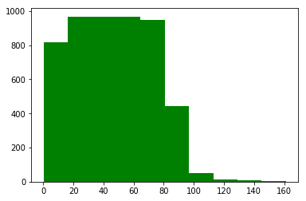
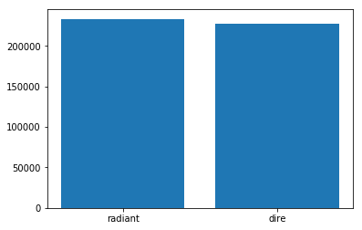
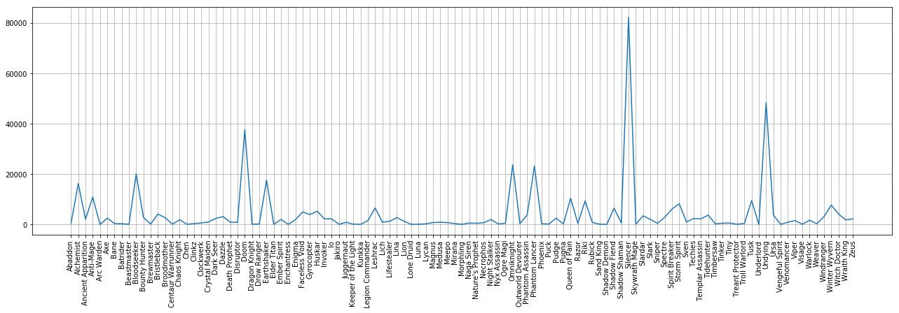
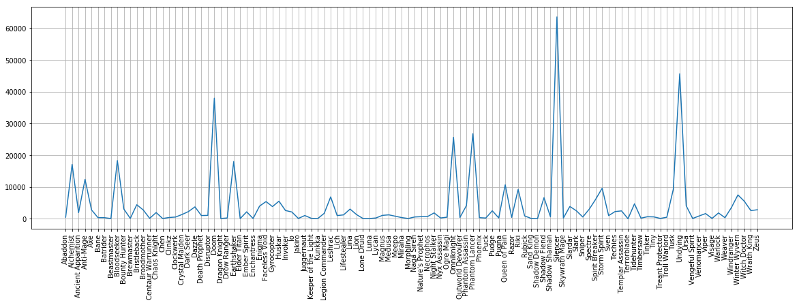
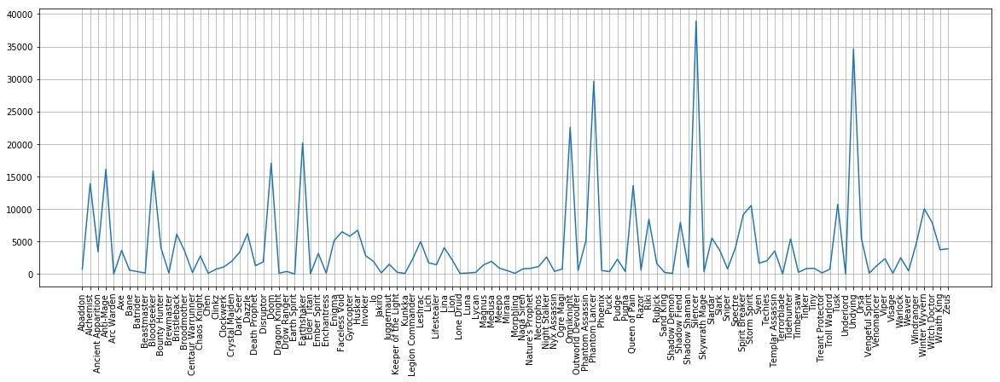
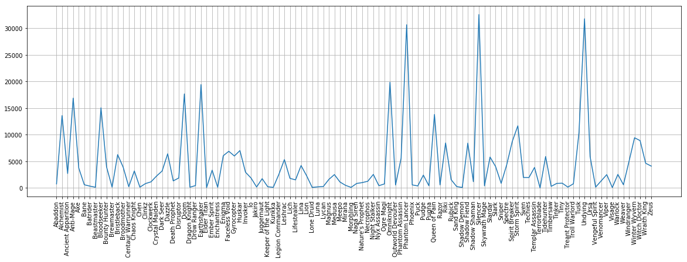
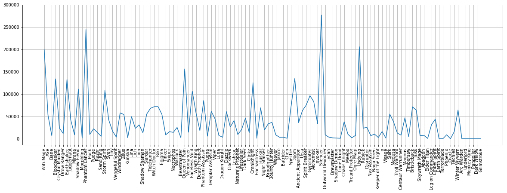
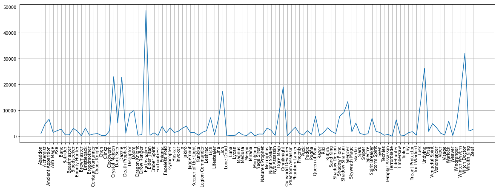
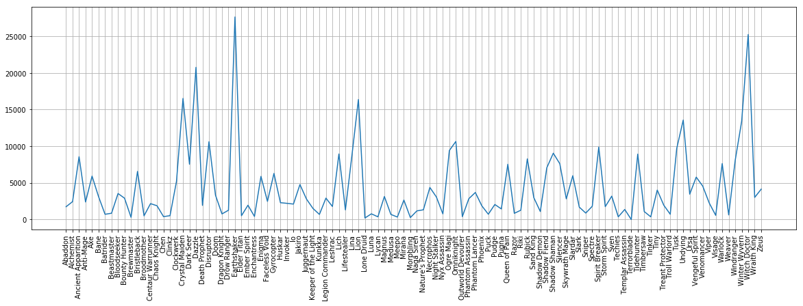
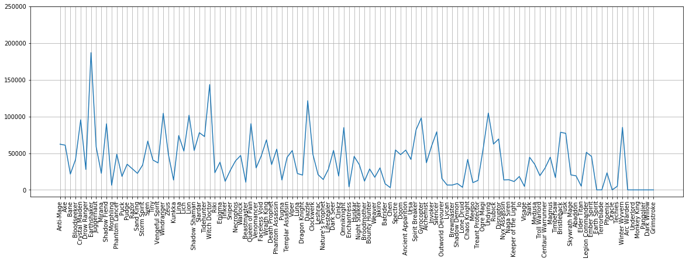

### <p align="center">**Draft Analysis of Dota 2**</p><br />
[]
----------

```python
# # Importing Packages
import os
import copy
import config
import dota2api
import numpy as np
import pandas as pd
import matplotlib.pyplot as plt
from sklearn.linear_model import LogisticRegression
from sklearn.model_selection import train_test_split
from sklearn.preprocessing import LabelEncoder
from sklearn.naive_bayes import MultinomialNB

%matplotlib inline
```


```python
# # STEAM Client API Key to access the dota2 api
API_KEY = config.STEAM_API_KEY
api = dota2api.Initialise(API_KEY)
```


```python
data = pd.read_csv('../data/draft/capmodedata.csv')
```


```python
data.head(5)
```


<div>
<style scoped>
    .dataframe tbody tr th:only-of-type {
        vertical-align: middle;
    }

    .dataframe tbody tr th {
        vertical-align: top;
    }

    .dataframe thead th {
        text-align: right;
    }
</style>
<table border="1" class="dataframe">
  <thead>
    <tr style="text-align: right;">
      <th></th>
      <th>match_id</th>
      <th>radiant_win</th>
      <th>duration</th>
      <th>1is_pick</th>
      <th>1team_id</th>
      <th>1hero_id</th>
      <th>2is_pick</th>
      <th>2team_id</th>
      <th>2hero_id</th>
      <th>3is_pick</th>
      <th>...</th>
      <th>17hero_id</th>
      <th>18is_pick</th>
      <th>18team_id</th>
      <th>18hero_id</th>
      <th>19is_pick</th>
      <th>19team_id</th>
      <th>19hero_id</th>
      <th>20is_pick</th>
      <th>20team_id</th>
      <th>20hero_id</th>
    </tr>
  </thead>
  <tbody>
    <tr>
      <th>0</th>
      <td>1928898739</td>
      <td>True</td>
      <td>2885</td>
      <td>False</td>
      <td>0</td>
      <td>73</td>
      <td>False</td>
      <td>1</td>
      <td>69</td>
      <td>False</td>
      <td>...</td>
      <td>41.0</td>
      <td>False</td>
      <td>0.0</td>
      <td>81.0</td>
      <td>True</td>
      <td>1.0</td>
      <td>105.0</td>
      <td>True</td>
      <td>0.0</td>
      <td>94.0</td>
    </tr>
    <tr>
      <th>1</th>
      <td>1928932285</td>
      <td>True</td>
      <td>1894</td>
      <td>False</td>
      <td>0</td>
      <td>69</td>
      <td>False</td>
      <td>1</td>
      <td>102</td>
      <td>False</td>
      <td>...</td>
      <td>40.0</td>
      <td>False</td>
      <td>0.0</td>
      <td>28.0</td>
      <td>True</td>
      <td>1.0</td>
      <td>97.0</td>
      <td>True</td>
      <td>0.0</td>
      <td>62.0</td>
    </tr>
    <tr>
      <th>2</th>
      <td>1928903165</td>
      <td>True</td>
      <td>2424</td>
      <td>False</td>
      <td>1</td>
      <td>85</td>
      <td>False</td>
      <td>0</td>
      <td>68</td>
      <td>False</td>
      <td>...</td>
      <td>30.0</td>
      <td>False</td>
      <td>1.0</td>
      <td>47.0</td>
      <td>True</td>
      <td>0.0</td>
      <td>58.0</td>
      <td>True</td>
      <td>1.0</td>
      <td>33.0</td>
    </tr>
    <tr>
      <th>3</th>
      <td>1928907204</td>
      <td>True</td>
      <td>2588</td>
      <td>False</td>
      <td>1</td>
      <td>71</td>
      <td>False</td>
      <td>0</td>
      <td>73</td>
      <td>False</td>
      <td>...</td>
      <td>30.0</td>
      <td>False</td>
      <td>1.0</td>
      <td>68.0</td>
      <td>True</td>
      <td>0.0</td>
      <td>50.0</td>
      <td>True</td>
      <td>1.0</td>
      <td>21.0</td>
    </tr>
    <tr>
      <th>4</th>
      <td>1928865084</td>
      <td>True</td>
      <td>3658</td>
      <td>False</td>
      <td>1</td>
      <td>12</td>
      <td>False</td>
      <td>0</td>
      <td>42</td>
      <td>False</td>
      <td>...</td>
      <td>93.0</td>
      <td>False</td>
      <td>1.0</td>
      <td>67.0</td>
      <td>True</td>
      <td>0.0</td>
      <td>72.0</td>
      <td>True</td>
      <td>1.0</td>
      <td>40.0</td>
    </tr>
  </tbody>
</table>
<p>5 rows × 63 columns</p>
</div>


```python
data.columns
```


    Index(['match_id', 'radiant_win', 'duration', '1is_pick', '1team_id',
           '1hero_id', '2is_pick', '2team_id', '2hero_id', '3is_pick', '3team_id',
           '3hero_id', '4is_pick', '4team_id', '4hero_id', '5is_pick', '5team_id',
           '5hero_id', '6is_pick', '6team_id', '6hero_id', '7is_pick', '7team_id',
           '7hero_id', '8is_pick', '8team_id', '8hero_id', '9is_pick', '9team_id',
           '9hero_id', '10is_pick', '10team_id', '10hero_id', '11is_pick',
           '11team_id', '11hero_id', '12is_pick', '12team_id', '12hero_id',
           '13is_pick', '13team_id', '13hero_id', '14is_pick', '14team_id',
           '14hero_id', '15is_pick', '15team_id', '15hero_id', '16is_pick',
           '16team_id', '16hero_id', '17is_pick', '17team_id', '17hero_id',
           '18is_pick', '18team_id', '18hero_id', '19is_pick', '19team_id',
           '19hero_id', '20is_pick', '20team_id', '20hero_id'],
          dtype='object')


```python
# # # Getting Heroes ID according to the name
heroes = api.get_heroes()
```


```python
heroes_dict = {}
for i in range (len(heroes['heroes'])):
    hero_id = heroes['heroes'][i]['id']
    hero_name = heroes['heroes'][i]['localized_name']
    heroes_dict[hero_id]= hero_name
```


```python
def change_hero_name(row):
    if row in heroes_dict:
        return heroes_dict[row]
    
columns = [
    '1hero_id', 
    '2hero_id', 
    '3hero_id', 
    '4hero_id', 
    '5hero_id', 
    '6hero_id', 
    '7hero_id', 
    '8hero_id', 
    '9hero_id',
    '10hero_id',
    '11hero_id', 
    '12hero_id', 
    '13hero_id', 
    '14hero_id', 
    '15hero_id', 
    '16hero_id', 
    '17hero_id', 
    '18hero_id', 
    '19hero_id',
    '20hero_id'
    ]
    
for i in range(len(columns)):
    data[columns[i]] = data[columns[i]].apply(change_hero_name)
```


```python
data.head(5)
```


<div>
<style scoped>
    .dataframe tbody tr th:only-of-type {
        vertical-align: middle;
    }

    .dataframe tbody tr th {
        vertical-align: top;
    }

    .dataframe thead th {
        text-align: right;
    }
</style>
<table border="1" class="dataframe">
  <thead>
    <tr style="text-align: right;">
      <th></th>
      <th>match_id</th>
      <th>radiant_win</th>
      <th>duration</th>
      <th>1is_pick</th>
      <th>1team_id</th>
      <th>1hero_id</th>
      <th>2is_pick</th>
      <th>2team_id</th>
      <th>2hero_id</th>
      <th>3is_pick</th>
      <th>...</th>
      <th>17hero_id</th>
      <th>18is_pick</th>
      <th>18team_id</th>
      <th>18hero_id</th>
      <th>19is_pick</th>
      <th>19team_id</th>
      <th>19hero_id</th>
      <th>20is_pick</th>
      <th>20team_id</th>
      <th>20hero_id</th>
    </tr>
  </thead>
  <tbody>
    <tr>
      <th>0</th>
      <td>1928898739</td>
      <td>True</td>
      <td>2885</td>
      <td>False</td>
      <td>0</td>
      <td>Alchemist</td>
      <td>False</td>
      <td>1</td>
      <td>Doom</td>
      <td>False</td>
      <td>...</td>
      <td>Faceless Void</td>
      <td>False</td>
      <td>0.0</td>
      <td>Chaos Knight</td>
      <td>True</td>
      <td>1.0</td>
      <td>Techies</td>
      <td>True</td>
      <td>0.0</td>
      <td>Medusa</td>
    </tr>
    <tr>
      <th>1</th>
      <td>1928932285</td>
      <td>True</td>
      <td>1894</td>
      <td>False</td>
      <td>0</td>
      <td>Doom</td>
      <td>False</td>
      <td>1</td>
      <td>Abaddon</td>
      <td>False</td>
      <td>...</td>
      <td>Venomancer</td>
      <td>False</td>
      <td>0.0</td>
      <td>Slardar</td>
      <td>True</td>
      <td>1.0</td>
      <td>Magnus</td>
      <td>True</td>
      <td>0.0</td>
      <td>Bounty Hunter</td>
    </tr>
    <tr>
      <th>2</th>
      <td>1928903165</td>
      <td>True</td>
      <td>2424</td>
      <td>False</td>
      <td>1</td>
      <td>Undying</td>
      <td>False</td>
      <td>0</td>
      <td>Ancient Apparition</td>
      <td>False</td>
      <td>...</td>
      <td>Witch Doctor</td>
      <td>False</td>
      <td>1.0</td>
      <td>Viper</td>
      <td>True</td>
      <td>0.0</td>
      <td>Enchantress</td>
      <td>True</td>
      <td>1.0</td>
      <td>Enigma</td>
    </tr>
    <tr>
      <th>3</th>
      <td>1928907204</td>
      <td>True</td>
      <td>2588</td>
      <td>False</td>
      <td>1</td>
      <td>Spirit Breaker</td>
      <td>False</td>
      <td>0</td>
      <td>Alchemist</td>
      <td>False</td>
      <td>...</td>
      <td>Witch Doctor</td>
      <td>False</td>
      <td>1.0</td>
      <td>Ancient Apparition</td>
      <td>True</td>
      <td>0.0</td>
      <td>Dazzle</td>
      <td>True</td>
      <td>1.0</td>
      <td>Windranger</td>
    </tr>
    <tr>
      <th>4</th>
      <td>1928865084</td>
      <td>True</td>
      <td>3658</td>
      <td>False</td>
      <td>1</td>
      <td>Phantom Lancer</td>
      <td>False</td>
      <td>0</td>
      <td>Wraith King</td>
      <td>False</td>
      <td>...</td>
      <td>Slark</td>
      <td>False</td>
      <td>1.0</td>
      <td>Spectre</td>
      <td>True</td>
      <td>0.0</td>
      <td>Gyrocopter</td>
      <td>True</td>
      <td>1.0</td>
      <td>Venomancer</td>
    </tr>
  </tbody>
</table>
<p>5 rows × 63 columns</p>
</div>


### Getting the longest match from the dataset (in minutes)


```python
max_minutes = (np.max(data['duration'])) / 60
max_minutes
```


    161.26666666666668


```python
# # Plotting the graph of match played in minutes
data['minutes'] = data['duration'].apply(lambda x: x / 60)
```


```python
groupby_minute = data.groupby(['minutes']).count()
```


```python
groupby_minute.index
```


    Float64Index([0.03333333333333333, 0.26666666666666666, 0.36666666666666664,
                   0.5166666666666667,                0.55,  0.5833333333333334,
                   0.6333333333333333,                0.65,                 0.8,
                   0.8166666666666667,
                  ...
                   127.83333333333333,              129.05,              136.35,
                               138.05,              138.35,  140.86666666666667,
                   142.46666666666667,               143.2,               153.3,
                   161.26666666666668],
                 dtype='float64', name='minutes', length=5184)


```python
plt.hist(groupby_minute.index, histtype='bar', color='green')
```


    (array([819., 967., 968., 967., 949., 444.,  50.,  11.,   7.,   2.]),
     array([3.33333333e-02, 1.61566667e+01, 3.22800000e+01, 4.84033333e+01,
            6.45266667e+01, 8.06500000e+01, 9.67733333e+01, 1.12896667e+02,
            1.29020000e+02, 1.45143333e+02, 1.61266667e+02]),
     <a list of 10 Patch objects>)





### Getting the wins on both sides (Radiant / Dire)
### As there should be no bias, lets see which side of the map has the most win or is it equal?


```python
base1 = data.loc[data['radiant_win'] == True]
```


```python
len(base1)
```


    233537


```python
base2 = data.loc[data['radiant_win'] == False]
```


```python
len(base2)
```


    227513


```python
# # Validation
total = len(base1) + len(base2)
print(total)
print(len(data))
```

    461050
    461050


```python
# # Plotting the graph for both sides, it seems they are nearly equal (no bias on the sides here)
temp_a = ['radiant', 'dire']
temp_b = [len(base1), len(base2)]
```


```python
plt.bar(temp_a, temp_b)
```


    <BarContainer object of 2 artists>





## Let's Analyze the Draft


### Basic Draft Rules
- First team to get ban also gets last ban
- First team to get ban gets first pick
- Second team to get ban gets second and third pick consecutively
- Second team to get ban gets last pick

### Getting the first ban heroes


```python
ban_1 = data['1hero_id']
```


```python
ban1_count = data.groupby(data['1hero_id']).size()
```


```python
plt.rcParams['figure.figsize'] = 22, 6
plt.xticks(rotation='vertical')
plt.grid()
plt.plot(ban1_count.index, ban1_count.values)
```


    [<matplotlib.lines.Line2D at 0x7f630a86b7b8>]





##### From this figure, we can say that the most banned heroes on the first ban phase from a certain team is Silencer, Undying and Doom.

### Getting the second ban heroes


```python
ban2_count = data.groupby(data['2hero_id']).size()
```


```python
plt.rcParams['figure.figsize'] = 20, 6
plt.xticks(rotation='vertical')
plt.grid()
plt.plot(ban2_count.index, ban2_count.values)
```


    [<matplotlib.lines.Line2D at 0x7f630a709e48>]





##### The second ban phase also shows that Silencer, Undying and Doom are the most banned heroes, same as that of first ban phase

### Getting the third ban heroes


```python
ban3_count = data.groupby(data['3hero_id']).size()
plt.rcParams['figure.figsize'] = 20, 6
plt.xticks(rotation='vertical')
plt.grid()
plt.plot(ban3_count.index, ban3_count.values)
```


    [<matplotlib.lines.Line2D at 0x7f6309da1518>]





##### The third ban phase has a different pattern which shows a rise of Antimage, Bloodseeker, Doom, Earthshaker, Ogre Magi, Phantom Lancer, Spirit Breaker, Strom Spirit and Winter Wyvern, a total of 9 new heroes on ban

### Getting the fourth ban heroes


```python
ban4_count = data.groupby(data['4hero_id']).size()
plt.rcParams['figure.figsize'] = 20, 6
plt.xticks(rotation='vertical')
plt.grid()
plt.plot(ban4_count.index, ban4_count.values)
```


    [<matplotlib.lines.Line2D at 0x7f6304f7a630>]





##### The fourth ban phase shows similar pattern to the third ban phase with a exclusion of 2 heroes, Queen of Pain and Riki trying to come on top

### Getting bans from all phases (1, 2, 3, 4, 9, 10, 11, 12, 17, 18)


```python
heroes_list = []
for i, j in enumerate(heroes_dict):
    hero_name = heroes_dict[j]
    heroes_list.append(hero_name)
```


```python
total_ban = 10
columns = ['1hero_id', '2hero_id', '3hero_id', '4hero_id', '9hero_id', '10hero_id', '11hero_id', '12hero_id', '17hero_id', '18hero_id']
all_data = pd.DataFrame(columns=columns, index=heroes_list)
```


```python
# # Sorting alphabetically
all_data.sort_index()
```


<div>
<style scoped>
    .dataframe tbody tr th:only-of-type {
        vertical-align: middle;
    }

    .dataframe tbody tr th {
        vertical-align: top;
    }

    .dataframe thead th {
        text-align: right;
    }
</style>
<table border="1" class="dataframe">
  <thead>
    <tr style="text-align: right;">
      <th></th>
      <th>1hero_id</th>
      <th>2hero_id</th>
      <th>3hero_id</th>
      <th>4hero_id</th>
      <th>9hero_id</th>
      <th>10hero_id</th>
      <th>11hero_id</th>
      <th>12hero_id</th>
      <th>17hero_id</th>
      <th>18hero_id</th>
    </tr>
  </thead>
  <tbody>
    <tr>
      <th>Abaddon</th>
      <td>NaN</td>
      <td>NaN</td>
      <td>NaN</td>
      <td>NaN</td>
      <td>NaN</td>
      <td>NaN</td>
      <td>NaN</td>
      <td>NaN</td>
      <td>NaN</td>
      <td>NaN</td>
    </tr>
    <tr>
      <th>Alchemist</th>
      <td>NaN</td>
      <td>NaN</td>
      <td>NaN</td>
      <td>NaN</td>
      <td>NaN</td>
      <td>NaN</td>
      <td>NaN</td>
      <td>NaN</td>
      <td>NaN</td>
      <td>NaN</td>
    </tr>
    <tr>
      <th>Ancient Apparition</th>
      <td>NaN</td>
      <td>NaN</td>
      <td>NaN</td>
      <td>NaN</td>
      <td>NaN</td>
      <td>NaN</td>
      <td>NaN</td>
      <td>NaN</td>
      <td>NaN</td>
      <td>NaN</td>
    </tr>
    <tr>
      <th>Anti-Mage</th>
      <td>NaN</td>
      <td>NaN</td>
      <td>NaN</td>
      <td>NaN</td>
      <td>NaN</td>
      <td>NaN</td>
      <td>NaN</td>
      <td>NaN</td>
      <td>NaN</td>
      <td>NaN</td>
    </tr>
    <tr>
      <th>Arc Warden</th>
      <td>NaN</td>
      <td>NaN</td>
      <td>NaN</td>
      <td>NaN</td>
      <td>NaN</td>
      <td>NaN</td>
      <td>NaN</td>
      <td>NaN</td>
      <td>NaN</td>
      <td>NaN</td>
    </tr>
    <tr>
      <th>Axe</th>
      <td>NaN</td>
      <td>NaN</td>
      <td>NaN</td>
      <td>NaN</td>
      <td>NaN</td>
      <td>NaN</td>
      <td>NaN</td>
      <td>NaN</td>
      <td>NaN</td>
      <td>NaN</td>
    </tr>
    <tr>
      <th>Bane</th>
      <td>NaN</td>
      <td>NaN</td>
      <td>NaN</td>
      <td>NaN</td>
      <td>NaN</td>
      <td>NaN</td>
      <td>NaN</td>
      <td>NaN</td>
      <td>NaN</td>
      <td>NaN</td>
    </tr>
    <tr>
      <th>Batrider</th>
      <td>NaN</td>
      <td>NaN</td>
      <td>NaN</td>
      <td>NaN</td>
      <td>NaN</td>
      <td>NaN</td>
      <td>NaN</td>
      <td>NaN</td>
      <td>NaN</td>
      <td>NaN</td>
    </tr>
    <tr>
      <th>Beastmaster</th>
      <td>NaN</td>
      <td>NaN</td>
      <td>NaN</td>
      <td>NaN</td>
      <td>NaN</td>
      <td>NaN</td>
      <td>NaN</td>
      <td>NaN</td>
      <td>NaN</td>
      <td>NaN</td>
    </tr>
    <tr>
      <th>Bloodseeker</th>
      <td>NaN</td>
      <td>NaN</td>
      <td>NaN</td>
      <td>NaN</td>
      <td>NaN</td>
      <td>NaN</td>
      <td>NaN</td>
      <td>NaN</td>
      <td>NaN</td>
      <td>NaN</td>
    </tr>
    <tr>
      <th>Bounty Hunter</th>
      <td>NaN</td>
      <td>NaN</td>
      <td>NaN</td>
      <td>NaN</td>
      <td>NaN</td>
      <td>NaN</td>
      <td>NaN</td>
      <td>NaN</td>
      <td>NaN</td>
      <td>NaN</td>
    </tr>
    <tr>
      <th>Brewmaster</th>
      <td>NaN</td>
      <td>NaN</td>
      <td>NaN</td>
      <td>NaN</td>
      <td>NaN</td>
      <td>NaN</td>
      <td>NaN</td>
      <td>NaN</td>
      <td>NaN</td>
      <td>NaN</td>
    </tr>
    <tr>
      <th>Bristleback</th>
      <td>NaN</td>
      <td>NaN</td>
      <td>NaN</td>
      <td>NaN</td>
      <td>NaN</td>
      <td>NaN</td>
      <td>NaN</td>
      <td>NaN</td>
      <td>NaN</td>
      <td>NaN</td>
    </tr>
    <tr>
      <th>Broodmother</th>
      <td>NaN</td>
      <td>NaN</td>
      <td>NaN</td>
      <td>NaN</td>
      <td>NaN</td>
      <td>NaN</td>
      <td>NaN</td>
      <td>NaN</td>
      <td>NaN</td>
      <td>NaN</td>
    </tr>
    <tr>
      <th>Centaur Warrunner</th>
      <td>NaN</td>
      <td>NaN</td>
      <td>NaN</td>
      <td>NaN</td>
      <td>NaN</td>
      <td>NaN</td>
      <td>NaN</td>
      <td>NaN</td>
      <td>NaN</td>
      <td>NaN</td>
    </tr>
    <tr>
      <th>Chaos Knight</th>
      <td>NaN</td>
      <td>NaN</td>
      <td>NaN</td>
      <td>NaN</td>
      <td>NaN</td>
      <td>NaN</td>
      <td>NaN</td>
      <td>NaN</td>
      <td>NaN</td>
      <td>NaN</td>
    </tr>
    <tr>
      <th>Chen</th>
      <td>NaN</td>
      <td>NaN</td>
      <td>NaN</td>
      <td>NaN</td>
      <td>NaN</td>
      <td>NaN</td>
      <td>NaN</td>
      <td>NaN</td>
      <td>NaN</td>
      <td>NaN</td>
    </tr>
    <tr>
      <th>Clinkz</th>
      <td>NaN</td>
      <td>NaN</td>
      <td>NaN</td>
      <td>NaN</td>
      <td>NaN</td>
      <td>NaN</td>
      <td>NaN</td>
      <td>NaN</td>
      <td>NaN</td>
      <td>NaN</td>
    </tr>
    <tr>
      <th>Clockwerk</th>
      <td>NaN</td>
      <td>NaN</td>
      <td>NaN</td>
      <td>NaN</td>
      <td>NaN</td>
      <td>NaN</td>
      <td>NaN</td>
      <td>NaN</td>
      <td>NaN</td>
      <td>NaN</td>
    </tr>
    <tr>
      <th>Crystal Maiden</th>
      <td>NaN</td>
      <td>NaN</td>
      <td>NaN</td>
      <td>NaN</td>
      <td>NaN</td>
      <td>NaN</td>
      <td>NaN</td>
      <td>NaN</td>
      <td>NaN</td>
      <td>NaN</td>
    </tr>
    <tr>
      <th>Dark Seer</th>
      <td>NaN</td>
      <td>NaN</td>
      <td>NaN</td>
      <td>NaN</td>
      <td>NaN</td>
      <td>NaN</td>
      <td>NaN</td>
      <td>NaN</td>
      <td>NaN</td>
      <td>NaN</td>
    </tr>
    <tr>
      <th>Dark Willow</th>
      <td>NaN</td>
      <td>NaN</td>
      <td>NaN</td>
      <td>NaN</td>
      <td>NaN</td>
      <td>NaN</td>
      <td>NaN</td>
      <td>NaN</td>
      <td>NaN</td>
      <td>NaN</td>
    </tr>
    <tr>
      <th>Dazzle</th>
      <td>NaN</td>
      <td>NaN</td>
      <td>NaN</td>
      <td>NaN</td>
      <td>NaN</td>
      <td>NaN</td>
      <td>NaN</td>
      <td>NaN</td>
      <td>NaN</td>
      <td>NaN</td>
    </tr>
    <tr>
      <th>Death Prophet</th>
      <td>NaN</td>
      <td>NaN</td>
      <td>NaN</td>
      <td>NaN</td>
      <td>NaN</td>
      <td>NaN</td>
      <td>NaN</td>
      <td>NaN</td>
      <td>NaN</td>
      <td>NaN</td>
    </tr>
    <tr>
      <th>Disruptor</th>
      <td>NaN</td>
      <td>NaN</td>
      <td>NaN</td>
      <td>NaN</td>
      <td>NaN</td>
      <td>NaN</td>
      <td>NaN</td>
      <td>NaN</td>
      <td>NaN</td>
      <td>NaN</td>
    </tr>
    <tr>
      <th>Doom</th>
      <td>NaN</td>
      <td>NaN</td>
      <td>NaN</td>
      <td>NaN</td>
      <td>NaN</td>
      <td>NaN</td>
      <td>NaN</td>
      <td>NaN</td>
      <td>NaN</td>
      <td>NaN</td>
    </tr>
    <tr>
      <th>Dragon Knight</th>
      <td>NaN</td>
      <td>NaN</td>
      <td>NaN</td>
      <td>NaN</td>
      <td>NaN</td>
      <td>NaN</td>
      <td>NaN</td>
      <td>NaN</td>
      <td>NaN</td>
      <td>NaN</td>
    </tr>
    <tr>
      <th>Drow Ranger</th>
      <td>NaN</td>
      <td>NaN</td>
      <td>NaN</td>
      <td>NaN</td>
      <td>NaN</td>
      <td>NaN</td>
      <td>NaN</td>
      <td>NaN</td>
      <td>NaN</td>
      <td>NaN</td>
    </tr>
    <tr>
      <th>Earth Spirit</th>
      <td>NaN</td>
      <td>NaN</td>
      <td>NaN</td>
      <td>NaN</td>
      <td>NaN</td>
      <td>NaN</td>
      <td>NaN</td>
      <td>NaN</td>
      <td>NaN</td>
      <td>NaN</td>
    </tr>
    <tr>
      <th>Earthshaker</th>
      <td>NaN</td>
      <td>NaN</td>
      <td>NaN</td>
      <td>NaN</td>
      <td>NaN</td>
      <td>NaN</td>
      <td>NaN</td>
      <td>NaN</td>
      <td>NaN</td>
      <td>NaN</td>
    </tr>
    <tr>
      <th>...</th>
      <td>...</td>
      <td>...</td>
      <td>...</td>
      <td>...</td>
      <td>...</td>
      <td>...</td>
      <td>...</td>
      <td>...</td>
      <td>...</td>
      <td>...</td>
    </tr>
    <tr>
      <th>Slark</th>
      <td>NaN</td>
      <td>NaN</td>
      <td>NaN</td>
      <td>NaN</td>
      <td>NaN</td>
      <td>NaN</td>
      <td>NaN</td>
      <td>NaN</td>
      <td>NaN</td>
      <td>NaN</td>
    </tr>
    <tr>
      <th>Sniper</th>
      <td>NaN</td>
      <td>NaN</td>
      <td>NaN</td>
      <td>NaN</td>
      <td>NaN</td>
      <td>NaN</td>
      <td>NaN</td>
      <td>NaN</td>
      <td>NaN</td>
      <td>NaN</td>
    </tr>
    <tr>
      <th>Spectre</th>
      <td>NaN</td>
      <td>NaN</td>
      <td>NaN</td>
      <td>NaN</td>
      <td>NaN</td>
      <td>NaN</td>
      <td>NaN</td>
      <td>NaN</td>
      <td>NaN</td>
      <td>NaN</td>
    </tr>
    <tr>
      <th>Spirit Breaker</th>
      <td>NaN</td>
      <td>NaN</td>
      <td>NaN</td>
      <td>NaN</td>
      <td>NaN</td>
      <td>NaN</td>
      <td>NaN</td>
      <td>NaN</td>
      <td>NaN</td>
      <td>NaN</td>
    </tr>
    <tr>
      <th>Storm Spirit</th>
      <td>NaN</td>
      <td>NaN</td>
      <td>NaN</td>
      <td>NaN</td>
      <td>NaN</td>
      <td>NaN</td>
      <td>NaN</td>
      <td>NaN</td>
      <td>NaN</td>
      <td>NaN</td>
    </tr>
    <tr>
      <th>Sven</th>
      <td>NaN</td>
      <td>NaN</td>
      <td>NaN</td>
      <td>NaN</td>
      <td>NaN</td>
      <td>NaN</td>
      <td>NaN</td>
      <td>NaN</td>
      <td>NaN</td>
      <td>NaN</td>
    </tr>
    <tr>
      <th>Techies</th>
      <td>NaN</td>
      <td>NaN</td>
      <td>NaN</td>
      <td>NaN</td>
      <td>NaN</td>
      <td>NaN</td>
      <td>NaN</td>
      <td>NaN</td>
      <td>NaN</td>
      <td>NaN</td>
    </tr>
    <tr>
      <th>Templar Assassin</th>
      <td>NaN</td>
      <td>NaN</td>
      <td>NaN</td>
      <td>NaN</td>
      <td>NaN</td>
      <td>NaN</td>
      <td>NaN</td>
      <td>NaN</td>
      <td>NaN</td>
      <td>NaN</td>
    </tr>
    <tr>
      <th>Terrorblade</th>
      <td>NaN</td>
      <td>NaN</td>
      <td>NaN</td>
      <td>NaN</td>
      <td>NaN</td>
      <td>NaN</td>
      <td>NaN</td>
      <td>NaN</td>
      <td>NaN</td>
      <td>NaN</td>
    </tr>
    <tr>
      <th>Tidehunter</th>
      <td>NaN</td>
      <td>NaN</td>
      <td>NaN</td>
      <td>NaN</td>
      <td>NaN</td>
      <td>NaN</td>
      <td>NaN</td>
      <td>NaN</td>
      <td>NaN</td>
      <td>NaN</td>
    </tr>
    <tr>
      <th>Timbersaw</th>
      <td>NaN</td>
      <td>NaN</td>
      <td>NaN</td>
      <td>NaN</td>
      <td>NaN</td>
      <td>NaN</td>
      <td>NaN</td>
      <td>NaN</td>
      <td>NaN</td>
      <td>NaN</td>
    </tr>
    <tr>
      <th>Tinker</th>
      <td>NaN</td>
      <td>NaN</td>
      <td>NaN</td>
      <td>NaN</td>
      <td>NaN</td>
      <td>NaN</td>
      <td>NaN</td>
      <td>NaN</td>
      <td>NaN</td>
      <td>NaN</td>
    </tr>
    <tr>
      <th>Tiny</th>
      <td>NaN</td>
      <td>NaN</td>
      <td>NaN</td>
      <td>NaN</td>
      <td>NaN</td>
      <td>NaN</td>
      <td>NaN</td>
      <td>NaN</td>
      <td>NaN</td>
      <td>NaN</td>
    </tr>
    <tr>
      <th>Treant Protector</th>
      <td>NaN</td>
      <td>NaN</td>
      <td>NaN</td>
      <td>NaN</td>
      <td>NaN</td>
      <td>NaN</td>
      <td>NaN</td>
      <td>NaN</td>
      <td>NaN</td>
      <td>NaN</td>
    </tr>
    <tr>
      <th>Troll Warlord</th>
      <td>NaN</td>
      <td>NaN</td>
      <td>NaN</td>
      <td>NaN</td>
      <td>NaN</td>
      <td>NaN</td>
      <td>NaN</td>
      <td>NaN</td>
      <td>NaN</td>
      <td>NaN</td>
    </tr>
    <tr>
      <th>Tusk</th>
      <td>NaN</td>
      <td>NaN</td>
      <td>NaN</td>
      <td>NaN</td>
      <td>NaN</td>
      <td>NaN</td>
      <td>NaN</td>
      <td>NaN</td>
      <td>NaN</td>
      <td>NaN</td>
    </tr>
    <tr>
      <th>Underlord</th>
      <td>NaN</td>
      <td>NaN</td>
      <td>NaN</td>
      <td>NaN</td>
      <td>NaN</td>
      <td>NaN</td>
      <td>NaN</td>
      <td>NaN</td>
      <td>NaN</td>
      <td>NaN</td>
    </tr>
    <tr>
      <th>Undying</th>
      <td>NaN</td>
      <td>NaN</td>
      <td>NaN</td>
      <td>NaN</td>
      <td>NaN</td>
      <td>NaN</td>
      <td>NaN</td>
      <td>NaN</td>
      <td>NaN</td>
      <td>NaN</td>
    </tr>
    <tr>
      <th>Ursa</th>
      <td>NaN</td>
      <td>NaN</td>
      <td>NaN</td>
      <td>NaN</td>
      <td>NaN</td>
      <td>NaN</td>
      <td>NaN</td>
      <td>NaN</td>
      <td>NaN</td>
      <td>NaN</td>
    </tr>
    <tr>
      <th>Vengeful Spirit</th>
      <td>NaN</td>
      <td>NaN</td>
      <td>NaN</td>
      <td>NaN</td>
      <td>NaN</td>
      <td>NaN</td>
      <td>NaN</td>
      <td>NaN</td>
      <td>NaN</td>
      <td>NaN</td>
    </tr>
    <tr>
      <th>Venomancer</th>
      <td>NaN</td>
      <td>NaN</td>
      <td>NaN</td>
      <td>NaN</td>
      <td>NaN</td>
      <td>NaN</td>
      <td>NaN</td>
      <td>NaN</td>
      <td>NaN</td>
      <td>NaN</td>
    </tr>
    <tr>
      <th>Viper</th>
      <td>NaN</td>
      <td>NaN</td>
      <td>NaN</td>
      <td>NaN</td>
      <td>NaN</td>
      <td>NaN</td>
      <td>NaN</td>
      <td>NaN</td>
      <td>NaN</td>
      <td>NaN</td>
    </tr>
    <tr>
      <th>Visage</th>
      <td>NaN</td>
      <td>NaN</td>
      <td>NaN</td>
      <td>NaN</td>
      <td>NaN</td>
      <td>NaN</td>
      <td>NaN</td>
      <td>NaN</td>
      <td>NaN</td>
      <td>NaN</td>
    </tr>
    <tr>
      <th>Warlock</th>
      <td>NaN</td>
      <td>NaN</td>
      <td>NaN</td>
      <td>NaN</td>
      <td>NaN</td>
      <td>NaN</td>
      <td>NaN</td>
      <td>NaN</td>
      <td>NaN</td>
      <td>NaN</td>
    </tr>
    <tr>
      <th>Weaver</th>
      <td>NaN</td>
      <td>NaN</td>
      <td>NaN</td>
      <td>NaN</td>
      <td>NaN</td>
      <td>NaN</td>
      <td>NaN</td>
      <td>NaN</td>
      <td>NaN</td>
      <td>NaN</td>
    </tr>
    <tr>
      <th>Windranger</th>
      <td>NaN</td>
      <td>NaN</td>
      <td>NaN</td>
      <td>NaN</td>
      <td>NaN</td>
      <td>NaN</td>
      <td>NaN</td>
      <td>NaN</td>
      <td>NaN</td>
      <td>NaN</td>
    </tr>
    <tr>
      <th>Winter Wyvern</th>
      <td>NaN</td>
      <td>NaN</td>
      <td>NaN</td>
      <td>NaN</td>
      <td>NaN</td>
      <td>NaN</td>
      <td>NaN</td>
      <td>NaN</td>
      <td>NaN</td>
      <td>NaN</td>
    </tr>
    <tr>
      <th>Witch Doctor</th>
      <td>NaN</td>
      <td>NaN</td>
      <td>NaN</td>
      <td>NaN</td>
      <td>NaN</td>
      <td>NaN</td>
      <td>NaN</td>
      <td>NaN</td>
      <td>NaN</td>
      <td>NaN</td>
    </tr>
    <tr>
      <th>Wraith King</th>
      <td>NaN</td>
      <td>NaN</td>
      <td>NaN</td>
      <td>NaN</td>
      <td>NaN</td>
      <td>NaN</td>
      <td>NaN</td>
      <td>NaN</td>
      <td>NaN</td>
      <td>NaN</td>
    </tr>
    <tr>
      <th>Zeus</th>
      <td>NaN</td>
      <td>NaN</td>
      <td>NaN</td>
      <td>NaN</td>
      <td>NaN</td>
      <td>NaN</td>
      <td>NaN</td>
      <td>NaN</td>
      <td>NaN</td>
      <td>NaN</td>
    </tr>
  </tbody>
</table>
<p>116 rows × 10 columns</p>
</div>


```python
for i in range(total_ban):
    all_data[columns[i]] = data.groupby(data[columns[i]]).size()
```


```python
all_data
```


<div>
<style scoped>
    .dataframe tbody tr th:only-of-type {
        vertical-align: middle;
    }

    .dataframe tbody tr th {
        vertical-align: top;
    }

    .dataframe thead th {
        text-align: right;
    }
</style>
<table border="1" class="dataframe">
  <thead>
    <tr style="text-align: right;">
      <th></th>
      <th>1hero_id</th>
      <th>2hero_id</th>
      <th>3hero_id</th>
      <th>4hero_id</th>
      <th>9hero_id</th>
      <th>10hero_id</th>
      <th>11hero_id</th>
      <th>12hero_id</th>
      <th>17hero_id</th>
      <th>18hero_id</th>
    </tr>
  </thead>
  <tbody>
    <tr>
      <th>Anti-Mage</th>
      <td>10887.0</td>
      <td>12392.0</td>
      <td>16132.0</td>
      <td>16880.0</td>
      <td>28283.0</td>
      <td>27217.0</td>
      <td>25382.0</td>
      <td>24606.0</td>
      <td>18704.0</td>
      <td>18923.0</td>
    </tr>
    <tr>
      <th>Axe</th>
      <td>2514.0</td>
      <td>2809.0</td>
      <td>3633.0</td>
      <td>3745.0</td>
      <td>9055.0</td>
      <td>8164.0</td>
      <td>6385.0</td>
      <td>6429.0</td>
      <td>5153.0</td>
      <td>4957.0</td>
    </tr>
    <tr>
      <th>Bane</th>
      <td>369.0</td>
      <td>361.0</td>
      <td>602.0</td>
      <td>596.0</td>
      <td>752.0</td>
      <td>807.0</td>
      <td>755.0</td>
      <td>751.0</td>
      <td>993.0</td>
      <td>924.0</td>
    </tr>
    <tr>
      <th>Bloodseeker</th>
      <td>20065.0</td>
      <td>18299.0</td>
      <td>15876.0</td>
      <td>15072.0</td>
      <td>14602.0</td>
      <td>12813.0</td>
      <td>11326.0</td>
      <td>10766.0</td>
      <td>7805.0</td>
      <td>7472.0</td>
    </tr>
    <tr>
      <th>Crystal Maiden</th>
      <td>1033.0</td>
      <td>1342.0</td>
      <td>1965.0</td>
      <td>2241.0</td>
      <td>2643.0</td>
      <td>2644.0</td>
      <td>2702.0</td>
      <td>2653.0</td>
      <td>3519.0</td>
      <td>3228.0</td>
    </tr>
    <tr>
      <th>Drow Ranger</th>
      <td>219.0</td>
      <td>251.0</td>
      <td>391.0</td>
      <td>441.0</td>
      <td>1571.0</td>
      <td>1540.0</td>
      <td>1343.0</td>
      <td>1371.0</td>
      <td>2249.0</td>
      <td>2495.0</td>
    </tr>
    <tr>
      <th>Earthshaker</th>
      <td>17621.0</td>
      <td>18024.0</td>
      <td>20185.0</td>
      <td>19430.0</td>
      <td>12875.0</td>
      <td>11931.0</td>
      <td>9991.0</td>
      <td>9342.0</td>
      <td>6693.0</td>
      <td>6487.0</td>
    </tr>
    <tr>
      <th>Juggernaut</th>
      <td>855.0</td>
      <td>1028.0</td>
      <td>1500.0</td>
      <td>1744.0</td>
      <td>4520.0</td>
      <td>4700.0</td>
      <td>5674.0</td>
      <td>6254.0</td>
      <td>7671.0</td>
      <td>7803.0</td>
    </tr>
    <tr>
      <th>Mirana</th>
      <td>354.0</td>
      <td>369.0</td>
      <td>520.0</td>
      <td>488.0</td>
      <td>1141.0</td>
      <td>1169.0</td>
      <td>1065.0</td>
      <td>1046.0</td>
      <td>1319.0</td>
      <td>1368.0</td>
    </tr>
    <tr>
      <th>Shadow Fiend</th>
      <td>6470.0</td>
      <td>6652.0</td>
      <td>7938.0</td>
      <td>8425.0</td>
      <td>11640.0</td>
      <td>11353.0</td>
      <td>11989.0</td>
      <td>11927.0</td>
      <td>16700.0</td>
      <td>17998.0</td>
    </tr>
    <tr>
      <th>Morphling</th>
      <td>86.0</td>
      <td>94.0</td>
      <td>112.0</td>
      <td>106.0</td>
      <td>153.0</td>
      <td>151.0</td>
      <td>154.0</td>
      <td>170.0</td>
      <td>171.0</td>
      <td>204.0</td>
    </tr>
    <tr>
      <th>Phantom Lancer</th>
      <td>23214.0</td>
      <td>26772.0</td>
      <td>29649.0</td>
      <td>30681.0</td>
      <td>29445.0</td>
      <td>29746.0</td>
      <td>24921.0</td>
      <td>23018.0</td>
      <td>12802.0</td>
      <td>14218.0</td>
    </tr>
    <tr>
      <th>Puck</th>
      <td>196.0</td>
      <td>239.0</td>
      <td>377.0</td>
      <td>378.0</td>
      <td>740.0</td>
      <td>786.0</td>
      <td>1006.0</td>
      <td>1139.0</td>
      <td>2272.0</td>
      <td>2514.0</td>
    </tr>
    <tr>
      <th>Pudge</th>
      <td>2530.0</td>
      <td>2518.0</td>
      <td>2265.0</td>
      <td>2406.0</td>
      <td>1976.0</td>
      <td>1898.0</td>
      <td>1956.0</td>
      <td>1944.0</td>
      <td>2247.0</td>
      <td>2497.0</td>
    </tr>
    <tr>
      <th>Razor</th>
      <td>435.0</td>
      <td>437.0</td>
      <td>612.0</td>
      <td>572.0</td>
      <td>1484.0</td>
      <td>1415.0</td>
      <td>1610.0</td>
      <td>1647.0</td>
      <td>2975.0</td>
      <td>3174.0</td>
    </tr>
    <tr>
      <th>Sand King</th>
      <td>131.0</td>
      <td>129.0</td>
      <td>241.0</td>
      <td>257.0</td>
      <td>530.0</td>
      <td>643.0</td>
      <td>755.0</td>
      <td>726.0</td>
      <td>1029.0</td>
      <td>962.0</td>
    </tr>
    <tr>
      <th>Storm Spirit</th>
      <td>8260.0</td>
      <td>9621.0</td>
      <td>10547.0</td>
      <td>11679.0</td>
      <td>8649.0</td>
      <td>9927.0</td>
      <td>10943.0</td>
      <td>11175.0</td>
      <td>13151.0</td>
      <td>14245.0</td>
    </tr>
    <tr>
      <th>Sven</th>
      <td>1011.0</td>
      <td>991.0</td>
      <td>1656.0</td>
      <td>1966.0</td>
      <td>5323.0</td>
      <td>5432.0</td>
      <td>6030.0</td>
      <td>6173.0</td>
      <td>6742.0</td>
      <td>6744.0</td>
    </tr>
    <tr>
      <th>Tiny</th>
      <td>560.0</td>
      <td>595.0</td>
      <td>880.0</td>
      <td>891.0</td>
      <td>2532.0</td>
      <td>2760.0</td>
      <td>2130.0</td>
      <td>2130.0</td>
      <td>2325.0</td>
      <td>2216.0</td>
    </tr>
    <tr>
      <th>Vengeful Spirit</th>
      <td>86.0</td>
      <td>94.0</td>
      <td>135.0</td>
      <td>153.0</td>
      <td>544.0</td>
      <td>489.0</td>
      <td>518.0</td>
      <td>480.0</td>
      <td>690.0</td>
      <td>597.0</td>
    </tr>
    <tr>
      <th>Windranger</th>
      <td>3140.0</td>
      <td>3555.0</td>
      <td>4818.0</td>
      <td>4973.0</td>
      <td>5260.0</td>
      <td>5410.0</td>
      <td>6861.0</td>
      <td>6988.0</td>
      <td>8411.0</td>
      <td>8450.0</td>
    </tr>
    <tr>
      <th>Zeus</th>
      <td>2256.0</td>
      <td>2836.0</td>
      <td>3890.0</td>
      <td>4107.0</td>
      <td>5688.0</td>
      <td>5814.0</td>
      <td>5999.0</td>
      <td>6171.0</td>
      <td>8699.0</td>
      <td>8749.0</td>
    </tr>
    <tr>
      <th>Kunkka</th>
      <td>85.0</td>
      <td>81.0</td>
      <td>93.0</td>
      <td>111.0</td>
      <td>291.0</td>
      <td>285.0</td>
      <td>307.0</td>
      <td>340.0</td>
      <td>438.0</td>
      <td>437.0</td>
    </tr>
    <tr>
      <th>Lina</th>
      <td>2760.0</td>
      <td>3056.0</td>
      <td>4048.0</td>
      <td>4202.0</td>
      <td>4622.0</td>
      <td>4912.0</td>
      <td>5738.0</td>
      <td>5919.0</td>
      <td>7156.0</td>
      <td>7187.0</td>
    </tr>
    <tr>
      <th>Lich</th>
      <td>936.0</td>
      <td>1010.0</td>
      <td>1734.0</td>
      <td>1802.0</td>
      <td>2654.0</td>
      <td>2819.0</td>
      <td>2623.0</td>
      <td>2713.0</td>
      <td>3681.0</td>
      <td>3335.0</td>
    </tr>
    <tr>
      <th>Lion</th>
      <td>1268.0</td>
      <td>1318.0</td>
      <td>2190.0</td>
      <td>2286.0</td>
      <td>3289.0</td>
      <td>3173.0</td>
      <td>3566.0</td>
      <td>3566.0</td>
      <td>5563.0</td>
      <td>5010.0</td>
    </tr>
    <tr>
      <th>Shadow Shaman</th>
      <td>613.0</td>
      <td>634.0</td>
      <td>1038.0</td>
      <td>1176.0</td>
      <td>1432.0</td>
      <td>1552.0</td>
      <td>1559.0</td>
      <td>1572.0</td>
      <td>1970.0</td>
      <td>1777.0</td>
    </tr>
    <tr>
      <th>Slardar</th>
      <td>3424.0</td>
      <td>3872.0</td>
      <td>5531.0</td>
      <td>5802.0</td>
      <td>6642.0</td>
      <td>6375.0</td>
      <td>6341.0</td>
      <td>5884.0</td>
      <td>5773.0</td>
      <td>5578.0</td>
    </tr>
    <tr>
      <th>Tidehunter</th>
      <td>3725.0</td>
      <td>4717.0</td>
      <td>5406.0</td>
      <td>5908.0</td>
      <td>8108.0</td>
      <td>8026.0</td>
      <td>7739.0</td>
      <td>7552.0</td>
      <td>8911.0</td>
      <td>8118.0</td>
    </tr>
    <tr>
      <th>Witch Doctor</th>
      <td>4167.0</td>
      <td>5491.0</td>
      <td>7914.0</td>
      <td>8895.0</td>
      <td>7374.0</td>
      <td>7221.0</td>
      <td>6942.0</td>
      <td>7369.0</td>
      <td>8627.0</td>
      <td>7820.0</td>
    </tr>
    <tr>
      <th>...</th>
      <td>...</td>
      <td>...</td>
      <td>...</td>
      <td>...</td>
      <td>...</td>
      <td>...</td>
      <td>...</td>
      <td>...</td>
      <td>...</td>
      <td>...</td>
    </tr>
    <tr>
      <th>Nyx Assassin</th>
      <td>236.0</td>
      <td>258.0</td>
      <td>407.0</td>
      <td>423.0</td>
      <td>840.0</td>
      <td>873.0</td>
      <td>926.0</td>
      <td>926.0</td>
      <td>1071.0</td>
      <td>1031.0</td>
    </tr>
    <tr>
      <th>Naga Siren</th>
      <td>578.0</td>
      <td>573.0</td>
      <td>794.0</td>
      <td>841.0</td>
      <td>1185.0</td>
      <td>1247.0</td>
      <td>1345.0</td>
      <td>1433.0</td>
      <td>1099.0</td>
      <td>1149.0</td>
    </tr>
    <tr>
      <th>Keeper of the Light</th>
      <td>128.0</td>
      <td>152.0</td>
      <td>271.0</td>
      <td>226.0</td>
      <td>336.0</td>
      <td>360.0</td>
      <td>315.0</td>
      <td>364.0</td>
      <td>376.0</td>
      <td>328.0</td>
    </tr>
    <tr>
      <th>Io</th>
      <td>2267.0</td>
      <td>2130.0</td>
      <td>1932.0</td>
      <td>1861.0</td>
      <td>1420.0</td>
      <td>1456.0</td>
      <td>730.0</td>
      <td>727.0</td>
      <td>2083.0</td>
      <td>1572.0</td>
    </tr>
    <tr>
      <th>Visage</th>
      <td>103.0</td>
      <td>109.0</td>
      <td>108.0</td>
      <td>82.0</td>
      <td>161.0</td>
      <td>183.0</td>
      <td>83.0</td>
      <td>122.0</td>
      <td>248.0</td>
      <td>194.0</td>
    </tr>
    <tr>
      <th>Slark</th>
      <td>2085.0</td>
      <td>2536.0</td>
      <td>3663.0</td>
      <td>4017.0</td>
      <td>5467.0</td>
      <td>6109.0</td>
      <td>7432.0</td>
      <td>7881.0</td>
      <td>7936.0</td>
      <td>8194.0</td>
    </tr>
    <tr>
      <th>Medusa</th>
      <td>905.0</td>
      <td>1239.0</td>
      <td>1947.0</td>
      <td>2509.0</td>
      <td>3096.0</td>
      <td>4026.0</td>
      <td>5219.0</td>
      <td>5930.0</td>
      <td>6113.0</td>
      <td>7121.0</td>
    </tr>
    <tr>
      <th>Troll Warlord</th>
      <td>427.0</td>
      <td>488.0</td>
      <td>751.0</td>
      <td>783.0</td>
      <td>1233.0</td>
      <td>1311.0</td>
      <td>1585.0</td>
      <td>1705.0</td>
      <td>2224.0</td>
      <td>2228.0</td>
    </tr>
    <tr>
      <th>Centaur Warrunner</th>
      <td>129.0</td>
      <td>134.0</td>
      <td>223.0</td>
      <td>236.0</td>
      <td>678.0</td>
      <td>785.0</td>
      <td>889.0</td>
      <td>901.0</td>
      <td>2151.0</td>
      <td>1938.0</td>
    </tr>
    <tr>
      <th>Magnus</th>
      <td>771.0</td>
      <td>1075.0</td>
      <td>1413.0</td>
      <td>1603.0</td>
      <td>7427.0</td>
      <td>7055.0</td>
      <td>6389.0</td>
      <td>6340.0</td>
      <td>7859.0</td>
      <td>7037.0</td>
    </tr>
    <tr>
      <th>Timbersaw</th>
      <td>221.0</td>
      <td>201.0</td>
      <td>270.0</td>
      <td>297.0</td>
      <td>424.0</td>
      <td>452.0</td>
      <td>543.0</td>
      <td>521.0</td>
      <td>883.0</td>
      <td>874.0</td>
    </tr>
    <tr>
      <th>Bristleback</th>
      <td>4171.0</td>
      <td>4416.0</td>
      <td>6131.0</td>
      <td>6260.0</td>
      <td>7154.0</td>
      <td>7788.0</td>
      <td>9052.0</td>
      <td>8683.0</td>
      <td>8964.0</td>
      <td>8844.0</td>
    </tr>
    <tr>
      <th>Tusk</th>
      <td>9493.0</td>
      <td>9239.0</td>
      <td>10723.0</td>
      <td>10392.0</td>
      <td>4119.0</td>
      <td>4352.0</td>
      <td>4590.0</td>
      <td>4636.0</td>
      <td>3273.0</td>
      <td>3074.0</td>
    </tr>
    <tr>
      <th>Skywrath Mage</th>
      <td>154.0</td>
      <td>240.0</td>
      <td>360.0</td>
      <td>393.0</td>
      <td>937.0</td>
      <td>893.0</td>
      <td>824.0</td>
      <td>911.0</td>
      <td>1183.0</td>
      <td>969.0</td>
    </tr>
    <tr>
      <th>Abaddon</th>
      <td>494.0</td>
      <td>500.0</td>
      <td>741.0</td>
      <td>756.0</td>
      <td>814.0</td>
      <td>752.0</td>
      <td>907.0</td>
      <td>991.0</td>
      <td>852.0</td>
      <td>872.0</td>
    </tr>
    <tr>
      <th>Elder Titan</th>
      <td>57.0</td>
      <td>57.0</td>
      <td>71.0</td>
      <td>65.0</td>
      <td>62.0</td>
      <td>81.0</td>
      <td>91.0</td>
      <td>90.0</td>
      <td>103.0</td>
      <td>97.0</td>
    </tr>
    <tr>
      <th>Legion Commander</th>
      <td>1560.0</td>
      <td>1711.0</td>
      <td>2356.0</td>
      <td>2538.0</td>
      <td>3676.0</td>
      <td>3984.0</td>
      <td>4190.0</td>
      <td>4492.0</td>
      <td>3395.0</td>
      <td>3492.0</td>
    </tr>
    <tr>
      <th>Ember Spirit</th>
      <td>2008.0</td>
      <td>2191.0</td>
      <td>3160.0</td>
      <td>3332.0</td>
      <td>4667.0</td>
      <td>4826.0</td>
      <td>5817.0</td>
      <td>5896.0</td>
      <td>5835.0</td>
      <td>6070.0</td>
    </tr>
    <tr>
      <th>Earth Spirit</th>
      <td>NaN</td>
      <td>NaN</td>
      <td>2.0</td>
      <td>NaN</td>
      <td>1.0</td>
      <td>1.0</td>
      <td>3.0</td>
      <td>1.0</td>
      <td>1.0</td>
      <td>2.0</td>
    </tr>
    <tr>
      <th>Terrorblade</th>
      <td>NaN</td>
      <td>2.0</td>
      <td>2.0</td>
      <td>1.0</td>
      <td>2.0</td>
      <td>NaN</td>
      <td>4.0</td>
      <td>4.0</td>
      <td>8.0</td>
      <td>3.0</td>
    </tr>
    <tr>
      <th>Phoenix</th>
      <td>303.0</td>
      <td>354.0</td>
      <td>536.0</td>
      <td>572.0</td>
      <td>806.0</td>
      <td>940.0</td>
      <td>1107.0</td>
      <td>1165.0</td>
      <td>1627.0</td>
      <td>1502.0</td>
    </tr>
    <tr>
      <th>Oracle</th>
      <td>NaN</td>
      <td>NaN</td>
      <td>NaN</td>
      <td>NaN</td>
      <td>NaN</td>
      <td>NaN</td>
      <td>1.0</td>
      <td>NaN</td>
      <td>NaN</td>
      <td>NaN</td>
    </tr>
    <tr>
      <th>Techies</th>
      <td>2398.0</td>
      <td>2271.0</td>
      <td>2055.0</td>
      <td>1957.0</td>
      <td>1200.0</td>
      <td>1276.0</td>
      <td>1183.0</td>
      <td>1270.0</td>
      <td>1234.0</td>
      <td>1213.0</td>
    </tr>
    <tr>
      <th>Winter Wyvern</th>
      <td>7721.0</td>
      <td>7507.0</td>
      <td>10042.0</td>
      <td>9431.0</td>
      <td>5778.0</td>
      <td>5866.0</td>
      <td>5407.0</td>
      <td>5151.0</td>
      <td>4014.0</td>
      <td>3542.0</td>
    </tr>
    <tr>
      <th>Arc Warden</th>
      <td>1.0</td>
      <td>NaN</td>
      <td>2.0</td>
      <td>NaN</td>
      <td>NaN</td>
      <td>3.0</td>
      <td>3.0</td>
      <td>1.0</td>
      <td>3.0</td>
      <td>4.0</td>
    </tr>
    <tr>
      <th>Underlord</th>
      <td>2.0</td>
      <td>NaN</td>
      <td>1.0</td>
      <td>NaN</td>
      <td>1.0</td>
      <td>1.0</td>
      <td>NaN</td>
      <td>2.0</td>
      <td>NaN</td>
      <td>2.0</td>
    </tr>
    <tr>
      <th>Monkey King</th>
      <td>NaN</td>
      <td>NaN</td>
      <td>NaN</td>
      <td>NaN</td>
      <td>NaN</td>
      <td>NaN</td>
      <td>NaN</td>
      <td>NaN</td>
      <td>NaN</td>
      <td>NaN</td>
    </tr>
    <tr>
      <th>Pangolier</th>
      <td>NaN</td>
      <td>NaN</td>
      <td>NaN</td>
      <td>NaN</td>
      <td>NaN</td>
      <td>NaN</td>
      <td>NaN</td>
      <td>NaN</td>
      <td>NaN</td>
      <td>NaN</td>
    </tr>
    <tr>
      <th>Dark Willow</th>
      <td>NaN</td>
      <td>NaN</td>
      <td>NaN</td>
      <td>NaN</td>
      <td>NaN</td>
      <td>NaN</td>
      <td>NaN</td>
      <td>NaN</td>
      <td>NaN</td>
      <td>NaN</td>
    </tr>
    <tr>
      <th>Grimstroke</th>
      <td>NaN</td>
      <td>NaN</td>
      <td>NaN</td>
      <td>NaN</td>
      <td>NaN</td>
      <td>NaN</td>
      <td>NaN</td>
      <td>NaN</td>
      <td>NaN</td>
      <td>NaN</td>
    </tr>
  </tbody>
</table>
<p>116 rows × 10 columns</p>
</div>


```python
# # For this context, null value is the 0 value (i.e hero is not picked on it's respective phase)
all_data.fillna(value=0)
```


<div>
<style scoped>
    .dataframe tbody tr th:only-of-type {
        vertical-align: middle;
    }

    .dataframe tbody tr th {
        vertical-align: top;
    }

    .dataframe thead th {
        text-align: right;
    }
</style>
<table border="1" class="dataframe">
  <thead>
    <tr style="text-align: right;">
      <th></th>
      <th>1hero_id</th>
      <th>2hero_id</th>
      <th>3hero_id</th>
      <th>4hero_id</th>
      <th>9hero_id</th>
      <th>10hero_id</th>
      <th>11hero_id</th>
      <th>12hero_id</th>
      <th>17hero_id</th>
      <th>18hero_id</th>
    </tr>
  </thead>
  <tbody>
    <tr>
      <th>Anti-Mage</th>
      <td>10887.0</td>
      <td>12392.0</td>
      <td>16132.0</td>
      <td>16880.0</td>
      <td>28283.0</td>
      <td>27217.0</td>
      <td>25382.0</td>
      <td>24606.0</td>
      <td>18704.0</td>
      <td>18923.0</td>
    </tr>
    <tr>
      <th>Axe</th>
      <td>2514.0</td>
      <td>2809.0</td>
      <td>3633.0</td>
      <td>3745.0</td>
      <td>9055.0</td>
      <td>8164.0</td>
      <td>6385.0</td>
      <td>6429.0</td>
      <td>5153.0</td>
      <td>4957.0</td>
    </tr>
    <tr>
      <th>Bane</th>
      <td>369.0</td>
      <td>361.0</td>
      <td>602.0</td>
      <td>596.0</td>
      <td>752.0</td>
      <td>807.0</td>
      <td>755.0</td>
      <td>751.0</td>
      <td>993.0</td>
      <td>924.0</td>
    </tr>
    <tr>
      <th>Bloodseeker</th>
      <td>20065.0</td>
      <td>18299.0</td>
      <td>15876.0</td>
      <td>15072.0</td>
      <td>14602.0</td>
      <td>12813.0</td>
      <td>11326.0</td>
      <td>10766.0</td>
      <td>7805.0</td>
      <td>7472.0</td>
    </tr>
    <tr>
      <th>Crystal Maiden</th>
      <td>1033.0</td>
      <td>1342.0</td>
      <td>1965.0</td>
      <td>2241.0</td>
      <td>2643.0</td>
      <td>2644.0</td>
      <td>2702.0</td>
      <td>2653.0</td>
      <td>3519.0</td>
      <td>3228.0</td>
    </tr>
    <tr>
      <th>Drow Ranger</th>
      <td>219.0</td>
      <td>251.0</td>
      <td>391.0</td>
      <td>441.0</td>
      <td>1571.0</td>
      <td>1540.0</td>
      <td>1343.0</td>
      <td>1371.0</td>
      <td>2249.0</td>
      <td>2495.0</td>
    </tr>
    <tr>
      <th>Earthshaker</th>
      <td>17621.0</td>
      <td>18024.0</td>
      <td>20185.0</td>
      <td>19430.0</td>
      <td>12875.0</td>
      <td>11931.0</td>
      <td>9991.0</td>
      <td>9342.0</td>
      <td>6693.0</td>
      <td>6487.0</td>
    </tr>
    <tr>
      <th>Juggernaut</th>
      <td>855.0</td>
      <td>1028.0</td>
      <td>1500.0</td>
      <td>1744.0</td>
      <td>4520.0</td>
      <td>4700.0</td>
      <td>5674.0</td>
      <td>6254.0</td>
      <td>7671.0</td>
      <td>7803.0</td>
    </tr>
    <tr>
      <th>Mirana</th>
      <td>354.0</td>
      <td>369.0</td>
      <td>520.0</td>
      <td>488.0</td>
      <td>1141.0</td>
      <td>1169.0</td>
      <td>1065.0</td>
      <td>1046.0</td>
      <td>1319.0</td>
      <td>1368.0</td>
    </tr>
    <tr>
      <th>Shadow Fiend</th>
      <td>6470.0</td>
      <td>6652.0</td>
      <td>7938.0</td>
      <td>8425.0</td>
      <td>11640.0</td>
      <td>11353.0</td>
      <td>11989.0</td>
      <td>11927.0</td>
      <td>16700.0</td>
      <td>17998.0</td>
    </tr>
    <tr>
      <th>Morphling</th>
      <td>86.0</td>
      <td>94.0</td>
      <td>112.0</td>
      <td>106.0</td>
      <td>153.0</td>
      <td>151.0</td>
      <td>154.0</td>
      <td>170.0</td>
      <td>171.0</td>
      <td>204.0</td>
    </tr>
    <tr>
      <th>Phantom Lancer</th>
      <td>23214.0</td>
      <td>26772.0</td>
      <td>29649.0</td>
      <td>30681.0</td>
      <td>29445.0</td>
      <td>29746.0</td>
      <td>24921.0</td>
      <td>23018.0</td>
      <td>12802.0</td>
      <td>14218.0</td>
    </tr>
    <tr>
      <th>Puck</th>
      <td>196.0</td>
      <td>239.0</td>
      <td>377.0</td>
      <td>378.0</td>
      <td>740.0</td>
      <td>786.0</td>
      <td>1006.0</td>
      <td>1139.0</td>
      <td>2272.0</td>
      <td>2514.0</td>
    </tr>
    <tr>
      <th>Pudge</th>
      <td>2530.0</td>
      <td>2518.0</td>
      <td>2265.0</td>
      <td>2406.0</td>
      <td>1976.0</td>
      <td>1898.0</td>
      <td>1956.0</td>
      <td>1944.0</td>
      <td>2247.0</td>
      <td>2497.0</td>
    </tr>
    <tr>
      <th>Razor</th>
      <td>435.0</td>
      <td>437.0</td>
      <td>612.0</td>
      <td>572.0</td>
      <td>1484.0</td>
      <td>1415.0</td>
      <td>1610.0</td>
      <td>1647.0</td>
      <td>2975.0</td>
      <td>3174.0</td>
    </tr>
    <tr>
      <th>Sand King</th>
      <td>131.0</td>
      <td>129.0</td>
      <td>241.0</td>
      <td>257.0</td>
      <td>530.0</td>
      <td>643.0</td>
      <td>755.0</td>
      <td>726.0</td>
      <td>1029.0</td>
      <td>962.0</td>
    </tr>
    <tr>
      <th>Storm Spirit</th>
      <td>8260.0</td>
      <td>9621.0</td>
      <td>10547.0</td>
      <td>11679.0</td>
      <td>8649.0</td>
      <td>9927.0</td>
      <td>10943.0</td>
      <td>11175.0</td>
      <td>13151.0</td>
      <td>14245.0</td>
    </tr>
    <tr>
      <th>Sven</th>
      <td>1011.0</td>
      <td>991.0</td>
      <td>1656.0</td>
      <td>1966.0</td>
      <td>5323.0</td>
      <td>5432.0</td>
      <td>6030.0</td>
      <td>6173.0</td>
      <td>6742.0</td>
      <td>6744.0</td>
    </tr>
    <tr>
      <th>Tiny</th>
      <td>560.0</td>
      <td>595.0</td>
      <td>880.0</td>
      <td>891.0</td>
      <td>2532.0</td>
      <td>2760.0</td>
      <td>2130.0</td>
      <td>2130.0</td>
      <td>2325.0</td>
      <td>2216.0</td>
    </tr>
    <tr>
      <th>Vengeful Spirit</th>
      <td>86.0</td>
      <td>94.0</td>
      <td>135.0</td>
      <td>153.0</td>
      <td>544.0</td>
      <td>489.0</td>
      <td>518.0</td>
      <td>480.0</td>
      <td>690.0</td>
      <td>597.0</td>
    </tr>
    <tr>
      <th>Windranger</th>
      <td>3140.0</td>
      <td>3555.0</td>
      <td>4818.0</td>
      <td>4973.0</td>
      <td>5260.0</td>
      <td>5410.0</td>
      <td>6861.0</td>
      <td>6988.0</td>
      <td>8411.0</td>
      <td>8450.0</td>
    </tr>
    <tr>
      <th>Zeus</th>
      <td>2256.0</td>
      <td>2836.0</td>
      <td>3890.0</td>
      <td>4107.0</td>
      <td>5688.0</td>
      <td>5814.0</td>
      <td>5999.0</td>
      <td>6171.0</td>
      <td>8699.0</td>
      <td>8749.0</td>
    </tr>
    <tr>
      <th>Kunkka</th>
      <td>85.0</td>
      <td>81.0</td>
      <td>93.0</td>
      <td>111.0</td>
      <td>291.0</td>
      <td>285.0</td>
      <td>307.0</td>
      <td>340.0</td>
      <td>438.0</td>
      <td>437.0</td>
    </tr>
    <tr>
      <th>Lina</th>
      <td>2760.0</td>
      <td>3056.0</td>
      <td>4048.0</td>
      <td>4202.0</td>
      <td>4622.0</td>
      <td>4912.0</td>
      <td>5738.0</td>
      <td>5919.0</td>
      <td>7156.0</td>
      <td>7187.0</td>
    </tr>
    <tr>
      <th>Lich</th>
      <td>936.0</td>
      <td>1010.0</td>
      <td>1734.0</td>
      <td>1802.0</td>
      <td>2654.0</td>
      <td>2819.0</td>
      <td>2623.0</td>
      <td>2713.0</td>
      <td>3681.0</td>
      <td>3335.0</td>
    </tr>
    <tr>
      <th>Lion</th>
      <td>1268.0</td>
      <td>1318.0</td>
      <td>2190.0</td>
      <td>2286.0</td>
      <td>3289.0</td>
      <td>3173.0</td>
      <td>3566.0</td>
      <td>3566.0</td>
      <td>5563.0</td>
      <td>5010.0</td>
    </tr>
    <tr>
      <th>Shadow Shaman</th>
      <td>613.0</td>
      <td>634.0</td>
      <td>1038.0</td>
      <td>1176.0</td>
      <td>1432.0</td>
      <td>1552.0</td>
      <td>1559.0</td>
      <td>1572.0</td>
      <td>1970.0</td>
      <td>1777.0</td>
    </tr>
    <tr>
      <th>Slardar</th>
      <td>3424.0</td>
      <td>3872.0</td>
      <td>5531.0</td>
      <td>5802.0</td>
      <td>6642.0</td>
      <td>6375.0</td>
      <td>6341.0</td>
      <td>5884.0</td>
      <td>5773.0</td>
      <td>5578.0</td>
    </tr>
    <tr>
      <th>Tidehunter</th>
      <td>3725.0</td>
      <td>4717.0</td>
      <td>5406.0</td>
      <td>5908.0</td>
      <td>8108.0</td>
      <td>8026.0</td>
      <td>7739.0</td>
      <td>7552.0</td>
      <td>8911.0</td>
      <td>8118.0</td>
    </tr>
    <tr>
      <th>Witch Doctor</th>
      <td>4167.0</td>
      <td>5491.0</td>
      <td>7914.0</td>
      <td>8895.0</td>
      <td>7374.0</td>
      <td>7221.0</td>
      <td>6942.0</td>
      <td>7369.0</td>
      <td>8627.0</td>
      <td>7820.0</td>
    </tr>
    <tr>
      <th>...</th>
      <td>...</td>
      <td>...</td>
      <td>...</td>
      <td>...</td>
      <td>...</td>
      <td>...</td>
      <td>...</td>
      <td>...</td>
      <td>...</td>
      <td>...</td>
    </tr>
    <tr>
      <th>Nyx Assassin</th>
      <td>236.0</td>
      <td>258.0</td>
      <td>407.0</td>
      <td>423.0</td>
      <td>840.0</td>
      <td>873.0</td>
      <td>926.0</td>
      <td>926.0</td>
      <td>1071.0</td>
      <td>1031.0</td>
    </tr>
    <tr>
      <th>Naga Siren</th>
      <td>578.0</td>
      <td>573.0</td>
      <td>794.0</td>
      <td>841.0</td>
      <td>1185.0</td>
      <td>1247.0</td>
      <td>1345.0</td>
      <td>1433.0</td>
      <td>1099.0</td>
      <td>1149.0</td>
    </tr>
    <tr>
      <th>Keeper of the Light</th>
      <td>128.0</td>
      <td>152.0</td>
      <td>271.0</td>
      <td>226.0</td>
      <td>336.0</td>
      <td>360.0</td>
      <td>315.0</td>
      <td>364.0</td>
      <td>376.0</td>
      <td>328.0</td>
    </tr>
    <tr>
      <th>Io</th>
      <td>2267.0</td>
      <td>2130.0</td>
      <td>1932.0</td>
      <td>1861.0</td>
      <td>1420.0</td>
      <td>1456.0</td>
      <td>730.0</td>
      <td>727.0</td>
      <td>2083.0</td>
      <td>1572.0</td>
    </tr>
    <tr>
      <th>Visage</th>
      <td>103.0</td>
      <td>109.0</td>
      <td>108.0</td>
      <td>82.0</td>
      <td>161.0</td>
      <td>183.0</td>
      <td>83.0</td>
      <td>122.0</td>
      <td>248.0</td>
      <td>194.0</td>
    </tr>
    <tr>
      <th>Slark</th>
      <td>2085.0</td>
      <td>2536.0</td>
      <td>3663.0</td>
      <td>4017.0</td>
      <td>5467.0</td>
      <td>6109.0</td>
      <td>7432.0</td>
      <td>7881.0</td>
      <td>7936.0</td>
      <td>8194.0</td>
    </tr>
    <tr>
      <th>Medusa</th>
      <td>905.0</td>
      <td>1239.0</td>
      <td>1947.0</td>
      <td>2509.0</td>
      <td>3096.0</td>
      <td>4026.0</td>
      <td>5219.0</td>
      <td>5930.0</td>
      <td>6113.0</td>
      <td>7121.0</td>
    </tr>
    <tr>
      <th>Troll Warlord</th>
      <td>427.0</td>
      <td>488.0</td>
      <td>751.0</td>
      <td>783.0</td>
      <td>1233.0</td>
      <td>1311.0</td>
      <td>1585.0</td>
      <td>1705.0</td>
      <td>2224.0</td>
      <td>2228.0</td>
    </tr>
    <tr>
      <th>Centaur Warrunner</th>
      <td>129.0</td>
      <td>134.0</td>
      <td>223.0</td>
      <td>236.0</td>
      <td>678.0</td>
      <td>785.0</td>
      <td>889.0</td>
      <td>901.0</td>
      <td>2151.0</td>
      <td>1938.0</td>
    </tr>
    <tr>
      <th>Magnus</th>
      <td>771.0</td>
      <td>1075.0</td>
      <td>1413.0</td>
      <td>1603.0</td>
      <td>7427.0</td>
      <td>7055.0</td>
      <td>6389.0</td>
      <td>6340.0</td>
      <td>7859.0</td>
      <td>7037.0</td>
    </tr>
    <tr>
      <th>Timbersaw</th>
      <td>221.0</td>
      <td>201.0</td>
      <td>270.0</td>
      <td>297.0</td>
      <td>424.0</td>
      <td>452.0</td>
      <td>543.0</td>
      <td>521.0</td>
      <td>883.0</td>
      <td>874.0</td>
    </tr>
    <tr>
      <th>Bristleback</th>
      <td>4171.0</td>
      <td>4416.0</td>
      <td>6131.0</td>
      <td>6260.0</td>
      <td>7154.0</td>
      <td>7788.0</td>
      <td>9052.0</td>
      <td>8683.0</td>
      <td>8964.0</td>
      <td>8844.0</td>
    </tr>
    <tr>
      <th>Tusk</th>
      <td>9493.0</td>
      <td>9239.0</td>
      <td>10723.0</td>
      <td>10392.0</td>
      <td>4119.0</td>
      <td>4352.0</td>
      <td>4590.0</td>
      <td>4636.0</td>
      <td>3273.0</td>
      <td>3074.0</td>
    </tr>
    <tr>
      <th>Skywrath Mage</th>
      <td>154.0</td>
      <td>240.0</td>
      <td>360.0</td>
      <td>393.0</td>
      <td>937.0</td>
      <td>893.0</td>
      <td>824.0</td>
      <td>911.0</td>
      <td>1183.0</td>
      <td>969.0</td>
    </tr>
    <tr>
      <th>Abaddon</th>
      <td>494.0</td>
      <td>500.0</td>
      <td>741.0</td>
      <td>756.0</td>
      <td>814.0</td>
      <td>752.0</td>
      <td>907.0</td>
      <td>991.0</td>
      <td>852.0</td>
      <td>872.0</td>
    </tr>
    <tr>
      <th>Elder Titan</th>
      <td>57.0</td>
      <td>57.0</td>
      <td>71.0</td>
      <td>65.0</td>
      <td>62.0</td>
      <td>81.0</td>
      <td>91.0</td>
      <td>90.0</td>
      <td>103.0</td>
      <td>97.0</td>
    </tr>
    <tr>
      <th>Legion Commander</th>
      <td>1560.0</td>
      <td>1711.0</td>
      <td>2356.0</td>
      <td>2538.0</td>
      <td>3676.0</td>
      <td>3984.0</td>
      <td>4190.0</td>
      <td>4492.0</td>
      <td>3395.0</td>
      <td>3492.0</td>
    </tr>
    <tr>
      <th>Ember Spirit</th>
      <td>2008.0</td>
      <td>2191.0</td>
      <td>3160.0</td>
      <td>3332.0</td>
      <td>4667.0</td>
      <td>4826.0</td>
      <td>5817.0</td>
      <td>5896.0</td>
      <td>5835.0</td>
      <td>6070.0</td>
    </tr>
    <tr>
      <th>Earth Spirit</th>
      <td>0.0</td>
      <td>0.0</td>
      <td>2.0</td>
      <td>0.0</td>
      <td>1.0</td>
      <td>1.0</td>
      <td>3.0</td>
      <td>1.0</td>
      <td>1.0</td>
      <td>2.0</td>
    </tr>
    <tr>
      <th>Terrorblade</th>
      <td>0.0</td>
      <td>2.0</td>
      <td>2.0</td>
      <td>1.0</td>
      <td>2.0</td>
      <td>0.0</td>
      <td>4.0</td>
      <td>4.0</td>
      <td>8.0</td>
      <td>3.0</td>
    </tr>
    <tr>
      <th>Phoenix</th>
      <td>303.0</td>
      <td>354.0</td>
      <td>536.0</td>
      <td>572.0</td>
      <td>806.0</td>
      <td>940.0</td>
      <td>1107.0</td>
      <td>1165.0</td>
      <td>1627.0</td>
      <td>1502.0</td>
    </tr>
    <tr>
      <th>Oracle</th>
      <td>0.0</td>
      <td>0.0</td>
      <td>0.0</td>
      <td>0.0</td>
      <td>0.0</td>
      <td>0.0</td>
      <td>1.0</td>
      <td>0.0</td>
      <td>0.0</td>
      <td>0.0</td>
    </tr>
    <tr>
      <th>Techies</th>
      <td>2398.0</td>
      <td>2271.0</td>
      <td>2055.0</td>
      <td>1957.0</td>
      <td>1200.0</td>
      <td>1276.0</td>
      <td>1183.0</td>
      <td>1270.0</td>
      <td>1234.0</td>
      <td>1213.0</td>
    </tr>
    <tr>
      <th>Winter Wyvern</th>
      <td>7721.0</td>
      <td>7507.0</td>
      <td>10042.0</td>
      <td>9431.0</td>
      <td>5778.0</td>
      <td>5866.0</td>
      <td>5407.0</td>
      <td>5151.0</td>
      <td>4014.0</td>
      <td>3542.0</td>
    </tr>
    <tr>
      <th>Arc Warden</th>
      <td>1.0</td>
      <td>0.0</td>
      <td>2.0</td>
      <td>0.0</td>
      <td>0.0</td>
      <td>3.0</td>
      <td>3.0</td>
      <td>1.0</td>
      <td>3.0</td>
      <td>4.0</td>
    </tr>
    <tr>
      <th>Underlord</th>
      <td>2.0</td>
      <td>0.0</td>
      <td>1.0</td>
      <td>0.0</td>
      <td>1.0</td>
      <td>1.0</td>
      <td>0.0</td>
      <td>2.0</td>
      <td>0.0</td>
      <td>2.0</td>
    </tr>
    <tr>
      <th>Monkey King</th>
      <td>0.0</td>
      <td>0.0</td>
      <td>0.0</td>
      <td>0.0</td>
      <td>0.0</td>
      <td>0.0</td>
      <td>0.0</td>
      <td>0.0</td>
      <td>0.0</td>
      <td>0.0</td>
    </tr>
    <tr>
      <th>Pangolier</th>
      <td>0.0</td>
      <td>0.0</td>
      <td>0.0</td>
      <td>0.0</td>
      <td>0.0</td>
      <td>0.0</td>
      <td>0.0</td>
      <td>0.0</td>
      <td>0.0</td>
      <td>0.0</td>
    </tr>
    <tr>
      <th>Dark Willow</th>
      <td>0.0</td>
      <td>0.0</td>
      <td>0.0</td>
      <td>0.0</td>
      <td>0.0</td>
      <td>0.0</td>
      <td>0.0</td>
      <td>0.0</td>
      <td>0.0</td>
      <td>0.0</td>
    </tr>
    <tr>
      <th>Grimstroke</th>
      <td>0.0</td>
      <td>0.0</td>
      <td>0.0</td>
      <td>0.0</td>
      <td>0.0</td>
      <td>0.0</td>
      <td>0.0</td>
      <td>0.0</td>
      <td>0.0</td>
      <td>0.0</td>
    </tr>
  </tbody>
</table>
<p>116 rows × 10 columns</p>
</div>


##### From this above table, we can see that 4 heroes (Monkey King, Pangolier, Dark Willow and Grimstroke) have 0 bans, it's because heroes api was updated on steam client which fetched the new heroes but weren't in the old meta.


```python
# # Grouping the heroes for plotting purpose
sum_all_data = all_data.sum(axis=1)
```


```python
sum_all_data
```


    Anti-Mage              199406.0
    Axe                     52844.0
    Bane                     6910.0
    Bloodseeker            134096.0
    Crystal Maiden          23970.0
    Drow Ranger             11871.0
    Earthshaker            132579.0
    Juggernaut              41749.0
    Mirana                   8839.0
    Shadow Fiend           111092.0
    Morphling                1401.0
    Phantom Lancer         244466.0
    Puck                     9647.0
    Pudge                   22237.0
    Razor                   14361.0
    Sand King                5403.0
    Storm Spirit           108197.0
    Sven                    42068.0
    Tiny                    17019.0
    Vengeful Spirit          3786.0
    Windranger              57866.0
    Zeus                    54209.0
    Kunkka                   2468.0
    Lina                    49600.0
    Lich                    23307.0
    Lion                    31229.0
    Shadow Shaman           13323.0
    Slardar                 55222.0
    Tidehunter              68210.0
    Witch Doctor            71820.0
                             ...   
    Nyx Assassin             6991.0
    Naga Siren              10244.0
    Keeper of the Light      2856.0
    Io                      16178.0
    Visage                   1393.0
    Slark                   55320.0
    Medusa                  38105.0
    Troll Warlord           12735.0
    Centaur Warrunner        8064.0
    Magnus                  46969.0
    Timbersaw                4686.0
    Bristleback             71463.0
    Tusk                    63891.0
    Skywrath Mage            6864.0
    Abaddon                  7679.0
    Elder Titan               774.0
    Legion Commander        31394.0
    Ember Spirit            43802.0
    Earth Spirit               11.0
    Terrorblade                26.0
    Phoenix                  8912.0
    Oracle                      1.0
    Techies                 16057.0
    Winter Wyvern           64459.0
    Arc Warden                 17.0
    Underlord                   9.0
    Monkey King                 0.0
    Pangolier                   0.0
    Dark Willow                 0.0
    Grimstroke                  0.0
    Length: 116, dtype: float64


```python
# # Plotting all the ban values
```


```python
plt.grid()
plt.plot(sum_all_data.index, sum_all_data.values)
plt.xticks(rotation='vertical')
plt.yticks(np.arange(0, 350000, 50000))
```


    ([<matplotlib.axis.YTick at 0x7f6304e4e5f8>,
      <matplotlib.axis.YTick at 0x7f6304e4e1d0>,
      <matplotlib.axis.YTick at 0x7f6304e5f278>,
      <matplotlib.axis.YTick at 0x7f6304cefda0>,
      <matplotlib.axis.YTick at 0x7f6304cf7320>,
      <matplotlib.axis.YTick at 0x7f6304cf7860>,
      <matplotlib.axis.YTick at 0x7f6304cf7da0>],
     <a list of 7 Text yticklabel objects>)





##### The above graphs shows the most banned heroes from all the 10 ban phases where most of them shows good distribution except 3 heroes (Phantom Lancer, Silencer and Undying)

### Similarly, Getting the first pick heroes


```python
pick1_count = data.groupby(data['5hero_id']).size()
plt.rcParams['figure.figsize'] = 20, 6
plt.xticks(rotation='vertical')
plt.grid()
plt.plot(pick1_count.index, pick1_count.values)
```


    [<matplotlib.lines.Line2D at 0x7f6304c41860>]





##### This figure shows that picks are not as bad as ban as there are many option of heroes here to pick. These heroes include Crystal Maiden, Dazzzle, Earthshaker, Undying and Witch Doctor. This also shows that Undying is on both graphs (Pick and Ban) which means that Undying Hero was really popular in the meta

### Getting the second picked heroes


```python
pick2_count = data.groupby(data['6hero_id']).size()
plt.rcParams['figure.figsize'] = 20, 6
plt.xticks(rotation='vertical')
plt.grid()
plt.plot(pick2_count.index, pick2_count.values)
```


    [<matplotlib.lines.Line2D at 0x7f6304acd710>]


##### Similar to the above graph but with the exception of heroes like Lion an Omniknight.

### Getting the third pick heroes


```python
pick3_count = data.groupby(data['7hero_id']).size()
plt.rcParams['figure.figsize'] = 20, 6
plt.xticks(rotation='vertical')
plt.grid()
plt.plot(pick3_count.index, pick3_count.values)
```


    [<matplotlib.lines.Line2D at 0x7f630495b438>]





##### As the six and seven pick always belong to the same team, we can conclude that the heroes of this graph and above can be paired on game. Heros like Crystal Maiden, Dazzle, Disruptor, Earthshaker, Lina, Lion, Ogre Magi, Omniknight, Shadow Sharman, Tush, Undying and Witch Doctor

### Getting graph for the most pick


```python
total_pick = 10
columns = ['5hero_id', '6hero_id', '7hero_id', '8hero_id', '13hero_id', '14hero_id', '15hero_id', '16hero_id', '19hero_id', '20hero_id']
pick_all_data = pd.DataFrame(columns=columns, index=heroes_list)
```


```python
pick_all_data
```


<div>
<style scoped>
    .dataframe tbody tr th:only-of-type {
        vertical-align: middle;
    }

    .dataframe tbody tr th {
        vertical-align: top;
    }

    .dataframe thead th {
        text-align: right;
    }
</style>
<table border="1" class="dataframe">
  <thead>
    <tr style="text-align: right;">
      <th></th>
      <th>5hero_id</th>
      <th>6hero_id</th>
      <th>7hero_id</th>
      <th>8hero_id</th>
      <th>13hero_id</th>
      <th>14hero_id</th>
      <th>15hero_id</th>
      <th>16hero_id</th>
      <th>19hero_id</th>
      <th>20hero_id</th>
    </tr>
  </thead>
  <tbody>
    <tr>
      <th>Anti-Mage</th>
      <td>NaN</td>
      <td>NaN</td>
      <td>NaN</td>
      <td>NaN</td>
      <td>NaN</td>
      <td>NaN</td>
      <td>NaN</td>
      <td>NaN</td>
      <td>NaN</td>
      <td>NaN</td>
    </tr>
    <tr>
      <th>Axe</th>
      <td>NaN</td>
      <td>NaN</td>
      <td>NaN</td>
      <td>NaN</td>
      <td>NaN</td>
      <td>NaN</td>
      <td>NaN</td>
      <td>NaN</td>
      <td>NaN</td>
      <td>NaN</td>
    </tr>
    <tr>
      <th>Bane</th>
      <td>NaN</td>
      <td>NaN</td>
      <td>NaN</td>
      <td>NaN</td>
      <td>NaN</td>
      <td>NaN</td>
      <td>NaN</td>
      <td>NaN</td>
      <td>NaN</td>
      <td>NaN</td>
    </tr>
    <tr>
      <th>Bloodseeker</th>
      <td>NaN</td>
      <td>NaN</td>
      <td>NaN</td>
      <td>NaN</td>
      <td>NaN</td>
      <td>NaN</td>
      <td>NaN</td>
      <td>NaN</td>
      <td>NaN</td>
      <td>NaN</td>
    </tr>
    <tr>
      <th>Crystal Maiden</th>
      <td>NaN</td>
      <td>NaN</td>
      <td>NaN</td>
      <td>NaN</td>
      <td>NaN</td>
      <td>NaN</td>
      <td>NaN</td>
      <td>NaN</td>
      <td>NaN</td>
      <td>NaN</td>
    </tr>
    <tr>
      <th>Drow Ranger</th>
      <td>NaN</td>
      <td>NaN</td>
      <td>NaN</td>
      <td>NaN</td>
      <td>NaN</td>
      <td>NaN</td>
      <td>NaN</td>
      <td>NaN</td>
      <td>NaN</td>
      <td>NaN</td>
    </tr>
    <tr>
      <th>Earthshaker</th>
      <td>NaN</td>
      <td>NaN</td>
      <td>NaN</td>
      <td>NaN</td>
      <td>NaN</td>
      <td>NaN</td>
      <td>NaN</td>
      <td>NaN</td>
      <td>NaN</td>
      <td>NaN</td>
    </tr>
    <tr>
      <th>Juggernaut</th>
      <td>NaN</td>
      <td>NaN</td>
      <td>NaN</td>
      <td>NaN</td>
      <td>NaN</td>
      <td>NaN</td>
      <td>NaN</td>
      <td>NaN</td>
      <td>NaN</td>
      <td>NaN</td>
    </tr>
    <tr>
      <th>Mirana</th>
      <td>NaN</td>
      <td>NaN</td>
      <td>NaN</td>
      <td>NaN</td>
      <td>NaN</td>
      <td>NaN</td>
      <td>NaN</td>
      <td>NaN</td>
      <td>NaN</td>
      <td>NaN</td>
    </tr>
    <tr>
      <th>Shadow Fiend</th>
      <td>NaN</td>
      <td>NaN</td>
      <td>NaN</td>
      <td>NaN</td>
      <td>NaN</td>
      <td>NaN</td>
      <td>NaN</td>
      <td>NaN</td>
      <td>NaN</td>
      <td>NaN</td>
    </tr>
    <tr>
      <th>Morphling</th>
      <td>NaN</td>
      <td>NaN</td>
      <td>NaN</td>
      <td>NaN</td>
      <td>NaN</td>
      <td>NaN</td>
      <td>NaN</td>
      <td>NaN</td>
      <td>NaN</td>
      <td>NaN</td>
    </tr>
    <tr>
      <th>Phantom Lancer</th>
      <td>NaN</td>
      <td>NaN</td>
      <td>NaN</td>
      <td>NaN</td>
      <td>NaN</td>
      <td>NaN</td>
      <td>NaN</td>
      <td>NaN</td>
      <td>NaN</td>
      <td>NaN</td>
    </tr>
    <tr>
      <th>Puck</th>
      <td>NaN</td>
      <td>NaN</td>
      <td>NaN</td>
      <td>NaN</td>
      <td>NaN</td>
      <td>NaN</td>
      <td>NaN</td>
      <td>NaN</td>
      <td>NaN</td>
      <td>NaN</td>
    </tr>
    <tr>
      <th>Pudge</th>
      <td>NaN</td>
      <td>NaN</td>
      <td>NaN</td>
      <td>NaN</td>
      <td>NaN</td>
      <td>NaN</td>
      <td>NaN</td>
      <td>NaN</td>
      <td>NaN</td>
      <td>NaN</td>
    </tr>
    <tr>
      <th>Razor</th>
      <td>NaN</td>
      <td>NaN</td>
      <td>NaN</td>
      <td>NaN</td>
      <td>NaN</td>
      <td>NaN</td>
      <td>NaN</td>
      <td>NaN</td>
      <td>NaN</td>
      <td>NaN</td>
    </tr>
    <tr>
      <th>Sand King</th>
      <td>NaN</td>
      <td>NaN</td>
      <td>NaN</td>
      <td>NaN</td>
      <td>NaN</td>
      <td>NaN</td>
      <td>NaN</td>
      <td>NaN</td>
      <td>NaN</td>
      <td>NaN</td>
    </tr>
    <tr>
      <th>Storm Spirit</th>
      <td>NaN</td>
      <td>NaN</td>
      <td>NaN</td>
      <td>NaN</td>
      <td>NaN</td>
      <td>NaN</td>
      <td>NaN</td>
      <td>NaN</td>
      <td>NaN</td>
      <td>NaN</td>
    </tr>
    <tr>
      <th>Sven</th>
      <td>NaN</td>
      <td>NaN</td>
      <td>NaN</td>
      <td>NaN</td>
      <td>NaN</td>
      <td>NaN</td>
      <td>NaN</td>
      <td>NaN</td>
      <td>NaN</td>
      <td>NaN</td>
    </tr>
    <tr>
      <th>Tiny</th>
      <td>NaN</td>
      <td>NaN</td>
      <td>NaN</td>
      <td>NaN</td>
      <td>NaN</td>
      <td>NaN</td>
      <td>NaN</td>
      <td>NaN</td>
      <td>NaN</td>
      <td>NaN</td>
    </tr>
    <tr>
      <th>Vengeful Spirit</th>
      <td>NaN</td>
      <td>NaN</td>
      <td>NaN</td>
      <td>NaN</td>
      <td>NaN</td>
      <td>NaN</td>
      <td>NaN</td>
      <td>NaN</td>
      <td>NaN</td>
      <td>NaN</td>
    </tr>
    <tr>
      <th>Windranger</th>
      <td>NaN</td>
      <td>NaN</td>
      <td>NaN</td>
      <td>NaN</td>
      <td>NaN</td>
      <td>NaN</td>
      <td>NaN</td>
      <td>NaN</td>
      <td>NaN</td>
      <td>NaN</td>
    </tr>
    <tr>
      <th>Zeus</th>
      <td>NaN</td>
      <td>NaN</td>
      <td>NaN</td>
      <td>NaN</td>
      <td>NaN</td>
      <td>NaN</td>
      <td>NaN</td>
      <td>NaN</td>
      <td>NaN</td>
      <td>NaN</td>
    </tr>
    <tr>
      <th>Kunkka</th>
      <td>NaN</td>
      <td>NaN</td>
      <td>NaN</td>
      <td>NaN</td>
      <td>NaN</td>
      <td>NaN</td>
      <td>NaN</td>
      <td>NaN</td>
      <td>NaN</td>
      <td>NaN</td>
    </tr>
    <tr>
      <th>Lina</th>
      <td>NaN</td>
      <td>NaN</td>
      <td>NaN</td>
      <td>NaN</td>
      <td>NaN</td>
      <td>NaN</td>
      <td>NaN</td>
      <td>NaN</td>
      <td>NaN</td>
      <td>NaN</td>
    </tr>
    <tr>
      <th>Lich</th>
      <td>NaN</td>
      <td>NaN</td>
      <td>NaN</td>
      <td>NaN</td>
      <td>NaN</td>
      <td>NaN</td>
      <td>NaN</td>
      <td>NaN</td>
      <td>NaN</td>
      <td>NaN</td>
    </tr>
    <tr>
      <th>Lion</th>
      <td>NaN</td>
      <td>NaN</td>
      <td>NaN</td>
      <td>NaN</td>
      <td>NaN</td>
      <td>NaN</td>
      <td>NaN</td>
      <td>NaN</td>
      <td>NaN</td>
      <td>NaN</td>
    </tr>
    <tr>
      <th>Shadow Shaman</th>
      <td>NaN</td>
      <td>NaN</td>
      <td>NaN</td>
      <td>NaN</td>
      <td>NaN</td>
      <td>NaN</td>
      <td>NaN</td>
      <td>NaN</td>
      <td>NaN</td>
      <td>NaN</td>
    </tr>
    <tr>
      <th>Slardar</th>
      <td>NaN</td>
      <td>NaN</td>
      <td>NaN</td>
      <td>NaN</td>
      <td>NaN</td>
      <td>NaN</td>
      <td>NaN</td>
      <td>NaN</td>
      <td>NaN</td>
      <td>NaN</td>
    </tr>
    <tr>
      <th>Tidehunter</th>
      <td>NaN</td>
      <td>NaN</td>
      <td>NaN</td>
      <td>NaN</td>
      <td>NaN</td>
      <td>NaN</td>
      <td>NaN</td>
      <td>NaN</td>
      <td>NaN</td>
      <td>NaN</td>
    </tr>
    <tr>
      <th>Witch Doctor</th>
      <td>NaN</td>
      <td>NaN</td>
      <td>NaN</td>
      <td>NaN</td>
      <td>NaN</td>
      <td>NaN</td>
      <td>NaN</td>
      <td>NaN</td>
      <td>NaN</td>
      <td>NaN</td>
    </tr>
    <tr>
      <th>...</th>
      <td>...</td>
      <td>...</td>
      <td>...</td>
      <td>...</td>
      <td>...</td>
      <td>...</td>
      <td>...</td>
      <td>...</td>
      <td>...</td>
      <td>...</td>
    </tr>
    <tr>
      <th>Nyx Assassin</th>
      <td>NaN</td>
      <td>NaN</td>
      <td>NaN</td>
      <td>NaN</td>
      <td>NaN</td>
      <td>NaN</td>
      <td>NaN</td>
      <td>NaN</td>
      <td>NaN</td>
      <td>NaN</td>
    </tr>
    <tr>
      <th>Naga Siren</th>
      <td>NaN</td>
      <td>NaN</td>
      <td>NaN</td>
      <td>NaN</td>
      <td>NaN</td>
      <td>NaN</td>
      <td>NaN</td>
      <td>NaN</td>
      <td>NaN</td>
      <td>NaN</td>
    </tr>
    <tr>
      <th>Keeper of the Light</th>
      <td>NaN</td>
      <td>NaN</td>
      <td>NaN</td>
      <td>NaN</td>
      <td>NaN</td>
      <td>NaN</td>
      <td>NaN</td>
      <td>NaN</td>
      <td>NaN</td>
      <td>NaN</td>
    </tr>
    <tr>
      <th>Io</th>
      <td>NaN</td>
      <td>NaN</td>
      <td>NaN</td>
      <td>NaN</td>
      <td>NaN</td>
      <td>NaN</td>
      <td>NaN</td>
      <td>NaN</td>
      <td>NaN</td>
      <td>NaN</td>
    </tr>
    <tr>
      <th>Visage</th>
      <td>NaN</td>
      <td>NaN</td>
      <td>NaN</td>
      <td>NaN</td>
      <td>NaN</td>
      <td>NaN</td>
      <td>NaN</td>
      <td>NaN</td>
      <td>NaN</td>
      <td>NaN</td>
    </tr>
    <tr>
      <th>Slark</th>
      <td>NaN</td>
      <td>NaN</td>
      <td>NaN</td>
      <td>NaN</td>
      <td>NaN</td>
      <td>NaN</td>
      <td>NaN</td>
      <td>NaN</td>
      <td>NaN</td>
      <td>NaN</td>
    </tr>
    <tr>
      <th>Medusa</th>
      <td>NaN</td>
      <td>NaN</td>
      <td>NaN</td>
      <td>NaN</td>
      <td>NaN</td>
      <td>NaN</td>
      <td>NaN</td>
      <td>NaN</td>
      <td>NaN</td>
      <td>NaN</td>
    </tr>
    <tr>
      <th>Troll Warlord</th>
      <td>NaN</td>
      <td>NaN</td>
      <td>NaN</td>
      <td>NaN</td>
      <td>NaN</td>
      <td>NaN</td>
      <td>NaN</td>
      <td>NaN</td>
      <td>NaN</td>
      <td>NaN</td>
    </tr>
    <tr>
      <th>Centaur Warrunner</th>
      <td>NaN</td>
      <td>NaN</td>
      <td>NaN</td>
      <td>NaN</td>
      <td>NaN</td>
      <td>NaN</td>
      <td>NaN</td>
      <td>NaN</td>
      <td>NaN</td>
      <td>NaN</td>
    </tr>
    <tr>
      <th>Magnus</th>
      <td>NaN</td>
      <td>NaN</td>
      <td>NaN</td>
      <td>NaN</td>
      <td>NaN</td>
      <td>NaN</td>
      <td>NaN</td>
      <td>NaN</td>
      <td>NaN</td>
      <td>NaN</td>
    </tr>
    <tr>
      <th>Timbersaw</th>
      <td>NaN</td>
      <td>NaN</td>
      <td>NaN</td>
      <td>NaN</td>
      <td>NaN</td>
      <td>NaN</td>
      <td>NaN</td>
      <td>NaN</td>
      <td>NaN</td>
      <td>NaN</td>
    </tr>
    <tr>
      <th>Bristleback</th>
      <td>NaN</td>
      <td>NaN</td>
      <td>NaN</td>
      <td>NaN</td>
      <td>NaN</td>
      <td>NaN</td>
      <td>NaN</td>
      <td>NaN</td>
      <td>NaN</td>
      <td>NaN</td>
    </tr>
    <tr>
      <th>Tusk</th>
      <td>NaN</td>
      <td>NaN</td>
      <td>NaN</td>
      <td>NaN</td>
      <td>NaN</td>
      <td>NaN</td>
      <td>NaN</td>
      <td>NaN</td>
      <td>NaN</td>
      <td>NaN</td>
    </tr>
    <tr>
      <th>Skywrath Mage</th>
      <td>NaN</td>
      <td>NaN</td>
      <td>NaN</td>
      <td>NaN</td>
      <td>NaN</td>
      <td>NaN</td>
      <td>NaN</td>
      <td>NaN</td>
      <td>NaN</td>
      <td>NaN</td>
    </tr>
    <tr>
      <th>Abaddon</th>
      <td>NaN</td>
      <td>NaN</td>
      <td>NaN</td>
      <td>NaN</td>
      <td>NaN</td>
      <td>NaN</td>
      <td>NaN</td>
      <td>NaN</td>
      <td>NaN</td>
      <td>NaN</td>
    </tr>
    <tr>
      <th>Elder Titan</th>
      <td>NaN</td>
      <td>NaN</td>
      <td>NaN</td>
      <td>NaN</td>
      <td>NaN</td>
      <td>NaN</td>
      <td>NaN</td>
      <td>NaN</td>
      <td>NaN</td>
      <td>NaN</td>
    </tr>
    <tr>
      <th>Legion Commander</th>
      <td>NaN</td>
      <td>NaN</td>
      <td>NaN</td>
      <td>NaN</td>
      <td>NaN</td>
      <td>NaN</td>
      <td>NaN</td>
      <td>NaN</td>
      <td>NaN</td>
      <td>NaN</td>
    </tr>
    <tr>
      <th>Ember Spirit</th>
      <td>NaN</td>
      <td>NaN</td>
      <td>NaN</td>
      <td>NaN</td>
      <td>NaN</td>
      <td>NaN</td>
      <td>NaN</td>
      <td>NaN</td>
      <td>NaN</td>
      <td>NaN</td>
    </tr>
    <tr>
      <th>Earth Spirit</th>
      <td>NaN</td>
      <td>NaN</td>
      <td>NaN</td>
      <td>NaN</td>
      <td>NaN</td>
      <td>NaN</td>
      <td>NaN</td>
      <td>NaN</td>
      <td>NaN</td>
      <td>NaN</td>
    </tr>
    <tr>
      <th>Terrorblade</th>
      <td>NaN</td>
      <td>NaN</td>
      <td>NaN</td>
      <td>NaN</td>
      <td>NaN</td>
      <td>NaN</td>
      <td>NaN</td>
      <td>NaN</td>
      <td>NaN</td>
      <td>NaN</td>
    </tr>
    <tr>
      <th>Phoenix</th>
      <td>NaN</td>
      <td>NaN</td>
      <td>NaN</td>
      <td>NaN</td>
      <td>NaN</td>
      <td>NaN</td>
      <td>NaN</td>
      <td>NaN</td>
      <td>NaN</td>
      <td>NaN</td>
    </tr>
    <tr>
      <th>Oracle</th>
      <td>NaN</td>
      <td>NaN</td>
      <td>NaN</td>
      <td>NaN</td>
      <td>NaN</td>
      <td>NaN</td>
      <td>NaN</td>
      <td>NaN</td>
      <td>NaN</td>
      <td>NaN</td>
    </tr>
    <tr>
      <th>Techies</th>
      <td>NaN</td>
      <td>NaN</td>
      <td>NaN</td>
      <td>NaN</td>
      <td>NaN</td>
      <td>NaN</td>
      <td>NaN</td>
      <td>NaN</td>
      <td>NaN</td>
      <td>NaN</td>
    </tr>
    <tr>
      <th>Winter Wyvern</th>
      <td>NaN</td>
      <td>NaN</td>
      <td>NaN</td>
      <td>NaN</td>
      <td>NaN</td>
      <td>NaN</td>
      <td>NaN</td>
      <td>NaN</td>
      <td>NaN</td>
      <td>NaN</td>
    </tr>
    <tr>
      <th>Arc Warden</th>
      <td>NaN</td>
      <td>NaN</td>
      <td>NaN</td>
      <td>NaN</td>
      <td>NaN</td>
      <td>NaN</td>
      <td>NaN</td>
      <td>NaN</td>
      <td>NaN</td>
      <td>NaN</td>
    </tr>
    <tr>
      <th>Underlord</th>
      <td>NaN</td>
      <td>NaN</td>
      <td>NaN</td>
      <td>NaN</td>
      <td>NaN</td>
      <td>NaN</td>
      <td>NaN</td>
      <td>NaN</td>
      <td>NaN</td>
      <td>NaN</td>
    </tr>
    <tr>
      <th>Monkey King</th>
      <td>NaN</td>
      <td>NaN</td>
      <td>NaN</td>
      <td>NaN</td>
      <td>NaN</td>
      <td>NaN</td>
      <td>NaN</td>
      <td>NaN</td>
      <td>NaN</td>
      <td>NaN</td>
    </tr>
    <tr>
      <th>Pangolier</th>
      <td>NaN</td>
      <td>NaN</td>
      <td>NaN</td>
      <td>NaN</td>
      <td>NaN</td>
      <td>NaN</td>
      <td>NaN</td>
      <td>NaN</td>
      <td>NaN</td>
      <td>NaN</td>
    </tr>
    <tr>
      <th>Dark Willow</th>
      <td>NaN</td>
      <td>NaN</td>
      <td>NaN</td>
      <td>NaN</td>
      <td>NaN</td>
      <td>NaN</td>
      <td>NaN</td>
      <td>NaN</td>
      <td>NaN</td>
      <td>NaN</td>
    </tr>
    <tr>
      <th>Grimstroke</th>
      <td>NaN</td>
      <td>NaN</td>
      <td>NaN</td>
      <td>NaN</td>
      <td>NaN</td>
      <td>NaN</td>
      <td>NaN</td>
      <td>NaN</td>
      <td>NaN</td>
      <td>NaN</td>
    </tr>
  </tbody>
</table>
<p>116 rows × 10 columns</p>
</div>


```python
for i in range(total_pick):
    pick_all_data[columns[i]] = data.groupby(data[columns[i]]).size()
```


```python
# # As in our context, we fill Null values with 0 (i.e, not picked = 0)
pick_all_data.fillna(0)
```


<div>
<style scoped>
    .dataframe tbody tr th:only-of-type {
        vertical-align: middle;
    }

    .dataframe tbody tr th {
        vertical-align: top;
    }

    .dataframe thead th {
        text-align: right;
    }
</style>
<table border="1" class="dataframe">
  <thead>
    <tr style="text-align: right;">
      <th></th>
      <th>5hero_id</th>
      <th>6hero_id</th>
      <th>7hero_id</th>
      <th>8hero_id</th>
      <th>13hero_id</th>
      <th>14hero_id</th>
      <th>15hero_id</th>
      <th>16hero_id</th>
      <th>19hero_id</th>
      <th>20hero_id</th>
    </tr>
  </thead>
  <tbody>
    <tr>
      <th>Anti-Mage</th>
      <td>1473.0</td>
      <td>1848.0</td>
      <td>2392.0</td>
      <td>4153.0</td>
      <td>7617.0</td>
      <td>7601.0</td>
      <td>10191.0</td>
      <td>10878.0</td>
      <td>8406.0</td>
      <td>7696.0</td>
    </tr>
    <tr>
      <th>Axe</th>
      <td>2190.0</td>
      <td>4781.0</td>
      <td>5925.0</td>
      <td>8543.0</td>
      <td>9151.0</td>
      <td>9182.0</td>
      <td>6280.0</td>
      <td>6383.0</td>
      <td>4186.0</td>
      <td>4300.0</td>
    </tr>
    <tr>
      <th>Bane</th>
      <td>2753.0</td>
      <td>3267.0</td>
      <td>3127.0</td>
      <td>3087.0</td>
      <td>1762.0</td>
      <td>2188.0</td>
      <td>1598.0</td>
      <td>1557.0</td>
      <td>1046.0</td>
      <td>1177.0</td>
    </tr>
    <tr>
      <th>Bloodseeker</th>
      <td>3059.0</td>
      <td>3238.0</td>
      <td>3548.0</td>
      <td>3781.0</td>
      <td>5002.0</td>
      <td>5159.0</td>
      <td>5035.0</td>
      <td>5079.0</td>
      <td>3662.0</td>
      <td>3765.0</td>
    </tr>
    <tr>
      <th>Crystal Maiden</th>
      <td>23045.0</td>
      <td>19252.0</td>
      <td>16526.0</td>
      <td>12551.0</td>
      <td>6020.0</td>
      <td>5344.0</td>
      <td>4148.0</td>
      <td>3672.0</td>
      <td>2516.0</td>
      <td>2449.0</td>
    </tr>
    <tr>
      <th>Drow Ranger</th>
      <td>643.0</td>
      <td>778.0</td>
      <td>1266.0</td>
      <td>1166.0</td>
      <td>2437.0</td>
      <td>2606.0</td>
      <td>4318.0</td>
      <td>4013.0</td>
      <td>5552.0</td>
      <td>5105.0</td>
    </tr>
    <tr>
      <th>Earthshaker</th>
      <td>48622.0</td>
      <td>42908.0</td>
      <td>27645.0</td>
      <td>25206.0</td>
      <td>11511.0</td>
      <td>10859.0</td>
      <td>6555.0</td>
      <td>6459.0</td>
      <td>3515.0</td>
      <td>3744.0</td>
    </tr>
    <tr>
      <th>Juggernaut</th>
      <td>1513.0</td>
      <td>1569.0</td>
      <td>2802.0</td>
      <td>2496.0</td>
      <td>6426.0</td>
      <td>6529.0</td>
      <td>9972.0</td>
      <td>9238.0</td>
      <td>9286.0</td>
      <td>8704.0</td>
    </tr>
    <tr>
      <th>Mirana</th>
      <td>1732.0</td>
      <td>1758.0</td>
      <td>2654.0</td>
      <td>2370.0</td>
      <td>2375.0</td>
      <td>2216.0</td>
      <td>2256.0</td>
      <td>2155.0</td>
      <td>2592.0</td>
      <td>2480.0</td>
    </tr>
    <tr>
      <th>Shadow Fiend</th>
      <td>7807.0</td>
      <td>7563.0</td>
      <td>7064.0</td>
      <td>5652.0</td>
      <td>9155.0</td>
      <td>7577.0</td>
      <td>10826.0</td>
      <td>9229.0</td>
      <td>13617.0</td>
      <td>11593.0</td>
    </tr>
    <tr>
      <th>Morphling</th>
      <td>183.0</td>
      <td>200.0</td>
      <td>267.0</td>
      <td>238.0</td>
      <td>475.0</td>
      <td>498.0</td>
      <td>808.0</td>
      <td>789.0</td>
      <td>1472.0</td>
      <td>1468.0</td>
    </tr>
    <tr>
      <th>Phantom Lancer</th>
      <td>3531.0</td>
      <td>2758.0</td>
      <td>3689.0</td>
      <td>4218.0</td>
      <td>6122.0</td>
      <td>5096.0</td>
      <td>5679.0</td>
      <td>6514.0</td>
      <td>5509.0</td>
      <td>5444.0</td>
    </tr>
    <tr>
      <th>Puck</th>
      <td>470.0</td>
      <td>526.0</td>
      <td>721.0</td>
      <td>802.0</td>
      <td>1577.0</td>
      <td>1717.0</td>
      <td>2378.0</td>
      <td>2537.0</td>
      <td>3990.0</td>
      <td>3739.0</td>
    </tr>
    <tr>
      <th>Pudge</th>
      <td>2196.0</td>
      <td>2162.0</td>
      <td>2051.0</td>
      <td>2189.0</td>
      <td>2775.0</td>
      <td>3000.0</td>
      <td>3208.0</td>
      <td>3330.0</td>
      <td>6949.0</td>
      <td>7078.0</td>
    </tr>
    <tr>
      <th>Razor</th>
      <td>348.0</td>
      <td>499.0</td>
      <td>845.0</td>
      <td>933.0</td>
      <td>2081.0</td>
      <td>2669.0</td>
      <td>4003.0</td>
      <td>4573.0</td>
      <td>6139.0</td>
      <td>6688.0</td>
    </tr>
    <tr>
      <th>Sand King</th>
      <td>1863.0</td>
      <td>1946.0</td>
      <td>2984.0</td>
      <td>2699.0</td>
      <td>2488.0</td>
      <td>2411.0</td>
      <td>2095.0</td>
      <td>2099.0</td>
      <td>1933.0</td>
      <td>2023.0</td>
    </tr>
    <tr>
      <th>Storm Spirit</th>
      <td>1900.0</td>
      <td>1663.0</td>
      <td>1758.0</td>
      <td>1760.0</td>
      <td>3311.0</td>
      <td>3167.0</td>
      <td>4171.0</td>
      <td>4233.0</td>
      <td>6145.0</td>
      <td>5728.0</td>
    </tr>
    <tr>
      <th>Sven</th>
      <td>1443.0</td>
      <td>1772.0</td>
      <td>3189.0</td>
      <td>3400.0</td>
      <td>7796.0</td>
      <td>8289.0</td>
      <td>10552.0</td>
      <td>10672.0</td>
      <td>9727.0</td>
      <td>9645.0</td>
    </tr>
    <tr>
      <th>Tiny</th>
      <td>1402.0</td>
      <td>1862.0</td>
      <td>4017.0</td>
      <td>3192.0</td>
      <td>4141.0</td>
      <td>4672.0</td>
      <td>5506.0</td>
      <td>5706.0</td>
      <td>5101.0</td>
      <td>5078.0</td>
    </tr>
    <tr>
      <th>Vengeful Spirit</th>
      <td>4894.0</td>
      <td>5192.0</td>
      <td>5787.0</td>
      <td>5422.0</td>
      <td>3392.0</td>
      <td>3382.0</td>
      <td>2693.0</td>
      <td>2532.0</td>
      <td>1718.0</td>
      <td>1762.0</td>
    </tr>
    <tr>
      <th>Windranger</th>
      <td>5793.0</td>
      <td>6006.0</td>
      <td>8076.0</td>
      <td>7514.0</td>
      <td>11751.0</td>
      <td>11135.0</td>
      <td>12809.0</td>
      <td>12558.0</td>
      <td>14455.0</td>
      <td>14261.0</td>
    </tr>
    <tr>
      <th>Zeus</th>
      <td>2622.0</td>
      <td>3085.0</td>
      <td>4139.0</td>
      <td>4047.0</td>
      <td>4758.0</td>
      <td>4901.0</td>
      <td>5641.0</td>
      <td>5460.0</td>
      <td>6758.0</td>
      <td>6708.0</td>
    </tr>
    <tr>
      <th>Kunkka</th>
      <td>417.0</td>
      <td>475.0</td>
      <td>695.0</td>
      <td>685.0</td>
      <td>1356.0</td>
      <td>1341.0</td>
      <td>1703.0</td>
      <td>1771.0</td>
      <td>2328.0</td>
      <td>2644.0</td>
    </tr>
    <tr>
      <th>Lina</th>
      <td>7061.0</td>
      <td>7297.0</td>
      <td>8726.0</td>
      <td>7886.0</td>
      <td>6847.0</td>
      <td>7031.0</td>
      <td>7067.0</td>
      <td>6938.0</td>
      <td>7519.0</td>
      <td>7650.0</td>
    </tr>
    <tr>
      <th>Lich</th>
      <td>7179.0</td>
      <td>7635.0</td>
      <td>8946.0</td>
      <td>8648.0</td>
      <td>4262.0</td>
      <td>4547.0</td>
      <td>3221.0</td>
      <td>3465.0</td>
      <td>2335.0</td>
      <td>2656.0</td>
    </tr>
    <tr>
      <th>Lion</th>
      <td>17406.0</td>
      <td>18357.0</td>
      <td>16378.0</td>
      <td>14377.0</td>
      <td>7736.0</td>
      <td>7930.0</td>
      <td>6037.0</td>
      <td>5931.0</td>
      <td>3759.0</td>
      <td>3837.0</td>
    </tr>
    <tr>
      <th>Shadow Shaman</th>
      <td>9134.0</td>
      <td>9050.0</td>
      <td>9049.0</td>
      <td>8020.0</td>
      <td>3924.0</td>
      <td>3975.0</td>
      <td>3154.0</td>
      <td>2971.0</td>
      <td>2234.0</td>
      <td>2238.0</td>
    </tr>
    <tr>
      <th>Slardar</th>
      <td>5131.0</td>
      <td>5519.0</td>
      <td>5978.0</td>
      <td>6809.0</td>
      <td>9090.0</td>
      <td>10425.0</td>
      <td>9710.0</td>
      <td>10032.0</td>
      <td>7164.0</td>
      <td>8078.0</td>
    </tr>
    <tr>
      <th>Tidehunter</th>
      <td>6377.0</td>
      <td>7403.0</td>
      <td>8928.0</td>
      <td>9241.0</td>
      <td>9859.0</td>
      <td>9527.0</td>
      <td>6337.0</td>
      <td>6409.0</td>
      <td>4216.0</td>
      <td>4395.0</td>
    </tr>
    <tr>
      <th>Witch Doctor</th>
      <td>32153.0</td>
      <td>27452.0</td>
      <td>25251.0</td>
      <td>19410.0</td>
      <td>9888.0</td>
      <td>9080.0</td>
      <td>6628.0</td>
      <td>6424.0</td>
      <td>3586.0</td>
      <td>3634.0</td>
    </tr>
    <tr>
      <th>...</th>
      <td>...</td>
      <td>...</td>
      <td>...</td>
      <td>...</td>
      <td>...</td>
      <td>...</td>
      <td>...</td>
      <td>...</td>
      <td>...</td>
      <td>...</td>
    </tr>
    <tr>
      <th>Nyx Assassin</th>
      <td>331.0</td>
      <td>663.0</td>
      <td>770.0</td>
      <td>1263.0</td>
      <td>1671.0</td>
      <td>1869.0</td>
      <td>1638.0</td>
      <td>1820.0</td>
      <td>1631.0</td>
      <td>1881.0</td>
    </tr>
    <tr>
      <th>Naga Siren</th>
      <td>901.0</td>
      <td>1186.0</td>
      <td>1177.0</td>
      <td>1492.0</td>
      <td>1314.0</td>
      <td>1490.0</td>
      <td>1374.0</td>
      <td>1470.0</td>
      <td>1713.0</td>
      <td>1725.0</td>
    </tr>
    <tr>
      <th>Keeper of the Light</th>
      <td>1441.0</td>
      <td>1630.0</td>
      <td>1516.0</td>
      <td>1669.0</td>
      <td>942.0</td>
      <td>1121.0</td>
      <td>794.0</td>
      <td>850.0</td>
      <td>666.0</td>
      <td>771.0</td>
    </tr>
    <tr>
      <th>Io</th>
      <td>3079.0</td>
      <td>3695.0</td>
      <td>2107.0</td>
      <td>1831.0</td>
      <td>1825.0</td>
      <td>1914.0</td>
      <td>1252.0</td>
      <td>1398.0</td>
      <td>572.0</td>
      <td>547.0</td>
    </tr>
    <tr>
      <th>Visage</th>
      <td>499.0</td>
      <td>498.0</td>
      <td>569.0</td>
      <td>521.0</td>
      <td>540.0</td>
      <td>556.0</td>
      <td>452.0</td>
      <td>432.0</td>
      <td>366.0</td>
      <td>354.0</td>
    </tr>
    <tr>
      <th>Slark</th>
      <td>1110.0</td>
      <td>1107.0</td>
      <td>1689.0</td>
      <td>1624.0</td>
      <td>4424.0</td>
      <td>4476.0</td>
      <td>7054.0</td>
      <td>7179.0</td>
      <td>8033.0</td>
      <td>7768.0</td>
    </tr>
    <tr>
      <th>Medusa</th>
      <td>523.0</td>
      <td>481.0</td>
      <td>693.0</td>
      <td>802.0</td>
      <td>2522.0</td>
      <td>2634.0</td>
      <td>4182.0</td>
      <td>5208.0</td>
      <td>8642.0</td>
      <td>9079.0</td>
    </tr>
    <tr>
      <th>Troll Warlord</th>
      <td>467.0</td>
      <td>472.0</td>
      <td>719.0</td>
      <td>762.0</td>
      <td>1587.0</td>
      <td>1869.0</td>
      <td>2907.0</td>
      <td>3027.0</td>
      <td>3751.0</td>
      <td>3777.0</td>
    </tr>
    <tr>
      <th>Centaur Warrunner</th>
      <td>885.0</td>
      <td>1032.0</td>
      <td>2168.0</td>
      <td>1911.0</td>
      <td>5109.0</td>
      <td>4925.0</td>
      <td>3916.0</td>
      <td>3846.0</td>
      <td>3015.0</td>
      <td>3038.0</td>
    </tr>
    <tr>
      <th>Magnus</th>
      <td>1583.0</td>
      <td>1653.0</td>
      <td>3138.0</td>
      <td>2986.0</td>
      <td>6344.0</td>
      <td>6059.0</td>
      <td>5794.0</td>
      <td>5628.0</td>
      <td>5790.0</td>
      <td>5524.0</td>
    </tr>
    <tr>
      <th>Timbersaw</th>
      <td>502.0</td>
      <td>558.0</td>
      <td>1085.0</td>
      <td>1059.0</td>
      <td>2674.0</td>
      <td>2754.0</td>
      <td>2208.0</td>
      <td>2216.0</td>
      <td>1812.0</td>
      <td>2030.0</td>
    </tr>
    <tr>
      <th>Bristleback</th>
      <td>3234.0</td>
      <td>3646.0</td>
      <td>6566.0</td>
      <td>6320.0</td>
      <td>14142.0</td>
      <td>13235.0</td>
      <td>9747.0</td>
      <td>9399.0</td>
      <td>5951.0</td>
      <td>6239.0</td>
    </tr>
    <tr>
      <th>Tusk</th>
      <td>12848.0</td>
      <td>10653.0</td>
      <td>9702.0</td>
      <td>8521.0</td>
      <td>8499.0</td>
      <td>7777.0</td>
      <td>5743.0</td>
      <td>5238.0</td>
      <td>4005.0</td>
      <td>4068.0</td>
    </tr>
    <tr>
      <th>Skywrath Mage</th>
      <td>1763.0</td>
      <td>2561.0</td>
      <td>2824.0</td>
      <td>3170.0</td>
      <td>1895.0</td>
      <td>2161.0</td>
      <td>1667.0</td>
      <td>1591.0</td>
      <td>1380.0</td>
      <td>1444.0</td>
    </tr>
    <tr>
      <th>Abaddon</th>
      <td>1117.0</td>
      <td>1517.0</td>
      <td>1743.0</td>
      <td>2068.0</td>
      <td>2185.0</td>
      <td>2493.0</td>
      <td>2091.0</td>
      <td>2292.0</td>
      <td>1741.0</td>
      <td>1895.0</td>
    </tr>
    <tr>
      <th>Elder Titan</th>
      <td>389.0</td>
      <td>422.0</td>
      <td>518.0</td>
      <td>532.0</td>
      <td>603.0</td>
      <td>631.0</td>
      <td>507.0</td>
      <td>511.0</td>
      <td>528.0</td>
      <td>496.0</td>
    </tr>
    <tr>
      <th>Legion Commander</th>
      <td>1558.0</td>
      <td>1726.0</td>
      <td>2920.0</td>
      <td>2888.0</td>
      <td>6390.0</td>
      <td>6678.0</td>
      <td>7524.0</td>
      <td>7403.0</td>
      <td>7024.0</td>
      <td>7089.0</td>
    </tr>
    <tr>
      <th>Ember Spirit</th>
      <td>1364.0</td>
      <td>1529.0</td>
      <td>1949.0</td>
      <td>2129.0</td>
      <td>4207.0</td>
      <td>4402.0</td>
      <td>6366.0</td>
      <td>6636.0</td>
      <td>8558.0</td>
      <td>8454.0</td>
    </tr>
    <tr>
      <th>Earth Spirit</th>
      <td>0.0</td>
      <td>0.0</td>
      <td>0.0</td>
      <td>0.0</td>
      <td>0.0</td>
      <td>0.0</td>
      <td>0.0</td>
      <td>0.0</td>
      <td>0.0</td>
      <td>0.0</td>
    </tr>
    <tr>
      <th>Terrorblade</th>
      <td>2.0</td>
      <td>1.0</td>
      <td>2.0</td>
      <td>2.0</td>
      <td>4.0</td>
      <td>3.0</td>
      <td>7.0</td>
      <td>3.0</td>
      <td>14.0</td>
      <td>7.0</td>
    </tr>
    <tr>
      <th>Phoenix</th>
      <td>1138.0</td>
      <td>1224.0</td>
      <td>1865.0</td>
      <td>2014.0</td>
      <td>2944.0</td>
      <td>3215.0</td>
      <td>2607.0</td>
      <td>2844.0</td>
      <td>2633.0</td>
      <td>2703.0</td>
    </tr>
    <tr>
      <th>Oracle</th>
      <td>0.0</td>
      <td>0.0</td>
      <td>0.0</td>
      <td>0.0</td>
      <td>0.0</td>
      <td>0.0</td>
      <td>0.0</td>
      <td>0.0</td>
      <td>0.0</td>
      <td>0.0</td>
    </tr>
    <tr>
      <th>Techies</th>
      <td>405.0</td>
      <td>375.0</td>
      <td>367.0</td>
      <td>358.0</td>
      <td>351.0</td>
      <td>358.0</td>
      <td>340.0</td>
      <td>421.0</td>
      <td>972.0</td>
      <td>1008.0</td>
    </tr>
    <tr>
      <th>Winter Wyvern</th>
      <td>17538.0</td>
      <td>17112.0</td>
      <td>13430.0</td>
      <td>12805.0</td>
      <td>5970.0</td>
      <td>6151.0</td>
      <td>3645.0</td>
      <td>3857.0</td>
      <td>2227.0</td>
      <td>2443.0</td>
    </tr>
    <tr>
      <th>Arc Warden</th>
      <td>0.0</td>
      <td>1.0</td>
      <td>0.0</td>
      <td>0.0</td>
      <td>0.0</td>
      <td>0.0</td>
      <td>0.0</td>
      <td>0.0</td>
      <td>0.0</td>
      <td>0.0</td>
    </tr>
    <tr>
      <th>Underlord</th>
      <td>0.0</td>
      <td>0.0</td>
      <td>0.0</td>
      <td>0.0</td>
      <td>0.0</td>
      <td>0.0</td>
      <td>0.0</td>
      <td>0.0</td>
      <td>0.0</td>
      <td>0.0</td>
    </tr>
    <tr>
      <th>Monkey King</th>
      <td>0.0</td>
      <td>0.0</td>
      <td>0.0</td>
      <td>0.0</td>
      <td>0.0</td>
      <td>0.0</td>
      <td>0.0</td>
      <td>0.0</td>
      <td>0.0</td>
      <td>0.0</td>
    </tr>
    <tr>
      <th>Pangolier</th>
      <td>0.0</td>
      <td>0.0</td>
      <td>0.0</td>
      <td>0.0</td>
      <td>0.0</td>
      <td>0.0</td>
      <td>0.0</td>
      <td>0.0</td>
      <td>0.0</td>
      <td>0.0</td>
    </tr>
    <tr>
      <th>Dark Willow</th>
      <td>0.0</td>
      <td>0.0</td>
      <td>0.0</td>
      <td>0.0</td>
      <td>0.0</td>
      <td>0.0</td>
      <td>0.0</td>
      <td>0.0</td>
      <td>0.0</td>
      <td>0.0</td>
    </tr>
    <tr>
      <th>Grimstroke</th>
      <td>0.0</td>
      <td>0.0</td>
      <td>0.0</td>
      <td>0.0</td>
      <td>0.0</td>
      <td>0.0</td>
      <td>0.0</td>
      <td>0.0</td>
      <td>0.0</td>
      <td>0.0</td>
    </tr>
  </tbody>
</table>
<p>116 rows × 10 columns</p>
</div>


```python
sum_all_pick_data = pick_all_data.sum(axis=1)
```


```python
sum_all_pick_data.head(2)
```


    Anti-Mage    62255.0
    Axe          60921.0
    dtype: float64


```python
plt.grid()
plt.plot(sum_all_pick_data.index, sum_all_pick_data.values)
plt.xticks(rotation='vertical')
plt.yticks(np.arange(0, 300000, 50000))
```


    ([<matplotlib.axis.YTick at 0x7f6304761438>,
      <matplotlib.axis.YTick at 0x7f6304819e48>,
      <matplotlib.axis.YTick at 0x7f63047a4b38>,
      <matplotlib.axis.YTick at 0x7f63046c6d68>,
      <matplotlib.axis.YTick at 0x7f63046c0a58>,
      <matplotlib.axis.YTick at 0x7f63047106d8>],
     <a list of 6 Text yticklabel objects>)





##### Although the ban phase was really bad distribution, the pick distribution was actually really good for the meta compared to the ban phase graph, which means that all the heroes got playtime on the game

### Getting the most populat hero pairings on the basis of winrate

##### We can take win rates for 1st picked team. (i.e: 5, 8, 14, 16, 19)
##### We can take win rates for 2nd picked team. (i.e: 6, 7, 13, 15, 20)


```python
temp = data.loc[data['1team_id'] == 0]
win1 = temp.loc[temp['radiant_win'] == True]
temp2 = data.loc[data['1team_id'] == 1]
win2 = temp2.loc[temp2['radiant_win'] == False]
```


```python
to_concat_dataframes = [win1, win2]
all_win_data_only_1 = pd.concat(to_concat_dataframes)
```


```python
temp = data.loc[data['1team_id'] == 0]
win1 = temp.loc[temp['radiant_win'] == False]
temp2 = data.loc[data['1team_id'] == 1]
win2 = temp2.loc[temp2['radiant_win'] == True]
```


```python
to_concat_dataframes = [win1, win2]
all_win_data_only_2 = pd.concat(to_concat_dataframes)
```


```python
# # Validation
print(all_win_data_only_1.shape)
print(all_win_data_only_2.shape)
print(all_win_data_only_1.shape[0] + all_win_data_only_2.shape[0])
print(data.shape[0])
```

    (233738, 64)
    (227312, 64)
    461050
    461050


```python
all_win_data_only_1.sort_index()
```


<div>
<style scoped>
    .dataframe tbody tr th:only-of-type {
        vertical-align: middle;
    }

    .dataframe tbody tr th {
        vertical-align: top;
    }

    .dataframe thead th {
        text-align: right;
    }
</style>
<table border="1" class="dataframe">
  <thead>
    <tr style="text-align: right;">
      <th></th>
      <th>match_id</th>
      <th>radiant_win</th>
      <th>duration</th>
      <th>1is_pick</th>
      <th>1team_id</th>
      <th>1hero_id</th>
      <th>2is_pick</th>
      <th>2team_id</th>
      <th>2hero_id</th>
      <th>3is_pick</th>
      <th>...</th>
      <th>18is_pick</th>
      <th>18team_id</th>
      <th>18hero_id</th>
      <th>19is_pick</th>
      <th>19team_id</th>
      <th>19hero_id</th>
      <th>20is_pick</th>
      <th>20team_id</th>
      <th>20hero_id</th>
      <th>minutes</th>
    </tr>
  </thead>
  <tbody>
    <tr>
      <th>0</th>
      <td>1928898739</td>
      <td>True</td>
      <td>2885</td>
      <td>False</td>
      <td>0</td>
      <td>Alchemist</td>
      <td>False</td>
      <td>1</td>
      <td>Doom</td>
      <td>False</td>
      <td>...</td>
      <td>False</td>
      <td>0.0</td>
      <td>Chaos Knight</td>
      <td>True</td>
      <td>1.0</td>
      <td>Techies</td>
      <td>True</td>
      <td>0.0</td>
      <td>Medusa</td>
      <td>48.083333</td>
    </tr>
    <tr>
      <th>1</th>
      <td>1928932285</td>
      <td>True</td>
      <td>1894</td>
      <td>False</td>
      <td>0</td>
      <td>Doom</td>
      <td>False</td>
      <td>1</td>
      <td>Abaddon</td>
      <td>False</td>
      <td>...</td>
      <td>False</td>
      <td>0.0</td>
      <td>Slardar</td>
      <td>True</td>
      <td>1.0</td>
      <td>Magnus</td>
      <td>True</td>
      <td>0.0</td>
      <td>Bounty Hunter</td>
      <td>31.566667</td>
    </tr>
    <tr>
      <th>5</th>
      <td>1928918721</td>
      <td>False</td>
      <td>2288</td>
      <td>False</td>
      <td>1</td>
      <td>Silencer</td>
      <td>False</td>
      <td>0</td>
      <td>Undying</td>
      <td>False</td>
      <td>...</td>
      <td>False</td>
      <td>1.0</td>
      <td>Weaver</td>
      <td>True</td>
      <td>0.0</td>
      <td>Bristleback</td>
      <td>True</td>
      <td>1.0</td>
      <td>Legion Commander</td>
      <td>38.133333</td>
    </tr>
    <tr>
      <th>7</th>
      <td>1928896797</td>
      <td>True</td>
      <td>2768</td>
      <td>False</td>
      <td>0</td>
      <td>Huskar</td>
      <td>False</td>
      <td>1</td>
      <td>Silencer</td>
      <td>False</td>
      <td>...</td>
      <td>False</td>
      <td>0.0</td>
      <td>Queen of Pain</td>
      <td>True</td>
      <td>1.0</td>
      <td>Invoker</td>
      <td>True</td>
      <td>0.0</td>
      <td>Necrophos</td>
      <td>46.133333</td>
    </tr>
    <tr>
      <th>12</th>
      <td>1928893986</td>
      <td>True</td>
      <td>2801</td>
      <td>False</td>
      <td>0</td>
      <td>Silencer</td>
      <td>False</td>
      <td>1</td>
      <td>Omniknight</td>
      <td>False</td>
      <td>...</td>
      <td>False</td>
      <td>0.0</td>
      <td>Lina</td>
      <td>True</td>
      <td>1.0</td>
      <td>Gyrocopter</td>
      <td>True</td>
      <td>0.0</td>
      <td>Riki</td>
      <td>46.683333</td>
    </tr>
    <tr>
      <th>13</th>
      <td>1928901539</td>
      <td>False</td>
      <td>2814</td>
      <td>False</td>
      <td>1</td>
      <td>Silencer</td>
      <td>False</td>
      <td>0</td>
      <td>Enigma</td>
      <td>False</td>
      <td>...</td>
      <td>False</td>
      <td>1.0</td>
      <td>Phantom Assassin</td>
      <td>True</td>
      <td>0.0</td>
      <td>Pudge</td>
      <td>True</td>
      <td>1.0</td>
      <td>Zeus</td>
      <td>46.900000</td>
    </tr>
    <tr>
      <th>16</th>
      <td>1928888035</td>
      <td>False</td>
      <td>2759</td>
      <td>False</td>
      <td>1</td>
      <td>Tusk</td>
      <td>False</td>
      <td>0</td>
      <td>Phantom Lancer</td>
      <td>False</td>
      <td>...</td>
      <td>False</td>
      <td>1.0</td>
      <td>Tiny</td>
      <td>True</td>
      <td>0.0</td>
      <td>Slark</td>
      <td>True</td>
      <td>1.0</td>
      <td>Clockwerk</td>
      <td>45.983333</td>
    </tr>
    <tr>
      <th>19</th>
      <td>1928927985</td>
      <td>True</td>
      <td>1990</td>
      <td>False</td>
      <td>0</td>
      <td>Silencer</td>
      <td>False</td>
      <td>1</td>
      <td>Tidehunter</td>
      <td>False</td>
      <td>...</td>
      <td>False</td>
      <td>0.0</td>
      <td>Tusk</td>
      <td>True</td>
      <td>1.0</td>
      <td>Queen of Pain</td>
      <td>True</td>
      <td>0.0</td>
      <td>Witch Doctor</td>
      <td>33.166667</td>
    </tr>
    <tr>
      <th>21</th>
      <td>1928890079</td>
      <td>False</td>
      <td>3048</td>
      <td>False</td>
      <td>1</td>
      <td>Silencer</td>
      <td>False</td>
      <td>0</td>
      <td>Tidehunter</td>
      <td>False</td>
      <td>...</td>
      <td>False</td>
      <td>1.0</td>
      <td>Pudge</td>
      <td>True</td>
      <td>0.0</td>
      <td>Windranger</td>
      <td>True</td>
      <td>1.0</td>
      <td>Bristleback</td>
      <td>50.800000</td>
    </tr>
    <tr>
      <th>22</th>
      <td>1928935461</td>
      <td>True</td>
      <td>1625</td>
      <td>False</td>
      <td>0</td>
      <td>Bloodseeker</td>
      <td>False</td>
      <td>1</td>
      <td>Alchemist</td>
      <td>False</td>
      <td>...</td>
      <td>False</td>
      <td>0.0</td>
      <td>Anti-Mage</td>
      <td>True</td>
      <td>1.0</td>
      <td>Lifestealer</td>
      <td>True</td>
      <td>0.0</td>
      <td>Queen of Pain</td>
      <td>27.083333</td>
    </tr>
    <tr>
      <th>23</th>
      <td>1928921906</td>
      <td>False</td>
      <td>2075</td>
      <td>False</td>
      <td>1</td>
      <td>Slardar</td>
      <td>False</td>
      <td>0</td>
      <td>Tusk</td>
      <td>False</td>
      <td>...</td>
      <td>False</td>
      <td>1.0</td>
      <td>Ancient Apparition</td>
      <td>True</td>
      <td>0.0</td>
      <td>Huskar</td>
      <td>True</td>
      <td>1.0</td>
      <td>Clinkz</td>
      <td>34.583333</td>
    </tr>
    <tr>
      <th>24</th>
      <td>1928915628</td>
      <td>True</td>
      <td>2445</td>
      <td>False</td>
      <td>0</td>
      <td>Silencer</td>
      <td>False</td>
      <td>1</td>
      <td>Ursa</td>
      <td>False</td>
      <td>...</td>
      <td>False</td>
      <td>0.0</td>
      <td>Sven</td>
      <td>True</td>
      <td>1.0</td>
      <td>Luna</td>
      <td>True</td>
      <td>0.0</td>
      <td>Drow Ranger</td>
      <td>40.750000</td>
    </tr>
    <tr>
      <th>26</th>
      <td>1928909378</td>
      <td>False</td>
      <td>2572</td>
      <td>False</td>
      <td>1</td>
      <td>Bloodseeker</td>
      <td>False</td>
      <td>0</td>
      <td>Silencer</td>
      <td>False</td>
      <td>...</td>
      <td>False</td>
      <td>1.0</td>
      <td>Phantom Lancer</td>
      <td>True</td>
      <td>0.0</td>
      <td>Sniper</td>
      <td>True</td>
      <td>1.0</td>
      <td>Queen of Pain</td>
      <td>42.866667</td>
    </tr>
    <tr>
      <th>27</th>
      <td>1928914396</td>
      <td>True</td>
      <td>2417</td>
      <td>False</td>
      <td>0</td>
      <td>Alchemist</td>
      <td>False</td>
      <td>1</td>
      <td>Queen of Pain</td>
      <td>False</td>
      <td>...</td>
      <td>False</td>
      <td>0.0</td>
      <td>Doom</td>
      <td>True</td>
      <td>1.0</td>
      <td>Phantom Assassin</td>
      <td>True</td>
      <td>0.0</td>
      <td>Juggernaut</td>
      <td>40.283333</td>
    </tr>
    <tr>
      <th>30</th>
      <td>1928898553</td>
      <td>False</td>
      <td>2687</td>
      <td>False</td>
      <td>1</td>
      <td>Io</td>
      <td>False</td>
      <td>0</td>
      <td>Alchemist</td>
      <td>False</td>
      <td>...</td>
      <td>False</td>
      <td>1.0</td>
      <td>Dragon Knight</td>
      <td>True</td>
      <td>0.0</td>
      <td>Troll Warlord</td>
      <td>True</td>
      <td>1.0</td>
      <td>Queen of Pain</td>
      <td>44.783333</td>
    </tr>
    <tr>
      <th>31</th>
      <td>1928951637</td>
      <td>False</td>
      <td>1235</td>
      <td>False</td>
      <td>1</td>
      <td>Slardar</td>
      <td>False</td>
      <td>0</td>
      <td>Doom</td>
      <td>False</td>
      <td>...</td>
      <td>False</td>
      <td>1.0</td>
      <td>Witch Doctor</td>
      <td>True</td>
      <td>0.0</td>
      <td>Earthshaker</td>
      <td>True</td>
      <td>1.0</td>
      <td>Templar Assassin</td>
      <td>20.583333</td>
    </tr>
    <tr>
      <th>32</th>
      <td>1928921308</td>
      <td>True</td>
      <td>2229</td>
      <td>False</td>
      <td>0</td>
      <td>Silencer</td>
      <td>False</td>
      <td>1</td>
      <td>Omniknight</td>
      <td>False</td>
      <td>...</td>
      <td>False</td>
      <td>0.0</td>
      <td>Ursa</td>
      <td>True</td>
      <td>1.0</td>
      <td>Faceless Void</td>
      <td>True</td>
      <td>0.0</td>
      <td>Axe</td>
      <td>37.150000</td>
    </tr>
    <tr>
      <th>36</th>
      <td>1928932214</td>
      <td>True</td>
      <td>1807</td>
      <td>False</td>
      <td>0</td>
      <td>Earthshaker</td>
      <td>False</td>
      <td>1</td>
      <td>Undying</td>
      <td>False</td>
      <td>...</td>
      <td>False</td>
      <td>0.0</td>
      <td>Phantom Lancer</td>
      <td>True</td>
      <td>1.0</td>
      <td>Templar Assassin</td>
      <td>True</td>
      <td>0.0</td>
      <td>Juggernaut</td>
      <td>30.116667</td>
    </tr>
    <tr>
      <th>38</th>
      <td>1928933341</td>
      <td>True</td>
      <td>2074</td>
      <td>False</td>
      <td>0</td>
      <td>Undying</td>
      <td>False</td>
      <td>1</td>
      <td>Templar Assassin</td>
      <td>False</td>
      <td>...</td>
      <td>False</td>
      <td>0.0</td>
      <td>Tidehunter</td>
      <td>True</td>
      <td>1.0</td>
      <td>Kunkka</td>
      <td>True</td>
      <td>0.0</td>
      <td>Anti-Mage</td>
      <td>34.566667</td>
    </tr>
    <tr>
      <th>41</th>
      <td>1928917969</td>
      <td>False</td>
      <td>2162</td>
      <td>False</td>
      <td>1</td>
      <td>Doom</td>
      <td>False</td>
      <td>0</td>
      <td>Razor</td>
      <td>False</td>
      <td>...</td>
      <td>False</td>
      <td>1.0</td>
      <td>Lich</td>
      <td>True</td>
      <td>0.0</td>
      <td>Bristleback</td>
      <td>True</td>
      <td>1.0</td>
      <td>Enchantress</td>
      <td>36.033333</td>
    </tr>
    <tr>
      <th>42</th>
      <td>1928921955</td>
      <td>True</td>
      <td>2053</td>
      <td>False</td>
      <td>0</td>
      <td>Undying</td>
      <td>False</td>
      <td>1</td>
      <td>Phantom Lancer</td>
      <td>False</td>
      <td>...</td>
      <td>False</td>
      <td>0.0</td>
      <td>Silencer</td>
      <td>True</td>
      <td>1.0</td>
      <td>Elder Titan</td>
      <td>True</td>
      <td>0.0</td>
      <td>Ember Spirit</td>
      <td>34.216667</td>
    </tr>
    <tr>
      <th>43</th>
      <td>1928909735</td>
      <td>False</td>
      <td>2705</td>
      <td>False</td>
      <td>1</td>
      <td>Alchemist</td>
      <td>False</td>
      <td>0</td>
      <td>Spirit Breaker</td>
      <td>False</td>
      <td>...</td>
      <td>False</td>
      <td>1.0</td>
      <td>Faceless Void</td>
      <td>True</td>
      <td>0.0</td>
      <td>Ember Spirit</td>
      <td>True</td>
      <td>1.0</td>
      <td>Shadow Fiend</td>
      <td>45.083333</td>
    </tr>
    <tr>
      <th>46</th>
      <td>1928948236</td>
      <td>False</td>
      <td>1736</td>
      <td>False</td>
      <td>1</td>
      <td>Phantom Lancer</td>
      <td>False</td>
      <td>0</td>
      <td>Razor</td>
      <td>False</td>
      <td>...</td>
      <td>False</td>
      <td>1.0</td>
      <td>Faceless Void</td>
      <td>True</td>
      <td>0.0</td>
      <td>Dazzle</td>
      <td>True</td>
      <td>1.0</td>
      <td>Bristleback</td>
      <td>28.933333</td>
    </tr>
    <tr>
      <th>47</th>
      <td>1928899026</td>
      <td>True</td>
      <td>3118</td>
      <td>False</td>
      <td>0</td>
      <td>Pudge</td>
      <td>False</td>
      <td>1</td>
      <td>Alchemist</td>
      <td>False</td>
      <td>...</td>
      <td>False</td>
      <td>0.0</td>
      <td>Windranger</td>
      <td>True</td>
      <td>1.0</td>
      <td>Axe</td>
      <td>True</td>
      <td>0.0</td>
      <td>Gyrocopter</td>
      <td>51.966667</td>
    </tr>
    <tr>
      <th>48</th>
      <td>1928900188</td>
      <td>True</td>
      <td>2922</td>
      <td>False</td>
      <td>0</td>
      <td>Silencer</td>
      <td>False</td>
      <td>1</td>
      <td>Undying</td>
      <td>False</td>
      <td>...</td>
      <td>False</td>
      <td>0.0</td>
      <td>Chaos Knight</td>
      <td>True</td>
      <td>1.0</td>
      <td>Windranger</td>
      <td>True</td>
      <td>0.0</td>
      <td>Spectre</td>
      <td>48.700000</td>
    </tr>
    <tr>
      <th>49</th>
      <td>1928962208</td>
      <td>True</td>
      <td>1028</td>
      <td>False</td>
      <td>0</td>
      <td>Silencer</td>
      <td>False</td>
      <td>1</td>
      <td>Doom</td>
      <td>False</td>
      <td>...</td>
      <td>False</td>
      <td>0.0</td>
      <td>Phantom Assassin</td>
      <td>True</td>
      <td>1.0</td>
      <td>Anti-Mage</td>
      <td>True</td>
      <td>0.0</td>
      <td>Pudge</td>
      <td>17.133333</td>
    </tr>
    <tr>
      <th>51</th>
      <td>1928893190</td>
      <td>False</td>
      <td>3308</td>
      <td>False</td>
      <td>1</td>
      <td>Doom</td>
      <td>False</td>
      <td>0</td>
      <td>Tusk</td>
      <td>False</td>
      <td>...</td>
      <td>False</td>
      <td>1.0</td>
      <td>Phantom Lancer</td>
      <td>True</td>
      <td>0.0</td>
      <td>Treant Protector</td>
      <td>True</td>
      <td>1.0</td>
      <td>Wraith King</td>
      <td>55.133333</td>
    </tr>
    <tr>
      <th>52</th>
      <td>1928916542</td>
      <td>True</td>
      <td>2583</td>
      <td>False</td>
      <td>0</td>
      <td>Tidehunter</td>
      <td>False</td>
      <td>1</td>
      <td>Bloodseeker</td>
      <td>False</td>
      <td>...</td>
      <td>False</td>
      <td>0.0</td>
      <td>Abaddon</td>
      <td>True</td>
      <td>1.0</td>
      <td>Spectre</td>
      <td>True</td>
      <td>0.0</td>
      <td>Warlock</td>
      <td>43.050000</td>
    </tr>
    <tr>
      <th>53</th>
      <td>1928921042</td>
      <td>True</td>
      <td>2377</td>
      <td>False</td>
      <td>0</td>
      <td>Undying</td>
      <td>False</td>
      <td>1</td>
      <td>Doom</td>
      <td>False</td>
      <td>...</td>
      <td>False</td>
      <td>0.0</td>
      <td>Phantom Lancer</td>
      <td>True</td>
      <td>1.0</td>
      <td>Slark</td>
      <td>True</td>
      <td>0.0</td>
      <td>Death Prophet</td>
      <td>39.616667</td>
    </tr>
    <tr>
      <th>55</th>
      <td>1928965089</td>
      <td>False</td>
      <td>1037</td>
      <td>False</td>
      <td>1</td>
      <td>Doom</td>
      <td>False</td>
      <td>0</td>
      <td>Undying</td>
      <td>False</td>
      <td>...</td>
      <td>False</td>
      <td>1.0</td>
      <td>Broodmother</td>
      <td>True</td>
      <td>0.0</td>
      <td>Batrider</td>
      <td>True</td>
      <td>1.0</td>
      <td>Silencer</td>
      <td>17.283333</td>
    </tr>
    <tr>
      <th>...</th>
      <td>...</td>
      <td>...</td>
      <td>...</td>
      <td>...</td>
      <td>...</td>
      <td>...</td>
      <td>...</td>
      <td>...</td>
      <td>...</td>
      <td>...</td>
      <td>...</td>
      <td>...</td>
      <td>...</td>
      <td>...</td>
      <td>...</td>
      <td>...</td>
      <td>...</td>
      <td>...</td>
      <td>...</td>
      <td>...</td>
      <td>...</td>
    </tr>
    <tr>
      <th>460997</th>
      <td>1829145682</td>
      <td>False</td>
      <td>2957</td>
      <td>False</td>
      <td>1</td>
      <td>Undying</td>
      <td>False</td>
      <td>0</td>
      <td>Anti-Mage</td>
      <td>False</td>
      <td>...</td>
      <td>False</td>
      <td>1.0</td>
      <td>Faceless Void</td>
      <td>True</td>
      <td>0.0</td>
      <td>Gyrocopter</td>
      <td>True</td>
      <td>1.0</td>
      <td>Wraith King</td>
      <td>49.283333</td>
    </tr>
    <tr>
      <th>460998</th>
      <td>1829191221</td>
      <td>False</td>
      <td>2039</td>
      <td>False</td>
      <td>1</td>
      <td>Bloodseeker</td>
      <td>False</td>
      <td>0</td>
      <td>Lifestealer</td>
      <td>False</td>
      <td>...</td>
      <td>False</td>
      <td>1.0</td>
      <td>Weaver</td>
      <td>True</td>
      <td>0.0</td>
      <td>Brewmaster</td>
      <td>True</td>
      <td>1.0</td>
      <td>Tiny</td>
      <td>33.983333</td>
    </tr>
    <tr>
      <th>461000</th>
      <td>1829178101</td>
      <td>False</td>
      <td>2252</td>
      <td>False</td>
      <td>1</td>
      <td>Windranger</td>
      <td>False</td>
      <td>0</td>
      <td>Bane</td>
      <td>False</td>
      <td>...</td>
      <td>False</td>
      <td>1.0</td>
      <td>Riki</td>
      <td>True</td>
      <td>0.0</td>
      <td>Queen of Pain</td>
      <td>True</td>
      <td>1.0</td>
      <td>Templar Assassin</td>
      <td>37.533333</td>
    </tr>
    <tr>
      <th>461001</th>
      <td>1829156294</td>
      <td>True</td>
      <td>3013</td>
      <td>False</td>
      <td>0</td>
      <td>Silencer</td>
      <td>False</td>
      <td>1</td>
      <td>Huskar</td>
      <td>False</td>
      <td>...</td>
      <td>False</td>
      <td>0.0</td>
      <td>Gyrocopter</td>
      <td>True</td>
      <td>1.0</td>
      <td>Zeus</td>
      <td>True</td>
      <td>0.0</td>
      <td>Queen of Pain</td>
      <td>50.216667</td>
    </tr>
    <tr>
      <th>461002</th>
      <td>1829193274</td>
      <td>True</td>
      <td>1807</td>
      <td>False</td>
      <td>0</td>
      <td>Bloodseeker</td>
      <td>False</td>
      <td>1</td>
      <td>Sven</td>
      <td>False</td>
      <td>...</td>
      <td>False</td>
      <td>0.0</td>
      <td>Storm Spirit</td>
      <td>True</td>
      <td>1.0</td>
      <td>Puck</td>
      <td>True</td>
      <td>0.0</td>
      <td>Sniper</td>
      <td>30.116667</td>
    </tr>
    <tr>
      <th>461005</th>
      <td>1829120346</td>
      <td>True</td>
      <td>3632</td>
      <td>False</td>
      <td>0</td>
      <td>Silencer</td>
      <td>False</td>
      <td>1</td>
      <td>Phantom Lancer</td>
      <td>False</td>
      <td>...</td>
      <td>False</td>
      <td>0.0</td>
      <td>Slark</td>
      <td>True</td>
      <td>1.0</td>
      <td>Winter Wyvern</td>
      <td>True</td>
      <td>0.0</td>
      <td>Pudge</td>
      <td>60.533333</td>
    </tr>
    <tr>
      <th>461008</th>
      <td>1829150986</td>
      <td>False</td>
      <td>3087</td>
      <td>False</td>
      <td>1</td>
      <td>Slark</td>
      <td>False</td>
      <td>0</td>
      <td>Spirit Breaker</td>
      <td>False</td>
      <td>...</td>
      <td>False</td>
      <td>1.0</td>
      <td>Bristleback</td>
      <td>True</td>
      <td>0.0</td>
      <td>Pudge</td>
      <td>True</td>
      <td>1.0</td>
      <td>Shadow Fiend</td>
      <td>51.450000</td>
    </tr>
    <tr>
      <th>461011</th>
      <td>1829197240</td>
      <td>False</td>
      <td>2033</td>
      <td>False</td>
      <td>1</td>
      <td>Bloodseeker</td>
      <td>False</td>
      <td>0</td>
      <td>Earthshaker</td>
      <td>False</td>
      <td>...</td>
      <td>False</td>
      <td>1.0</td>
      <td>Zeus</td>
      <td>True</td>
      <td>0.0</td>
      <td>Anti-Mage</td>
      <td>True</td>
      <td>1.0</td>
      <td>Windranger</td>
      <td>33.883333</td>
    </tr>
    <tr>
      <th>461012</th>
      <td>1829205428</td>
      <td>False</td>
      <td>1868</td>
      <td>False</td>
      <td>1</td>
      <td>Undying</td>
      <td>False</td>
      <td>0</td>
      <td>Bloodseeker</td>
      <td>False</td>
      <td>...</td>
      <td>False</td>
      <td>1.0</td>
      <td>Medusa</td>
      <td>True</td>
      <td>0.0</td>
      <td>Spectre</td>
      <td>True</td>
      <td>1.0</td>
      <td>Weaver</td>
      <td>31.133333</td>
    </tr>
    <tr>
      <th>461014</th>
      <td>1829169148</td>
      <td>False</td>
      <td>2593</td>
      <td>False</td>
      <td>1</td>
      <td>Spirit Breaker</td>
      <td>False</td>
      <td>0</td>
      <td>Leshrac</td>
      <td>False</td>
      <td>...</td>
      <td>False</td>
      <td>1.0</td>
      <td>Slark</td>
      <td>True</td>
      <td>0.0</td>
      <td>Ursa</td>
      <td>True</td>
      <td>1.0</td>
      <td>Phantom Lancer</td>
      <td>43.216667</td>
    </tr>
    <tr>
      <th>461016</th>
      <td>1829181890</td>
      <td>True</td>
      <td>2412</td>
      <td>False</td>
      <td>0</td>
      <td>Enigma</td>
      <td>False</td>
      <td>1</td>
      <td>Undying</td>
      <td>False</td>
      <td>...</td>
      <td>False</td>
      <td>0.0</td>
      <td>Phantom Assassin</td>
      <td>True</td>
      <td>1.0</td>
      <td>Chaos Knight</td>
      <td>True</td>
      <td>0.0</td>
      <td>Sven</td>
      <td>40.200000</td>
    </tr>
    <tr>
      <th>461018</th>
      <td>1829131276</td>
      <td>False</td>
      <td>3432</td>
      <td>False</td>
      <td>1</td>
      <td>Silencer</td>
      <td>False</td>
      <td>0</td>
      <td>Undying</td>
      <td>False</td>
      <td>...</td>
      <td>False</td>
      <td>1.0</td>
      <td>Anti-Mage</td>
      <td>True</td>
      <td>0.0</td>
      <td>Juggernaut</td>
      <td>True</td>
      <td>1.0</td>
      <td>Night Stalker</td>
      <td>57.200000</td>
    </tr>
    <tr>
      <th>461019</th>
      <td>1829151361</td>
      <td>True</td>
      <td>3307</td>
      <td>False</td>
      <td>0</td>
      <td>Omniknight</td>
      <td>False</td>
      <td>1</td>
      <td>Riki</td>
      <td>False</td>
      <td>...</td>
      <td>False</td>
      <td>0.0</td>
      <td>Spirit Breaker</td>
      <td>True</td>
      <td>1.0</td>
      <td>Undying</td>
      <td>True</td>
      <td>0.0</td>
      <td>Sven</td>
      <td>55.116667</td>
    </tr>
    <tr>
      <th>461020</th>
      <td>1829167848</td>
      <td>False</td>
      <td>2724</td>
      <td>False</td>
      <td>1</td>
      <td>Silencer</td>
      <td>False</td>
      <td>0</td>
      <td>Undying</td>
      <td>False</td>
      <td>...</td>
      <td>False</td>
      <td>1.0</td>
      <td>Pugna</td>
      <td>True</td>
      <td>0.0</td>
      <td>Lion</td>
      <td>True</td>
      <td>1.0</td>
      <td>Sven</td>
      <td>45.400000</td>
    </tr>
    <tr>
      <th>461022</th>
      <td>1829123884</td>
      <td>False</td>
      <td>3565</td>
      <td>False</td>
      <td>1</td>
      <td>Winter Wyvern</td>
      <td>False</td>
      <td>0</td>
      <td>Lina</td>
      <td>False</td>
      <td>...</td>
      <td>False</td>
      <td>1.0</td>
      <td>Anti-Mage</td>
      <td>True</td>
      <td>0.0</td>
      <td>Wraith King</td>
      <td>True</td>
      <td>1.0</td>
      <td>Phantom Assassin</td>
      <td>59.416667</td>
    </tr>
    <tr>
      <th>461027</th>
      <td>1829173133</td>
      <td>False</td>
      <td>2714</td>
      <td>False</td>
      <td>1</td>
      <td>Silencer</td>
      <td>False</td>
      <td>0</td>
      <td>Queen of Pain</td>
      <td>False</td>
      <td>...</td>
      <td>False</td>
      <td>1.0</td>
      <td>Phantom Assassin</td>
      <td>True</td>
      <td>0.0</td>
      <td>Templar Assassin</td>
      <td>True</td>
      <td>1.0</td>
      <td>Ember Spirit</td>
      <td>45.233333</td>
    </tr>
    <tr>
      <th>461028</th>
      <td>1829216259</td>
      <td>True</td>
      <td>1953</td>
      <td>False</td>
      <td>0</td>
      <td>Omniknight</td>
      <td>False</td>
      <td>1</td>
      <td>Silencer</td>
      <td>False</td>
      <td>...</td>
      <td>False</td>
      <td>0.0</td>
      <td>Slark</td>
      <td>True</td>
      <td>1.0</td>
      <td>Storm Spirit</td>
      <td>True</td>
      <td>0.0</td>
      <td>Queen of Pain</td>
      <td>32.550000</td>
    </tr>
    <tr>
      <th>461030</th>
      <td>1829211652</td>
      <td>True</td>
      <td>2047</td>
      <td>False</td>
      <td>0</td>
      <td>Lifestealer</td>
      <td>False</td>
      <td>1</td>
      <td>Anti-Mage</td>
      <td>False</td>
      <td>...</td>
      <td>False</td>
      <td>0.0</td>
      <td>Necrophos</td>
      <td>True</td>
      <td>1.0</td>
      <td>Shadow Shaman</td>
      <td>True</td>
      <td>0.0</td>
      <td>Warlock</td>
      <td>34.116667</td>
    </tr>
    <tr>
      <th>461031</th>
      <td>1829173426</td>
      <td>False</td>
      <td>2471</td>
      <td>False</td>
      <td>1</td>
      <td>Phantom Lancer</td>
      <td>False</td>
      <td>0</td>
      <td>Shadow Fiend</td>
      <td>False</td>
      <td>...</td>
      <td>False</td>
      <td>1.0</td>
      <td>Magnus</td>
      <td>True</td>
      <td>0.0</td>
      <td>Spirit Breaker</td>
      <td>True</td>
      <td>1.0</td>
      <td>Meepo</td>
      <td>41.183333</td>
    </tr>
    <tr>
      <th>461033</th>
      <td>1829141533</td>
      <td>False</td>
      <td>3274</td>
      <td>False</td>
      <td>1</td>
      <td>Silencer</td>
      <td>False</td>
      <td>0</td>
      <td>Phantom Assassin</td>
      <td>False</td>
      <td>...</td>
      <td>False</td>
      <td>1.0</td>
      <td>Ursa</td>
      <td>True</td>
      <td>0.0</td>
      <td>Bounty Hunter</td>
      <td>True</td>
      <td>1.0</td>
      <td>Pudge</td>
      <td>54.566667</td>
    </tr>
    <tr>
      <th>461035</th>
      <td>1829187976</td>
      <td>True</td>
      <td>2505</td>
      <td>False</td>
      <td>0</td>
      <td>Chaos Knight</td>
      <td>False</td>
      <td>1</td>
      <td>Riki</td>
      <td>False</td>
      <td>...</td>
      <td>False</td>
      <td>0.0</td>
      <td>Elder Titan</td>
      <td>True</td>
      <td>1.0</td>
      <td>Bristleback</td>
      <td>True</td>
      <td>0.0</td>
      <td>Pudge</td>
      <td>41.750000</td>
    </tr>
    <tr>
      <th>461036</th>
      <td>1829157021</td>
      <td>True</td>
      <td>3048</td>
      <td>False</td>
      <td>0</td>
      <td>Storm Spirit</td>
      <td>False</td>
      <td>1</td>
      <td>Undying</td>
      <td>False</td>
      <td>...</td>
      <td>False</td>
      <td>0.0</td>
      <td>Ursa</td>
      <td>True</td>
      <td>1.0</td>
      <td>Broodmother</td>
      <td>True</td>
      <td>0.0</td>
      <td>Phoenix</td>
      <td>50.800000</td>
    </tr>
    <tr>
      <th>461037</th>
      <td>1829212312</td>
      <td>True</td>
      <td>1664</td>
      <td>False</td>
      <td>0</td>
      <td>Silencer</td>
      <td>False</td>
      <td>1</td>
      <td>Enigma</td>
      <td>False</td>
      <td>...</td>
      <td>False</td>
      <td>0.0</td>
      <td>Queen of Pain</td>
      <td>True</td>
      <td>1.0</td>
      <td>Juggernaut</td>
      <td>True</td>
      <td>0.0</td>
      <td>Shadow Fiend</td>
      <td>27.733333</td>
    </tr>
    <tr>
      <th>461038</th>
      <td>1829163603</td>
      <td>True</td>
      <td>3003</td>
      <td>False</td>
      <td>0</td>
      <td>Phantom Lancer</td>
      <td>False</td>
      <td>1</td>
      <td>Axe</td>
      <td>False</td>
      <td>...</td>
      <td>False</td>
      <td>0.0</td>
      <td>Gyrocopter</td>
      <td>True</td>
      <td>1.0</td>
      <td>Storm Spirit</td>
      <td>True</td>
      <td>0.0</td>
      <td>Lion</td>
      <td>50.050000</td>
    </tr>
    <tr>
      <th>461039</th>
      <td>1829158252</td>
      <td>False</td>
      <td>2926</td>
      <td>False</td>
      <td>1</td>
      <td>Bloodseeker</td>
      <td>False</td>
      <td>0</td>
      <td>Slark</td>
      <td>False</td>
      <td>...</td>
      <td>False</td>
      <td>1.0</td>
      <td>Silencer</td>
      <td>True</td>
      <td>0.0</td>
      <td>Death Prophet</td>
      <td>True</td>
      <td>1.0</td>
      <td>Skywrath Mage</td>
      <td>48.766667</td>
    </tr>
    <tr>
      <th>461041</th>
      <td>1829201186</td>
      <td>True</td>
      <td>2123</td>
      <td>False</td>
      <td>0</td>
      <td>Omniknight</td>
      <td>False</td>
      <td>1</td>
      <td>Bloodseeker</td>
      <td>False</td>
      <td>...</td>
      <td>False</td>
      <td>0.0</td>
      <td>Leshrac</td>
      <td>True</td>
      <td>1.0</td>
      <td>Gyrocopter</td>
      <td>True</td>
      <td>0.0</td>
      <td>Legion Commander</td>
      <td>35.383333</td>
    </tr>
    <tr>
      <th>461044</th>
      <td>1829146665</td>
      <td>True</td>
      <td>3181</td>
      <td>False</td>
      <td>0</td>
      <td>Dazzle</td>
      <td>False</td>
      <td>1</td>
      <td>Omniknight</td>
      <td>False</td>
      <td>...</td>
      <td>False</td>
      <td>0.0</td>
      <td>Riki</td>
      <td>True</td>
      <td>1.0</td>
      <td>Juggernaut</td>
      <td>True</td>
      <td>0.0</td>
      <td>Anti-Mage</td>
      <td>53.016667</td>
    </tr>
    <tr>
      <th>461045</th>
      <td>1829200497</td>
      <td>False</td>
      <td>2248</td>
      <td>False</td>
      <td>1</td>
      <td>Undying</td>
      <td>False</td>
      <td>0</td>
      <td>Huskar</td>
      <td>False</td>
      <td>...</td>
      <td>False</td>
      <td>1.0</td>
      <td>Broodmother</td>
      <td>True</td>
      <td>0.0</td>
      <td>Clockwerk</td>
      <td>True</td>
      <td>1.0</td>
      <td>Omniknight</td>
      <td>37.466667</td>
    </tr>
    <tr>
      <th>461046</th>
      <td>1829177389</td>
      <td>True</td>
      <td>2755</td>
      <td>False</td>
      <td>0</td>
      <td>Silencer</td>
      <td>False</td>
      <td>1</td>
      <td>Bloodseeker</td>
      <td>False</td>
      <td>...</td>
      <td>False</td>
      <td>0.0</td>
      <td>Ursa</td>
      <td>True</td>
      <td>1.0</td>
      <td>Shadow Fiend</td>
      <td>True</td>
      <td>0.0</td>
      <td>Luna</td>
      <td>45.916667</td>
    </tr>
    <tr>
      <th>461048</th>
      <td>1829220503</td>
      <td>False</td>
      <td>1609</td>
      <td>False</td>
      <td>1</td>
      <td>Anti-Mage</td>
      <td>False</td>
      <td>0</td>
      <td>Omniknight</td>
      <td>False</td>
      <td>...</td>
      <td>False</td>
      <td>1.0</td>
      <td>Lion</td>
      <td>True</td>
      <td>0.0</td>
      <td>Nature's Prophet</td>
      <td>True</td>
      <td>1.0</td>
      <td>Gyrocopter</td>
      <td>26.816667</td>
    </tr>
  </tbody>
</table>
<p>233738 rows × 64 columns</p>
</div>


```python
all_win_data_only_2.sort_index()
```


<div>
<style scoped>
    .dataframe tbody tr th:only-of-type {
        vertical-align: middle;
    }

    .dataframe tbody tr th {
        vertical-align: top;
    }

    .dataframe thead th {
        text-align: right;
    }
</style>
<table border="1" class="dataframe">
  <thead>
    <tr style="text-align: right;">
      <th></th>
      <th>match_id</th>
      <th>radiant_win</th>
      <th>duration</th>
      <th>1is_pick</th>
      <th>1team_id</th>
      <th>1hero_id</th>
      <th>2is_pick</th>
      <th>2team_id</th>
      <th>2hero_id</th>
      <th>3is_pick</th>
      <th>...</th>
      <th>18is_pick</th>
      <th>18team_id</th>
      <th>18hero_id</th>
      <th>19is_pick</th>
      <th>19team_id</th>
      <th>19hero_id</th>
      <th>20is_pick</th>
      <th>20team_id</th>
      <th>20hero_id</th>
      <th>minutes</th>
    </tr>
  </thead>
  <tbody>
    <tr>
      <th>2</th>
      <td>1928903165</td>
      <td>True</td>
      <td>2424</td>
      <td>False</td>
      <td>1</td>
      <td>Undying</td>
      <td>False</td>
      <td>0</td>
      <td>Ancient Apparition</td>
      <td>False</td>
      <td>...</td>
      <td>False</td>
      <td>1.0</td>
      <td>Viper</td>
      <td>True</td>
      <td>0.0</td>
      <td>Enchantress</td>
      <td>True</td>
      <td>1.0</td>
      <td>Enigma</td>
      <td>40.400000</td>
    </tr>
    <tr>
      <th>3</th>
      <td>1928907204</td>
      <td>True</td>
      <td>2588</td>
      <td>False</td>
      <td>1</td>
      <td>Spirit Breaker</td>
      <td>False</td>
      <td>0</td>
      <td>Alchemist</td>
      <td>False</td>
      <td>...</td>
      <td>False</td>
      <td>1.0</td>
      <td>Ancient Apparition</td>
      <td>True</td>
      <td>0.0</td>
      <td>Dazzle</td>
      <td>True</td>
      <td>1.0</td>
      <td>Windranger</td>
      <td>43.133333</td>
    </tr>
    <tr>
      <th>4</th>
      <td>1928865084</td>
      <td>True</td>
      <td>3658</td>
      <td>False</td>
      <td>1</td>
      <td>Phantom Lancer</td>
      <td>False</td>
      <td>0</td>
      <td>Wraith King</td>
      <td>False</td>
      <td>...</td>
      <td>False</td>
      <td>1.0</td>
      <td>Spectre</td>
      <td>True</td>
      <td>0.0</td>
      <td>Gyrocopter</td>
      <td>True</td>
      <td>1.0</td>
      <td>Venomancer</td>
      <td>60.966667</td>
    </tr>
    <tr>
      <th>6</th>
      <td>1928926702</td>
      <td>True</td>
      <td>1998</td>
      <td>False</td>
      <td>1</td>
      <td>Undying</td>
      <td>False</td>
      <td>0</td>
      <td>Silencer</td>
      <td>False</td>
      <td>...</td>
      <td>False</td>
      <td>1.0</td>
      <td>Ancient Apparition</td>
      <td>True</td>
      <td>0.0</td>
      <td>Death Prophet</td>
      <td>True</td>
      <td>1.0</td>
      <td>Kunkka</td>
      <td>33.300000</td>
    </tr>
    <tr>
      <th>8</th>
      <td>1928902687</td>
      <td>False</td>
      <td>2595</td>
      <td>False</td>
      <td>0</td>
      <td>Silencer</td>
      <td>False</td>
      <td>1</td>
      <td>Omniknight</td>
      <td>False</td>
      <td>...</td>
      <td>False</td>
      <td>0.0</td>
      <td>Shadow Fiend</td>
      <td>True</td>
      <td>1.0</td>
      <td>Weaver</td>
      <td>True</td>
      <td>0.0</td>
      <td>Windranger</td>
      <td>43.250000</td>
    </tr>
    <tr>
      <th>9</th>
      <td>1928917475</td>
      <td>False</td>
      <td>2019</td>
      <td>False</td>
      <td>0</td>
      <td>Doom</td>
      <td>False</td>
      <td>1</td>
      <td>Undying</td>
      <td>False</td>
      <td>...</td>
      <td>False</td>
      <td>0.0</td>
      <td>Vengeful Spirit</td>
      <td>True</td>
      <td>1.0</td>
      <td>Lion</td>
      <td>True</td>
      <td>0.0</td>
      <td>Disruptor</td>
      <td>33.650000</td>
    </tr>
    <tr>
      <th>10</th>
      <td>1928908270</td>
      <td>False</td>
      <td>2329</td>
      <td>False</td>
      <td>0</td>
      <td>Alchemist</td>
      <td>False</td>
      <td>1</td>
      <td>Anti-Mage</td>
      <td>False</td>
      <td>...</td>
      <td>False</td>
      <td>0.0</td>
      <td>Rubick</td>
      <td>True</td>
      <td>1.0</td>
      <td>Viper</td>
      <td>True</td>
      <td>0.0</td>
      <td>Dragon Knight</td>
      <td>38.816667</td>
    </tr>
    <tr>
      <th>11</th>
      <td>1928901534</td>
      <td>True</td>
      <td>2626</td>
      <td>False</td>
      <td>1</td>
      <td>Riki</td>
      <td>False</td>
      <td>0</td>
      <td>Windranger</td>
      <td>False</td>
      <td>...</td>
      <td>False</td>
      <td>1.0</td>
      <td>Gyrocopter</td>
      <td>True</td>
      <td>0.0</td>
      <td>Weaver</td>
      <td>True</td>
      <td>1.0</td>
      <td>Juggernaut</td>
      <td>43.766667</td>
    </tr>
    <tr>
      <th>14</th>
      <td>1928897896</td>
      <td>False</td>
      <td>2841</td>
      <td>False</td>
      <td>0</td>
      <td>Doom</td>
      <td>False</td>
      <td>1</td>
      <td>Io</td>
      <td>False</td>
      <td>...</td>
      <td>False</td>
      <td>0.0</td>
      <td>Anti-Mage</td>
      <td>True</td>
      <td>1.0</td>
      <td>Necrophos</td>
      <td>True</td>
      <td>0.0</td>
      <td>Dark Seer</td>
      <td>47.350000</td>
    </tr>
    <tr>
      <th>15</th>
      <td>1928914863</td>
      <td>False</td>
      <td>2380</td>
      <td>False</td>
      <td>0</td>
      <td>Tusk</td>
      <td>False</td>
      <td>1</td>
      <td>Alchemist</td>
      <td>False</td>
      <td>...</td>
      <td>False</td>
      <td>0.0</td>
      <td>Faceless Void</td>
      <td>True</td>
      <td>1.0</td>
      <td>Spectre</td>
      <td>True</td>
      <td>0.0</td>
      <td>Ember Spirit</td>
      <td>39.666667</td>
    </tr>
    <tr>
      <th>17</th>
      <td>1928904698</td>
      <td>True</td>
      <td>2758</td>
      <td>False</td>
      <td>1</td>
      <td>Doom</td>
      <td>False</td>
      <td>0</td>
      <td>Slardar</td>
      <td>False</td>
      <td>...</td>
      <td>False</td>
      <td>1.0</td>
      <td>Lion</td>
      <td>True</td>
      <td>0.0</td>
      <td>Magnus</td>
      <td>True</td>
      <td>1.0</td>
      <td>Disruptor</td>
      <td>45.966667</td>
    </tr>
    <tr>
      <th>18</th>
      <td>1928925391</td>
      <td>True</td>
      <td>1675</td>
      <td>False</td>
      <td>1</td>
      <td>Alchemist</td>
      <td>False</td>
      <td>0</td>
      <td>Templar Assassin</td>
      <td>False</td>
      <td>...</td>
      <td>False</td>
      <td>1.0</td>
      <td>Gyrocopter</td>
      <td>True</td>
      <td>0.0</td>
      <td>Lifestealer</td>
      <td>True</td>
      <td>1.0</td>
      <td>Invoker</td>
      <td>27.916667</td>
    </tr>
    <tr>
      <th>20</th>
      <td>1928947968</td>
      <td>True</td>
      <td>1499</td>
      <td>False</td>
      <td>1</td>
      <td>Winter Wyvern</td>
      <td>False</td>
      <td>0</td>
      <td>Alchemist</td>
      <td>False</td>
      <td>...</td>
      <td>False</td>
      <td>1.0</td>
      <td>Anti-Mage</td>
      <td>True</td>
      <td>0.0</td>
      <td>Phantom Assassin</td>
      <td>True</td>
      <td>1.0</td>
      <td>Legion Commander</td>
      <td>24.983333</td>
    </tr>
    <tr>
      <th>25</th>
      <td>1928882302</td>
      <td>False</td>
      <td>3297</td>
      <td>False</td>
      <td>0</td>
      <td>Phantom Lancer</td>
      <td>False</td>
      <td>1</td>
      <td>Alchemist</td>
      <td>False</td>
      <td>...</td>
      <td>False</td>
      <td>0.0</td>
      <td>Sniper</td>
      <td>True</td>
      <td>1.0</td>
      <td>Witch Doctor</td>
      <td>True</td>
      <td>0.0</td>
      <td>Drow Ranger</td>
      <td>54.950000</td>
    </tr>
    <tr>
      <th>28</th>
      <td>1928898323</td>
      <td>False</td>
      <td>2830</td>
      <td>False</td>
      <td>0</td>
      <td>Riki</td>
      <td>False</td>
      <td>1</td>
      <td>Phantom Lancer</td>
      <td>False</td>
      <td>...</td>
      <td>False</td>
      <td>0.0</td>
      <td>Viper</td>
      <td>True</td>
      <td>1.0</td>
      <td>Chaos Knight</td>
      <td>True</td>
      <td>0.0</td>
      <td>Huskar</td>
      <td>47.166667</td>
    </tr>
    <tr>
      <th>29</th>
      <td>1928898031</td>
      <td>True</td>
      <td>2984</td>
      <td>False</td>
      <td>1</td>
      <td>Legion Commander</td>
      <td>False</td>
      <td>0</td>
      <td>Doom</td>
      <td>False</td>
      <td>...</td>
      <td>False</td>
      <td>1.0</td>
      <td>Troll Warlord</td>
      <td>True</td>
      <td>0.0</td>
      <td>Ancient Apparition</td>
      <td>True</td>
      <td>1.0</td>
      <td>Bristleback</td>
      <td>49.733333</td>
    </tr>
    <tr>
      <th>33</th>
      <td>1928916547</td>
      <td>True</td>
      <td>2504</td>
      <td>False</td>
      <td>1</td>
      <td>Doom</td>
      <td>False</td>
      <td>0</td>
      <td>Undying</td>
      <td>False</td>
      <td>...</td>
      <td>False</td>
      <td>1.0</td>
      <td>Bounty Hunter</td>
      <td>True</td>
      <td>0.0</td>
      <td>Lich</td>
      <td>True</td>
      <td>1.0</td>
      <td>Rubick</td>
      <td>41.733333</td>
    </tr>
    <tr>
      <th>34</th>
      <td>1928922418</td>
      <td>False</td>
      <td>2250</td>
      <td>False</td>
      <td>0</td>
      <td>Alchemist</td>
      <td>False</td>
      <td>1</td>
      <td>Doom</td>
      <td>False</td>
      <td>...</td>
      <td>False</td>
      <td>0.0</td>
      <td>Spectre</td>
      <td>True</td>
      <td>1.0</td>
      <td>Spirit Breaker</td>
      <td>True</td>
      <td>0.0</td>
      <td>Ursa</td>
      <td>37.500000</td>
    </tr>
    <tr>
      <th>35</th>
      <td>1928899945</td>
      <td>False</td>
      <td>3131</td>
      <td>False</td>
      <td>0</td>
      <td>Doom</td>
      <td>False</td>
      <td>1</td>
      <td>Ember Spirit</td>
      <td>False</td>
      <td>...</td>
      <td>False</td>
      <td>0.0</td>
      <td>Necrophos</td>
      <td>True</td>
      <td>1.0</td>
      <td>Meepo</td>
      <td>True</td>
      <td>0.0</td>
      <td>Chaos Knight</td>
      <td>52.183333</td>
    </tr>
    <tr>
      <th>37</th>
      <td>1928904736</td>
      <td>True</td>
      <td>2738</td>
      <td>False</td>
      <td>1</td>
      <td>Silencer</td>
      <td>False</td>
      <td>0</td>
      <td>Earthshaker</td>
      <td>False</td>
      <td>...</td>
      <td>False</td>
      <td>1.0</td>
      <td>Crystal Maiden</td>
      <td>True</td>
      <td>0.0</td>
      <td>Rubick</td>
      <td>True</td>
      <td>1.0</td>
      <td>Storm Spirit</td>
      <td>45.633333</td>
    </tr>
    <tr>
      <th>39</th>
      <td>1928918024</td>
      <td>False</td>
      <td>2016</td>
      <td>False</td>
      <td>0</td>
      <td>Queen of Pain</td>
      <td>False</td>
      <td>1</td>
      <td>Silencer</td>
      <td>False</td>
      <td>...</td>
      <td>False</td>
      <td>0.0</td>
      <td>Broodmother</td>
      <td>True</td>
      <td>1.0</td>
      <td>Invoker</td>
      <td>True</td>
      <td>0.0</td>
      <td>Slardar</td>
      <td>33.600000</td>
    </tr>
    <tr>
      <th>40</th>
      <td>1928904474</td>
      <td>True</td>
      <td>2710</td>
      <td>False</td>
      <td>1</td>
      <td>Silencer</td>
      <td>False</td>
      <td>0</td>
      <td>Legion Commander</td>
      <td>False</td>
      <td>...</td>
      <td>False</td>
      <td>1.0</td>
      <td>Razor</td>
      <td>True</td>
      <td>0.0</td>
      <td>Earthshaker</td>
      <td>True</td>
      <td>1.0</td>
      <td>Lich</td>
      <td>45.166667</td>
    </tr>
    <tr>
      <th>44</th>
      <td>1928906773</td>
      <td>True</td>
      <td>2527</td>
      <td>False</td>
      <td>1</td>
      <td>Omniknight</td>
      <td>False</td>
      <td>0</td>
      <td>Undying</td>
      <td>False</td>
      <td>...</td>
      <td>False</td>
      <td>1.0</td>
      <td>Death Prophet</td>
      <td>True</td>
      <td>0.0</td>
      <td>Gyrocopter</td>
      <td>True</td>
      <td>1.0</td>
      <td>Razor</td>
      <td>42.116667</td>
    </tr>
    <tr>
      <th>45</th>
      <td>1928908555</td>
      <td>False</td>
      <td>2651</td>
      <td>False</td>
      <td>0</td>
      <td>Doom</td>
      <td>False</td>
      <td>1</td>
      <td>Undying</td>
      <td>False</td>
      <td>...</td>
      <td>False</td>
      <td>0.0</td>
      <td>Witch Doctor</td>
      <td>True</td>
      <td>1.0</td>
      <td>Disruptor</td>
      <td>True</td>
      <td>0.0</td>
      <td>Ancient Apparition</td>
      <td>44.183333</td>
    </tr>
    <tr>
      <th>50</th>
      <td>1928907445</td>
      <td>False</td>
      <td>2720</td>
      <td>False</td>
      <td>0</td>
      <td>Phantom Lancer</td>
      <td>False</td>
      <td>1</td>
      <td>Omniknight</td>
      <td>False</td>
      <td>...</td>
      <td>False</td>
      <td>0.0</td>
      <td>Earthshaker</td>
      <td>True</td>
      <td>1.0</td>
      <td>Magnus</td>
      <td>True</td>
      <td>0.0</td>
      <td>Sniper</td>
      <td>45.333333</td>
    </tr>
    <tr>
      <th>54</th>
      <td>1928899687</td>
      <td>True</td>
      <td>2998</td>
      <td>False</td>
      <td>1</td>
      <td>Earthshaker</td>
      <td>False</td>
      <td>0</td>
      <td>Phantom Lancer</td>
      <td>False</td>
      <td>...</td>
      <td>False</td>
      <td>1.0</td>
      <td>Huskar</td>
      <td>True</td>
      <td>0.0</td>
      <td>Medusa</td>
      <td>True</td>
      <td>1.0</td>
      <td>Anti-Mage</td>
      <td>49.966667</td>
    </tr>
    <tr>
      <th>56</th>
      <td>1928920811</td>
      <td>True</td>
      <td>2014</td>
      <td>False</td>
      <td>1</td>
      <td>Phantom Lancer</td>
      <td>False</td>
      <td>0</td>
      <td>Silencer</td>
      <td>False</td>
      <td>...</td>
      <td>False</td>
      <td>1.0</td>
      <td>Anti-Mage</td>
      <td>True</td>
      <td>0.0</td>
      <td>Storm Spirit</td>
      <td>True</td>
      <td>1.0</td>
      <td>Centaur Warrunner</td>
      <td>33.566667</td>
    </tr>
    <tr>
      <th>57</th>
      <td>1928926136</td>
      <td>True</td>
      <td>1986</td>
      <td>False</td>
      <td>1</td>
      <td>Spirit Breaker</td>
      <td>False</td>
      <td>0</td>
      <td>Doom</td>
      <td>False</td>
      <td>...</td>
      <td>False</td>
      <td>1.0</td>
      <td>Bounty Hunter</td>
      <td>True</td>
      <td>0.0</td>
      <td>Lion</td>
      <td>True</td>
      <td>1.0</td>
      <td>Disruptor</td>
      <td>33.100000</td>
    </tr>
    <tr>
      <th>59</th>
      <td>1928912675</td>
      <td>False</td>
      <td>2303</td>
      <td>False</td>
      <td>0</td>
      <td>Tusk</td>
      <td>False</td>
      <td>1</td>
      <td>Doom</td>
      <td>False</td>
      <td>...</td>
      <td>False</td>
      <td>0.0</td>
      <td>Phantom Lancer</td>
      <td>True</td>
      <td>1.0</td>
      <td>Medusa</td>
      <td>True</td>
      <td>0.0</td>
      <td>Wraith King</td>
      <td>38.383333</td>
    </tr>
    <tr>
      <th>61</th>
      <td>1928909182</td>
      <td>False</td>
      <td>2879</td>
      <td>False</td>
      <td>0</td>
      <td>Doom</td>
      <td>False</td>
      <td>1</td>
      <td>Spirit Breaker</td>
      <td>False</td>
      <td>...</td>
      <td>False</td>
      <td>0.0</td>
      <td>Broodmother</td>
      <td>True</td>
      <td>1.0</td>
      <td>Drow Ranger</td>
      <td>True</td>
      <td>0.0</td>
      <td>Gyrocopter</td>
      <td>47.983333</td>
    </tr>
    <tr>
      <th>...</th>
      <td>...</td>
      <td>...</td>
      <td>...</td>
      <td>...</td>
      <td>...</td>
      <td>...</td>
      <td>...</td>
      <td>...</td>
      <td>...</td>
      <td>...</td>
      <td>...</td>
      <td>...</td>
      <td>...</td>
      <td>...</td>
      <td>...</td>
      <td>...</td>
      <td>...</td>
      <td>...</td>
      <td>...</td>
      <td>...</td>
      <td>...</td>
    </tr>
    <tr>
      <th>460979</th>
      <td>1829180976</td>
      <td>True</td>
      <td>2043</td>
      <td>False</td>
      <td>1</td>
      <td>Silencer</td>
      <td>False</td>
      <td>0</td>
      <td>Undying</td>
      <td>False</td>
      <td>...</td>
      <td>False</td>
      <td>1.0</td>
      <td>Weaver</td>
      <td>True</td>
      <td>0.0</td>
      <td>Night Stalker</td>
      <td>True</td>
      <td>1.0</td>
      <td>Tidehunter</td>
      <td>34.050000</td>
    </tr>
    <tr>
      <th>460982</th>
      <td>1829211600</td>
      <td>True</td>
      <td>1546</td>
      <td>False</td>
      <td>1</td>
      <td>Storm Spirit</td>
      <td>False</td>
      <td>0</td>
      <td>Silencer</td>
      <td>False</td>
      <td>...</td>
      <td>False</td>
      <td>1.0</td>
      <td>Tidehunter</td>
      <td>True</td>
      <td>0.0</td>
      <td>Axe</td>
      <td>True</td>
      <td>1.0</td>
      <td>Spectre</td>
      <td>25.766667</td>
    </tr>
    <tr>
      <th>460988</th>
      <td>1829191408</td>
      <td>True</td>
      <td>2322</td>
      <td>False</td>
      <td>1</td>
      <td>Silencer</td>
      <td>False</td>
      <td>0</td>
      <td>Witch Doctor</td>
      <td>False</td>
      <td>...</td>
      <td>False</td>
      <td>1.0</td>
      <td>Medusa</td>
      <td>True</td>
      <td>0.0</td>
      <td>Invoker</td>
      <td>True</td>
      <td>1.0</td>
      <td>Shadow Fiend</td>
      <td>38.700000</td>
    </tr>
    <tr>
      <th>460990</th>
      <td>1829202355</td>
      <td>True</td>
      <td>1407</td>
      <td>False</td>
      <td>1</td>
      <td>Lina</td>
      <td>False</td>
      <td>0</td>
      <td>Bounty Hunter</td>
      <td>False</td>
      <td>...</td>
      <td>False</td>
      <td>1.0</td>
      <td>Storm Spirit</td>
      <td>True</td>
      <td>0.0</td>
      <td>Batrider</td>
      <td>True</td>
      <td>1.0</td>
      <td>Phoenix</td>
      <td>23.450000</td>
    </tr>
    <tr>
      <th>460991</th>
      <td>1829150323</td>
      <td>False</td>
      <td>2739</td>
      <td>False</td>
      <td>0</td>
      <td>Shadow Fiend</td>
      <td>False</td>
      <td>1</td>
      <td>Undying</td>
      <td>False</td>
      <td>...</td>
      <td>False</td>
      <td>0.0</td>
      <td>Anti-Mage</td>
      <td>True</td>
      <td>1.0</td>
      <td>Chaos Knight</td>
      <td>True</td>
      <td>0.0</td>
      <td>Sven</td>
      <td>45.650000</td>
    </tr>
    <tr>
      <th>460994</th>
      <td>1829217329</td>
      <td>False</td>
      <td>1446</td>
      <td>False</td>
      <td>0</td>
      <td>Faceless Void</td>
      <td>False</td>
      <td>1</td>
      <td>Naga Siren</td>
      <td>False</td>
      <td>...</td>
      <td>False</td>
      <td>0.0</td>
      <td>Tusk</td>
      <td>True</td>
      <td>1.0</td>
      <td>Night Stalker</td>
      <td>True</td>
      <td>0.0</td>
      <td>Anti-Mage</td>
      <td>24.100000</td>
    </tr>
    <tr>
      <th>460996</th>
      <td>1829155443</td>
      <td>False</td>
      <td>2380</td>
      <td>False</td>
      <td>0</td>
      <td>Silencer</td>
      <td>False</td>
      <td>1</td>
      <td>Wraith King</td>
      <td>False</td>
      <td>...</td>
      <td>False</td>
      <td>0.0</td>
      <td>Sven</td>
      <td>True</td>
      <td>1.0</td>
      <td>Axe</td>
      <td>True</td>
      <td>0.0</td>
      <td>Shadow Fiend</td>
      <td>39.666667</td>
    </tr>
    <tr>
      <th>460999</th>
      <td>1829159866</td>
      <td>True</td>
      <td>2686</td>
      <td>False</td>
      <td>1</td>
      <td>Storm Spirit</td>
      <td>False</td>
      <td>0</td>
      <td>Zeus</td>
      <td>False</td>
      <td>...</td>
      <td>False</td>
      <td>1.0</td>
      <td>Earthshaker</td>
      <td>True</td>
      <td>0.0</td>
      <td>Clinkz</td>
      <td>True</td>
      <td>1.0</td>
      <td>Phantom Lancer</td>
      <td>44.766667</td>
    </tr>
    <tr>
      <th>461003</th>
      <td>1829173298</td>
      <td>False</td>
      <td>2305</td>
      <td>False</td>
      <td>0</td>
      <td>Death Prophet</td>
      <td>False</td>
      <td>1</td>
      <td>Storm Spirit</td>
      <td>False</td>
      <td>...</td>
      <td>False</td>
      <td>0.0</td>
      <td>Phantom Assassin</td>
      <td>True</td>
      <td>1.0</td>
      <td>Luna</td>
      <td>True</td>
      <td>0.0</td>
      <td>Morphling</td>
      <td>38.416667</td>
    </tr>
    <tr>
      <th>461004</th>
      <td>1829154867</td>
      <td>True</td>
      <td>2973</td>
      <td>False</td>
      <td>1</td>
      <td>Undying</td>
      <td>False</td>
      <td>0</td>
      <td>Silencer</td>
      <td>False</td>
      <td>...</td>
      <td>False</td>
      <td>1.0</td>
      <td>Storm Spirit</td>
      <td>True</td>
      <td>0.0</td>
      <td>Queen of Pain</td>
      <td>True</td>
      <td>1.0</td>
      <td>Pudge</td>
      <td>49.550000</td>
    </tr>
    <tr>
      <th>461006</th>
      <td>1829185496</td>
      <td>True</td>
      <td>2192</td>
      <td>False</td>
      <td>1</td>
      <td>Undying</td>
      <td>False</td>
      <td>0</td>
      <td>Omniknight</td>
      <td>False</td>
      <td>...</td>
      <td>False</td>
      <td>1.0</td>
      <td>Magnus</td>
      <td>True</td>
      <td>0.0</td>
      <td>Sniper</td>
      <td>True</td>
      <td>1.0</td>
      <td>Phantom Assassin</td>
      <td>36.533333</td>
    </tr>
    <tr>
      <th>461007</th>
      <td>1829172438</td>
      <td>False</td>
      <td>2486</td>
      <td>False</td>
      <td>0</td>
      <td>Silencer</td>
      <td>False</td>
      <td>1</td>
      <td>Doom</td>
      <td>False</td>
      <td>...</td>
      <td>False</td>
      <td>0.0</td>
      <td>Ancient Apparition</td>
      <td>True</td>
      <td>1.0</td>
      <td>Pugna</td>
      <td>True</td>
      <td>0.0</td>
      <td>Shadow Fiend</td>
      <td>41.433333</td>
    </tr>
    <tr>
      <th>461009</th>
      <td>1829123849</td>
      <td>True</td>
      <td>3479</td>
      <td>False</td>
      <td>1</td>
      <td>Ursa</td>
      <td>False</td>
      <td>0</td>
      <td>Phantom Lancer</td>
      <td>False</td>
      <td>...</td>
      <td>False</td>
      <td>1.0</td>
      <td>Omniknight</td>
      <td>True</td>
      <td>0.0</td>
      <td>Death Prophet</td>
      <td>True</td>
      <td>1.0</td>
      <td>Bristleback</td>
      <td>57.983333</td>
    </tr>
    <tr>
      <th>461010</th>
      <td>1829160208</td>
      <td>True</td>
      <td>2652</td>
      <td>False</td>
      <td>1</td>
      <td>Doom</td>
      <td>False</td>
      <td>0</td>
      <td>Chaos Knight</td>
      <td>False</td>
      <td>...</td>
      <td>False</td>
      <td>1.0</td>
      <td>Ogre Magi</td>
      <td>True</td>
      <td>0.0</td>
      <td>Bane</td>
      <td>True</td>
      <td>1.0</td>
      <td>Pugna</td>
      <td>44.200000</td>
    </tr>
    <tr>
      <th>461013</th>
      <td>1829189540</td>
      <td>False</td>
      <td>2252</td>
      <td>False</td>
      <td>0</td>
      <td>Witch Doctor</td>
      <td>False</td>
      <td>1</td>
      <td>Undying</td>
      <td>False</td>
      <td>...</td>
      <td>False</td>
      <td>0.0</td>
      <td>Leshrac</td>
      <td>True</td>
      <td>1.0</td>
      <td>Silencer</td>
      <td>True</td>
      <td>0.0</td>
      <td>Lifestealer</td>
      <td>37.533333</td>
    </tr>
    <tr>
      <th>461015</th>
      <td>1829198889</td>
      <td>False</td>
      <td>2133</td>
      <td>False</td>
      <td>0</td>
      <td>Spirit Breaker</td>
      <td>False</td>
      <td>1</td>
      <td>Silencer</td>
      <td>False</td>
      <td>...</td>
      <td>False</td>
      <td>0.0</td>
      <td>Tidehunter</td>
      <td>True</td>
      <td>1.0</td>
      <td>Templar Assassin</td>
      <td>True</td>
      <td>0.0</td>
      <td>Bounty Hunter</td>
      <td>35.550000</td>
    </tr>
    <tr>
      <th>461017</th>
      <td>1829153572</td>
      <td>False</td>
      <td>2997</td>
      <td>False</td>
      <td>0</td>
      <td>Storm Spirit</td>
      <td>False</td>
      <td>1</td>
      <td>Phantom Lancer</td>
      <td>False</td>
      <td>...</td>
      <td>False</td>
      <td>0.0</td>
      <td>Faceless Void</td>
      <td>True</td>
      <td>1.0</td>
      <td>Slark</td>
      <td>True</td>
      <td>0.0</td>
      <td>Magnus</td>
      <td>49.950000</td>
    </tr>
    <tr>
      <th>461021</th>
      <td>1829209036</td>
      <td>True</td>
      <td>1946</td>
      <td>False</td>
      <td>1</td>
      <td>Tidehunter</td>
      <td>False</td>
      <td>0</td>
      <td>Bristleback</td>
      <td>False</td>
      <td>...</td>
      <td>False</td>
      <td>1.0</td>
      <td>Queen of Pain</td>
      <td>True</td>
      <td>0.0</td>
      <td>Necrophos</td>
      <td>True</td>
      <td>1.0</td>
      <td>Lina</td>
      <td>32.433333</td>
    </tr>
    <tr>
      <th>461023</th>
      <td>1829234020</td>
      <td>False</td>
      <td>1078</td>
      <td>False</td>
      <td>0</td>
      <td>Phantom Assassin</td>
      <td>False</td>
      <td>1</td>
      <td>Phantom Lancer</td>
      <td>False</td>
      <td>...</td>
      <td>False</td>
      <td>0.0</td>
      <td>Techies</td>
      <td>True</td>
      <td>1.0</td>
      <td>Viper</td>
      <td>True</td>
      <td>0.0</td>
      <td>Vengeful Spirit</td>
      <td>17.966667</td>
    </tr>
    <tr>
      <th>461024</th>
      <td>1829111018</td>
      <td>True</td>
      <td>4180</td>
      <td>False</td>
      <td>1</td>
      <td>Earthshaker</td>
      <td>False</td>
      <td>0</td>
      <td>Huskar</td>
      <td>False</td>
      <td>...</td>
      <td>False</td>
      <td>1.0</td>
      <td>Winter Wyvern</td>
      <td>True</td>
      <td>0.0</td>
      <td>Enigma</td>
      <td>True</td>
      <td>1.0</td>
      <td>Ember Spirit</td>
      <td>69.666667</td>
    </tr>
    <tr>
      <th>461025</th>
      <td>1829186282</td>
      <td>False</td>
      <td>2266</td>
      <td>False</td>
      <td>0</td>
      <td>Naga Siren</td>
      <td>False</td>
      <td>1</td>
      <td>Undying</td>
      <td>False</td>
      <td>...</td>
      <td>False</td>
      <td>0.0</td>
      <td>Spirit Breaker</td>
      <td>True</td>
      <td>1.0</td>
      <td>Night Stalker</td>
      <td>True</td>
      <td>0.0</td>
      <td>Clinkz</td>
      <td>37.766667</td>
    </tr>
    <tr>
      <th>461026</th>
      <td>1829179699</td>
      <td>False</td>
      <td>2367</td>
      <td>False</td>
      <td>0</td>
      <td>Bloodseeker</td>
      <td>False</td>
      <td>1</td>
      <td>Storm Spirit</td>
      <td>False</td>
      <td>...</td>
      <td>False</td>
      <td>0.0</td>
      <td>Spirit Breaker</td>
      <td>True</td>
      <td>1.0</td>
      <td>Ogre Magi</td>
      <td>True</td>
      <td>0.0</td>
      <td>Witch Doctor</td>
      <td>39.450000</td>
    </tr>
    <tr>
      <th>461029</th>
      <td>1829147824</td>
      <td>False</td>
      <td>3072</td>
      <td>False</td>
      <td>0</td>
      <td>Enigma</td>
      <td>False</td>
      <td>1</td>
      <td>Witch Doctor</td>
      <td>False</td>
      <td>...</td>
      <td>False</td>
      <td>0.0</td>
      <td>Storm Spirit</td>
      <td>True</td>
      <td>1.0</td>
      <td>Zeus</td>
      <td>True</td>
      <td>0.0</td>
      <td>Lion</td>
      <td>51.200000</td>
    </tr>
    <tr>
      <th>461032</th>
      <td>1829234154</td>
      <td>True</td>
      <td>1426</td>
      <td>False</td>
      <td>1</td>
      <td>Phantom Lancer</td>
      <td>False</td>
      <td>0</td>
      <td>Riki</td>
      <td>False</td>
      <td>...</td>
      <td>False</td>
      <td>1.0</td>
      <td>Pudge</td>
      <td>True</td>
      <td>0.0</td>
      <td>Huskar</td>
      <td>True</td>
      <td>1.0</td>
      <td>Juggernaut</td>
      <td>23.766667</td>
    </tr>
    <tr>
      <th>461034</th>
      <td>1829153980</td>
      <td>True</td>
      <td>2956</td>
      <td>False</td>
      <td>1</td>
      <td>Techies</td>
      <td>False</td>
      <td>0</td>
      <td>Bloodseeker</td>
      <td>False</td>
      <td>...</td>
      <td>False</td>
      <td>1.0</td>
      <td>Lion</td>
      <td>True</td>
      <td>0.0</td>
      <td>Legion Commander</td>
      <td>True</td>
      <td>1.0</td>
      <td>Wraith King</td>
      <td>49.266667</td>
    </tr>
    <tr>
      <th>461040</th>
      <td>1829185825</td>
      <td>True</td>
      <td>2304</td>
      <td>False</td>
      <td>1</td>
      <td>Undying</td>
      <td>False</td>
      <td>0</td>
      <td>Naga Siren</td>
      <td>False</td>
      <td>...</td>
      <td>False</td>
      <td>1.0</td>
      <td>Anti-Mage</td>
      <td>True</td>
      <td>0.0</td>
      <td>Slark</td>
      <td>True</td>
      <td>1.0</td>
      <td>Lifestealer</td>
      <td>38.400000</td>
    </tr>
    <tr>
      <th>461042</th>
      <td>1829093169</td>
      <td>False</td>
      <td>4199</td>
      <td>False</td>
      <td>0</td>
      <td>Zeus</td>
      <td>False</td>
      <td>1</td>
      <td>Bounty Hunter</td>
      <td>False</td>
      <td>...</td>
      <td>False</td>
      <td>0.0</td>
      <td>Storm Spirit</td>
      <td>True</td>
      <td>1.0</td>
      <td>Viper</td>
      <td>True</td>
      <td>0.0</td>
      <td>Shadow Fiend</td>
      <td>69.983333</td>
    </tr>
    <tr>
      <th>461043</th>
      <td>1829173585</td>
      <td>False</td>
      <td>2658</td>
      <td>False</td>
      <td>0</td>
      <td>Lifestealer</td>
      <td>False</td>
      <td>1</td>
      <td>Spirit Breaker</td>
      <td>False</td>
      <td>...</td>
      <td>False</td>
      <td>0.0</td>
      <td>Tidehunter</td>
      <td>True</td>
      <td>1.0</td>
      <td>Medusa</td>
      <td>True</td>
      <td>0.0</td>
      <td>Spectre</td>
      <td>44.300000</td>
    </tr>
    <tr>
      <th>461047</th>
      <td>1829187140</td>
      <td>True</td>
      <td>2346</td>
      <td>False</td>
      <td>1</td>
      <td>Phantom Assassin</td>
      <td>False</td>
      <td>0</td>
      <td>Tidehunter</td>
      <td>False</td>
      <td>...</td>
      <td>False</td>
      <td>1.0</td>
      <td>Puck</td>
      <td>True</td>
      <td>0.0</td>
      <td>Windranger</td>
      <td>True</td>
      <td>1.0</td>
      <td>Tusk</td>
      <td>39.100000</td>
    </tr>
    <tr>
      <th>461049</th>
      <td>1829227757</td>
      <td>True</td>
      <td>1584</td>
      <td>False</td>
      <td>1</td>
      <td>Spirit Breaker</td>
      <td>False</td>
      <td>0</td>
      <td>Tusk</td>
      <td>False</td>
      <td>...</td>
      <td>False</td>
      <td>1.0</td>
      <td>Dark Seer</td>
      <td>True</td>
      <td>0.0</td>
      <td>Timbersaw</td>
      <td>True</td>
      <td>1.0</td>
      <td>Ember Spirit</td>
      <td>26.400000</td>
    </tr>
  </tbody>
</table>
<p>227312 rows × 64 columns</p>
</div>


```python
# # Getting the hero with the most wins
total_pick_heroes = 10
pick_heroes_range = [5, 8, 14, 16, 19, 6, 7, 13, 15, 20]
change_count = 5
most_picked_hero_win_list = {}
for i in range(total_pick_heroes):
    hero_id = '{}hero_id'.format(pick_heroes_range[i])
    if i >= 5:
        most_win_hero = all_win_data_only_2.groupby([hero_id]).size().sort_values(ascending=False).index[0]
        most_win_hero_stats = all_win_data_only_2.groupby([hero_id]).size().sort_values(ascending=False)[0]
        if most_win_hero in most_picked_hero_win_list:
            most_picked_hero_win_list[most_win_hero] += most_win_hero_stats
        else:
            most_picked_hero_win_list[most_win_hero] = most_win_hero_stats
    else:
        most_win_hero = all_win_data_only_1.groupby([hero_id]).size().sort_values(ascending=False).index[0]
        most_win_hero_stats = all_win_data_only_1.groupby([hero_id]).size().sort_values(ascending=False)[0]
        if most_win_hero in most_picked_hero_win_list:
            most_picked_hero_win_list[most_win_hero] += most_win_hero_stats
        else:
            most_picked_hero_win_list[most_win_hero] = most_win_hero_stats

```


```python
# # Total games
data.shape[0]
print('Total Games: ', data.shape[0])
```

    Total Games:  461050


```python
most_picked_hero_win_list
```


    {'Earthshaker': 71882,
     'Bristleback': 13658,
     'Gyrocopter': 14346,
     'Windranger': 14129}


```python
# # Validation
71882 + 13658 + 14346 + 14129 < 461050
```


    True


### Getting the most winning pairs of 5


```python
# # We can take win rates for 1st picked team. (i.e: 5, 8, 14, 16, 19)
# # We can take win rates for 2nd picked team. (i.e: 6, 7, 13, 15, 20)
grouped_win_1 = all_win_data_only_1.groupby(['5hero_id', '8hero_id', '14hero_id', '16hero_id', '19hero_id']).size()
grouped_win_2 = all_win_data_only_2.groupby(['6hero_id', '7hero_id', '13hero_id', '15hero_id', '20hero_id']).size()
```


```python
temp_groups = [grouped_win_1, grouped_win_2]
```


```python
winning_combination_5 = pd.concat(temp_groups)
winning_combination_5 = winning_combination_5.groupby(winning_combination_5.index).sum().sort_values(ascending=False)
```


    (Shadow Fiend, Winter Wyvern, Gyrocopter, Rubick, Ember Spirit)    3
    (Earthshaker, Witch Doctor, Spirit Breaker, Anti-Mage, Sven)       3
    (Lion, Warlock, Shadow Fiend, Windranger, Invoker)                 3
    dtype: int64


```python
max_value = winning_combination_5[0]
winning_combination_5.loc[winning_combination_5.values == max_value]
```


    (Shadow Fiend, Winter Wyvern, Gyrocopter, Rubick, Ember Spirit)             3
    (Earthshaker, Witch Doctor, Spirit Breaker, Anti-Mage, Sven)                3
    (Lion, Warlock, Shadow Fiend, Windranger, Invoker)                          3
    (Earthshaker, Shadow Fiend, Dark Seer, Ember Spirit, Windranger)            3
    (Witch Doctor, Crystal Maiden, Bristleback, Sven, Queen of Pain)            3
    (Ancient Apparition, Lion, Queen of Pain, Phantom Lancer, Ember Spirit)     3
    (Witch Doctor, Spirit Breaker, Io, Tiny, Magnus)                            3
    (Witch Doctor, Tidehunter, Enigma, Sven, Shadow Fiend)                      3
    (Winter Wyvern, Earthshaker, Clockwerk, Windranger, Ember Spirit)           3
    (Shadow Fiend, Earthshaker, Clockwerk, Ancient Apparition, Ember Spirit)    3
    (Shadow Fiend, Earthshaker, Gyrocopter, Clockwerk, Bounty Hunter)           3
    (Winter Wyvern, Earthshaker, Dark Seer, Shadow Fiend, Windranger)           3
    (Omniknight, Crystal Maiden, Bristleback, Phantom Assassin, Viper)          3
    (Omniknight, Phantom Assassin, Shadow Shaman, Wraith King, Anti-Mage)       3
    (Crystal Maiden, Enigma, Magnus, Sven, Shadow Fiend)                        3
    (Crystal Maiden, Vengeful Spirit, Luna, Drow Ranger, Sven)                  3
    (Earthshaker, Dazzle, Bristleback, Shadow Fiend, Faceless Void)             3
    dtype: int64


```python
# # Validating
winning_combination_5.shape[0] < (118 * 118 * 118 * 118 * 118)
```


    True


##### Playing the combination of these heroes was the highest (i.e=3). Out of 4 hundred thousand matches, only 6 combinations has the rate of winning and that is only of 3. This shows that picking the best win rate hero doesn't necessarly win the match, there should be good combination of all the heroes of the same team

### Getting the most winning pairs of 4


```python
# # Validation
# # C = Combination
# # 5C4 = 5
```


```python
# # We can take win rates for 1st picked team. (i.e: 5, 8, 14, 16, 19)
# # We can take win rates for 2nd picked team. (i.e: 6, 7, 13, 15, 20)
# # grouped_win_1 = all_win_data_only_1.groupby(['5hero_id', '8hero_id', '14hero_id', '16hero_id', '19hero_id']).size()
grouped_win_1 = all_win_data_only_1.groupby(['5hero_id', '8hero_id', '14hero_id', '16hero_id']).size()
grouped_win_2 = all_win_data_only_1.groupby(['5hero_id', '8hero_id', '14hero_id', '19hero_id']).size()
grouped_win_3 = all_win_data_only_1.groupby(['5hero_id', '8hero_id', '16hero_id', '19hero_id']).size()
grouped_win_4 = all_win_data_only_1.groupby(['5hero_id', '14hero_id', '16hero_id', '19hero_id']).size()
grouped_win_5 = all_win_data_only_1.groupby(['8hero_id', '14hero_id', '16hero_id', '19hero_id']).size()
# # grouped_win_2 = all_win_data_only_2.groupby(['6hero_id', '7hero_id', '13hero_id', '15hero_id', '20hero_id']).size()
grouped_win_6 = all_win_data_only_2.groupby(['6hero_id', '7hero_id', '13hero_id', '15hero_id']).size()
grouped_win_7 = all_win_data_only_2.groupby(['6hero_id', '7hero_id', '13hero_id', '20hero_id']).size()
grouped_win_8 = all_win_data_only_2.groupby(['6hero_id', '7hero_id', '15hero_id', '20hero_id']).size()
grouped_win_9 = all_win_data_only_2.groupby(['6hero_id', '13hero_id', '15hero_id', '20hero_id']).size()
grouped_win_10 = all_win_data_only_2.groupby(['7hero_id', '13hero_id', '15hero_id', '20hero_id']).size()
```


```python
temp_groups = [grouped_win_1, grouped_win_2, grouped_win_3, grouped_win_4, grouped_win_5, grouped_win_6, grouped_win_7, grouped_win_8, grouped_win_9, grouped_win_10]
```


```python
winning_combination_4 = pd.concat(temp_groups)
winning_combination_4 = winning_combination_4.groupby(winning_combination_4.index).sum().sort_values(ascending=False)
```


```python
max_value = winning_combination_4[0]
winning_combination_4.loc[winning_combination_4.values == max_value]
```


    (Crystal Maiden, Vengeful Spirit, Luna, Drow Ranger)    27
    dtype: int64


```python
# # Validating
winning_combination_4.shape[0] < (118 * 118 * 118 * 118)
```


    True


### Getting the most winning pair of 3


```python
# # We can take win rates for 1st picked team. (i.e: 5, 8, 14, 16, 19)
# # We can take win rates for 2nd picked team. (i.e: 6, 7, 13, 15, 20)
grouped_win_1 = all_win_data_only_1.groupby(['5hero_id', '8hero_id', '14hero_id']).size()
grouped_win_2 = all_win_data_only_1.groupby(['5hero_id', '8hero_id', '16hero_id']).size()
grouped_win_3 = all_win_data_only_1.groupby(['5hero_id', '8hero_id', '19hero_id']).size()
grouped_win_4 = all_win_data_only_1.groupby(['8hero_id', '14hero_id', '16hero_id']).size()
grouped_win_5 = all_win_data_only_1.groupby(['8hero_id', '14hero_id', '19hero_id']).size()
grouped_win_6 = all_win_data_only_1.groupby(['14hero_id', '16hero_id', '19hero_id']).size()
grouped_win_7 = all_win_data_only_1.groupby(['5hero_id', '16hero_id', '19hero_id']).size()
grouped_win_8 = all_win_data_only_1.groupby(['8hero_id', '16hero_id', '19hero_id']).size()
grouped_win_9 = all_win_data_only_1.groupby(['5hero_id', '14hero_id', '19hero_id']).size()
grouped_win_10 = all_win_data_only_1.groupby(['5hero_id', '14hero_id', '16hero_id']).size()
grouped_win_11 = all_win_data_only_2.groupby(['6hero_id', '7hero_id', '13hero_id']).size()
grouped_win_12 = all_win_data_only_2.groupby(['6hero_id', '7hero_id', '15hero_id']).size()
grouped_win_13 = all_win_data_only_2.groupby(['6hero_id', '7hero_id', '20hero_id']).size()
grouped_win_14 = all_win_data_only_2.groupby(['7hero_id', '13hero_id', '15hero_id']).size()
grouped_win_15 = all_win_data_only_2.groupby(['7hero_id', '13hero_id', '20hero_id']).size()
grouped_win_16 = all_win_data_only_2.groupby([ '13hero_id', '15hero_id', '20hero_id']).size()
grouped_win_17 = all_win_data_only_2.groupby(['6hero_id', '15hero_id', '20hero_id']).size()
grouped_win_18 = all_win_data_only_2.groupby(['7hero_id', '15hero_id', '20hero_id']).size()
grouped_win_19 = all_win_data_only_2.groupby(['6hero_id', '13hero_id', '20hero_id']).size()
grouped_win_20 = all_win_data_only_2.groupby(['6hero_id', '13hero_id', '15hero_id']).size()
```


```python
temp_groups = [
    grouped_win_1, grouped_win_2, grouped_win_3, grouped_win_4, grouped_win_5, grouped_win_6, grouped_win_7, grouped_win_8, grouped_win_9, grouped_win_10,
    grouped_win_11, grouped_win_12, grouped_win_13, grouped_win_14, grouped_win_15, grouped_win_16, grouped_win_17, grouped_win_18, grouped_win_19,grouped_win_20
]
```


```python
winning_combination_3 = pd.concat(temp_groups)
winning_combination_3 = winning_combination_3.groupby(winning_combination_3.index).sum().sort_values(ascending=False)
```


```python
max_value = winning_combination_3[0]
winning_combination_3.loc[winning_combination_3.values == max_value]
```


    (Earthshaker, Witch Doctor, Windranger)    443
    dtype: int64


```python
# # Validating
winning_combination_3.shape[0] < (118 * 118 * 118)
```


    True


### Getting the most winning pair of 2


```python
# # We can take win rates for 1st picked team. (i.e: 5, 8, 14, 16, 19)
# # We can take win rates for 2nd picked team. (i.e: 6, 7, 13, 15, 20)
grouped_win_1 = all_win_data_only_1.groupby(['5hero_id', '8hero_id']).size()
grouped_win_2 = all_win_data_only_1.groupby(['5hero_id', '14hero_id']).size()
grouped_win_3 = all_win_data_only_1.groupby(['5hero_id', '16hero_id']).size()
grouped_win_4 = all_win_data_only_1.groupby(['8hero_id', '19hero_id']).size()
grouped_win_5 = all_win_data_only_1.groupby(['8hero_id', '14hero_id']).size()
grouped_win_6 = all_win_data_only_1.groupby(['8hero_id', '16hero_id']).size()
grouped_win_7 = all_win_data_only_1.groupby(['8hero_id', '19hero_id']).size()
grouped_win_8 = all_win_data_only_1.groupby(['14hero_id', '16hero_id']).size()
grouped_win_9 = all_win_data_only_1.groupby(['14hero_id', '19hero_id']).size()
grouped_win_10 = all_win_data_only_1.groupby(['16hero_id', '19hero_id']).size()
grouped_win_11 = all_win_data_only_2.groupby(['6hero_id', '7hero_id']).size()
grouped_win_12 = all_win_data_only_2.groupby(['6hero_id', '13hero_id']).size()
grouped_win_13 = all_win_data_only_2.groupby(['6hero_id', '15hero_id']).size()
grouped_win_14 = all_win_data_only_2.groupby(['6hero_id', '20hero_id']).size()
grouped_win_15 = all_win_data_only_2.groupby(['7hero_id', '13hero_id']).size()
grouped_win_16 = all_win_data_only_2.groupby([ '7hero_id', '15hero_id']).size()
grouped_win_17 = all_win_data_only_2.groupby(['7hero_id', '20hero_id']).size()
grouped_win_18 = all_win_data_only_2.groupby(['13hero_id', '15hero_id']).size()
grouped_win_19 = all_win_data_only_2.groupby(['13hero_id', '20hero_id']).size()
grouped_win_20 = all_win_data_only_2.groupby(['15hero_id', '20hero_id']).size()
```


```python
temp_groups = [
    grouped_win_1, grouped_win_2, grouped_win_3, grouped_win_4, grouped_win_5, grouped_win_6, grouped_win_7, grouped_win_8, grouped_win_9, grouped_win_10,
    grouped_win_11, grouped_win_12, grouped_win_13, grouped_win_14, grouped_win_15, grouped_win_16, grouped_win_17, grouped_win_18, grouped_win_19,grouped_win_20
]
```


```python
winning_combination_2 = pd.concat(temp_groups)
```


```python
winning_combination_2 = winning_combination_2.groupby(winning_combination_2.index).sum().sort_values(ascending=False)
```


```python
max_value = winning_combination_2[0]
winning_combination_2.loc[winning_combination_2.values == max_value]
```


    (Earthshaker, Gyrocopter)    8309
    dtype: int64


```python
# # Validating
winning_combination_2.shape[0] < (118 * 118)
```


    True


#### From a Gamers Perspective
#### Dota totally depends on the meta. This draft is done on 6.* whereas the current meta is on 7.* So, this draft analysis, if used in real life on real games will not be good due to the meta changes.


```python

```


##### Notebook Created by: [Sulabh Shrestha](https://github.com/codexponent/)
###### - Connect with me on [Linkedin](https://www.linkedin.com/in/sulabhshrestha/) & [Twitter](http://www.twitter.com/codexponent)
----------

## Contribute
----------

- Issue Tracker: https://github.com/codexponent/dota2-draft-analysis/issues
- Source Code: https://github.com/codexponent/dota2-draft-analysis
- Contributors: https://github.com/codexponent/dota2-draft-analysis/contributors.txt

## Support
-------

If you are having issues, please let us know.
I have a mailing list located at: tsulabh4@gmail.com

## Copyright and License
-------

Copyright 2018 Codexponent. Code released under the [MIT]license.
